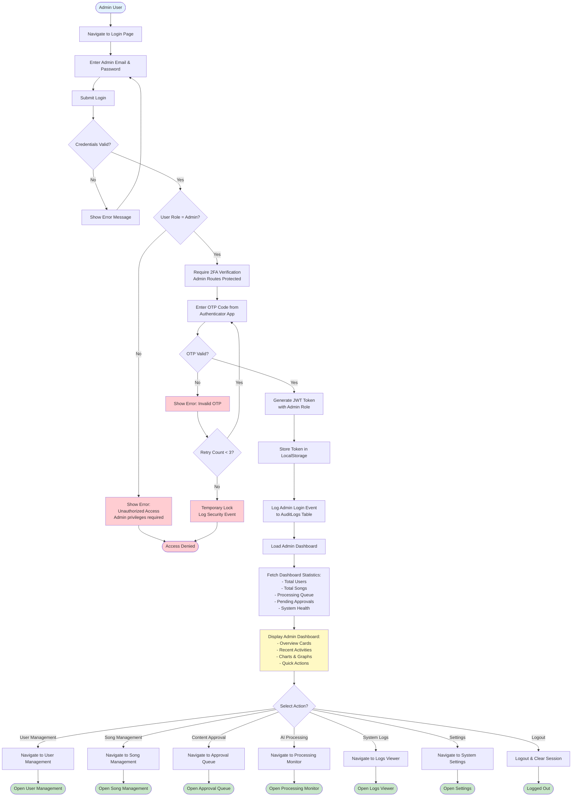
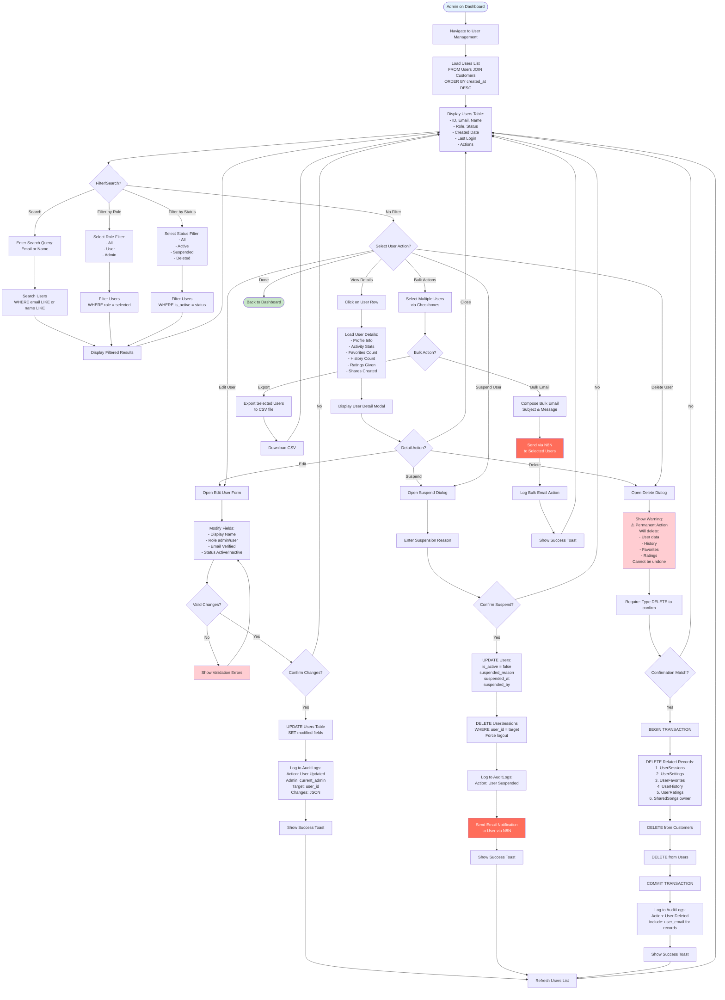
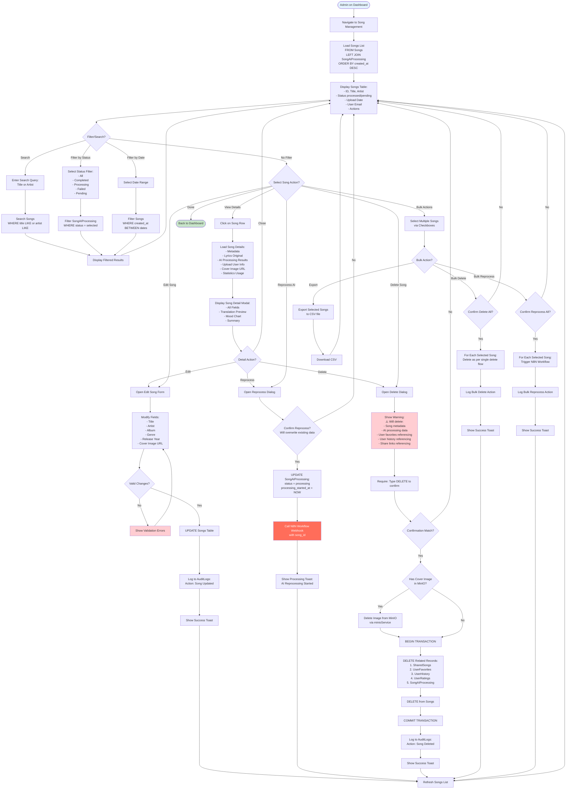
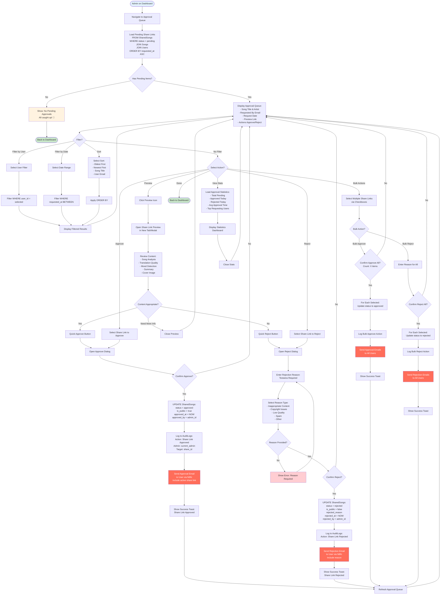

# MUSE MUSIC - Admin Activity Diagrams

## Overview
Activity diagrams showing the workflows and business processes for administrators in the MUSE MUSIC platform. These diagrams illustrate administrative tasks, content moderation, system monitoring, and user management.

**Last Updated:** November 25, 2025  
**Repository:** tikpoptv/MUSE-MUSIC  
**Branch:** docs/diagrams  
**Actor:** Admin / Content Reviewer

---

## 🔐 Activity 1: Admin Login & Dashboard Access

---

## 👥 Activity 2: User Management

---

## 🎵 Activity 3: Song Management

---

## ✅ Activity 4: Content Approval (Share Links)

---

## 🔄 Activity 5: AI Processing Monitor

```mermaid
flowchart TD
    Start([Admin on Dashboard]) --> ClickProcessing[Navigate to Processing Monitor]
    ClickProcessing --> LoadProcessing[Load Processing Data<br/>FROM SongAIProcessing<br/>JOIN Songs<br/>ORDER BY processing_started_at DESC]
    
    LoadProcessing --> DisplayOverview[Display Processing Overview:<br/>- Total Processed<br/>- Currently Processing<br/>- Failed Count<br/>- Avg Processing Time<br/>- Queue Status]
    
    DisplayOverview --> TabChoice{Select Tab?}
    
    %% Active Processing Tab
    TabChoice -->|Active| LoadActive[Load Active Processing<br/>WHERE status = processing]
    LoadActive --> CheckActive{Has Active?}
    CheckActive -->|No| ShowNoActive[Show: No Active Processing<br/>All queues idle]
    ShowNoActive --> DisplayOverview
    
    CheckActive -->|Yes| DisplayActive[Display Active Jobs Table:<br/>- Song Title & Artist<br/>- Started At<br/>- Duration<br/>- Progress Status<br/>- Actions]
    DisplayActive --> ActiveAction{Action?}
    
    ActiveAction -->|View Details| ViewActiveDetail[View Processing Details:<br/>- Processing Steps<br/>- Current Step<br/>- Logs<br/>- N8N Workflow Status]
    ViewActiveDetail --> CloseDetail1[Close Details]
    CloseDetail1 --> DisplayActive
    
    ActiveAction -->|Cancel| ConfirmCancel{Confirm Cancel Job?}
    ConfirmCancel -->|No| DisplayActive
    ConfirmCancel -->|Yes| CancelJob[UPDATE SongAIProcessing:<br/>status = cancelled]
    CancelJob --> LogCancel[Log to AuditLogs:<br/>Action: Processing Cancelled]
    LogCancel --> ShowToast1[Show Toast: Job Cancelled]
    ShowToast1 --> LoadActive
    
    ActiveAction -->|Refresh| RefreshActive[Refresh Active Jobs]
    RefreshActive --> LoadActive
    
    ActiveAction -->|Back| DisplayOverview
    
    %% Completed Tab
    TabChoice -->|Completed| LoadCompleted[Load Completed Processing<br/>WHERE status = completed<br/>ORDER BY completed_at DESC<br/>LIMIT 100]
    LoadCompleted --> DisplayCompleted[Display Completed Jobs Table:<br/>- Song Info<br/>- Completed At<br/>- Processing Duration<br/>- Result Summary<br/>- Actions]
    DisplayCompleted --> CompletedAction{Action?}
    
    CompletedAction -->|View Results| ViewCompletedDetail[View Processing Results:<br/>- Translation Output<br/>- Mood Percentages<br/>- Summary Text<br/>- Processing Logs]
    ViewCompletedDetail --> CloseDetail2[Close Details]
    CloseDetail2 --> DisplayCompleted
    
    CompletedAction -->|Reprocess| ConfirmReprocess{Confirm Reprocess?<br/>Will overwrite results}
    ConfirmReprocess -->|No| DisplayCompleted
    ConfirmReprocess -->|Yes| TriggerReprocess[UPDATE status = processing<br/>Call N8N Webhook]
    TriggerReprocess --> LogReprocess[Log Reprocess Action]
    LogReprocess --> ShowToast2[Show Toast: Reprocessing Started]
    ShowToast2 --> LoadCompleted
    
    CompletedAction -->|Export| ExportCompleted[Export Completed Jobs<br/>to CSV with Results]
    ExportCompleted --> DownloadCSV1[Download CSV]
    DownloadCSV1 --> DisplayCompleted
    
    CompletedAction -->|Back| DisplayOverview
    
    %% Failed Tab
    TabChoice -->|Failed| LoadFailed[Load Failed Processing<br/>WHERE status = failed<br/>ORDER BY failed_at DESC]
    LoadFailed --> CheckFailed{Has Failed?}
    CheckFailed -->|No| ShowNoFailed[Show: No Failed Jobs<br/>All systems operational! ✅]
    ShowNoFailed --> DisplayOverview
    
    CheckFailed -->|Yes| DisplayFailed[Display Failed Jobs Table:<br/>- Song Info<br/>- Failed At<br/>- Error Message<br/>- Retry Count<br/>- Actions]
    DisplayFailed --> FailedAction{Action?}
    
    FailedAction -->|View Error| ViewError[View Detailed Error:<br/>- Error Message<br/>- Stack Trace<br/>- N8N Logs<br/>- Input Data<br/>- Timestamp]
    ViewError --> CloseDetail3[Close Error Details]
    CloseDetail3 --> DisplayFailed
    
    FailedAction -->|Retry| ConfirmRetry{Confirm Retry?}
    ConfirmRetry -->|No| DisplayFailed
    ConfirmRetry -->|Yes| IncrementRetry[Increment retry_count]
    IncrementRetry --> RetriggerJob[UPDATE status = processing<br/>Call N8N Webhook]
    RetriggerJob --> LogRetry[Log Retry Action]
    LogRetry --> ShowToast3[Show Toast: Job Retrying]
    ShowToast3 --> LoadFailed
    
    FailedAction -->|Mark Resolved| ConfirmResolve{Mark as Resolved?<br/>Will remove from failed list}
    ConfirmResolve -->|No| DisplayFailed
    ConfirmResolve -->|Yes| UpdateResolve[UPDATE status = resolved]
    UpdateResolve --> LogResolve[Log Resolved Action]
    LogResolve --> ShowToast4[Show Toast: Marked Resolved]
    ShowToast4 --> LoadFailed
    
    FailedAction -->|Bulk Retry| SelectMultipleFailed[Select Multiple Failed Jobs]
    SelectMultipleFailed --> ConfirmBulkRetry{Confirm Retry All?}
    ConfirmBulkRetry -->|No| DisplayFailed
    ConfirmBulkRetry -->|Yes| BulkRetryLoop[For Each Selected:<br/>Retry Processing]
    BulkRetryLoop --> LogBulkRetry[Log Bulk Retry Action]
    LogBulkRetry --> ShowToast5[Show Toast: Bulk Retry Started]
    ShowToast5 --> LoadFailed
    
    FailedAction -->|Back| DisplayOverview
    
    %% Statistics & Charts
    TabChoice -->|Statistics| LoadCharts[Load Processing Statistics:<br/>- Jobs per Day Chart<br/>- Success Rate Chart<br/>- Avg Duration Trend<br/>- Error Types Breakdown<br/>- Peak Hours Heatmap]
    LoadCharts --> DisplayCharts[Display Charts & Graphs<br/>using Recharts]
    DisplayCharts --> ExportStats[Option: Export Statistics]
    ExportStats --> DownloadStats[Download PDF Report]
    DownloadStats --> DisplayCharts
    DisplayCharts --> BackFromCharts[Back to Overview]
    BackFromCharts --> DisplayOverview
    
    %% System Health Check
    TabChoice -->|Health Check| RunHealthCheck[Run System Health Check:<br/>- Database Connection<br/>- N8N Workflow Status<br/>- MinIO Storage Status<br/>- API Response Times<br/>- Queue Status]
    RunHealthCheck --> DisplayHealth[Display Health Status:<br/>- Green: All OK<br/>- Yellow: Warnings<br/>- Red: Critical Issues]
    DisplayHealth --> CheckHealthStatus{All Healthy?}
    CheckHealthStatus -->|Yes| ShowHealthy[Show: All Systems Operational ✅]
    ShowHealthy --> DisplayOverview
    CheckHealthStatus -->|No| ShowIssues[Show Critical Issues:<br/>- Issue Description<br/>- Affected Component<br/>- Suggested Action]
    ShowIssues --> TakeAction{Take Action?}
    TakeAction -->|Fix| AttemptFix[Execute Automated Fix<br/>if available]
    AttemptFix --> RerunHealth[Re-run Health Check]
    RerunHealth --> RunHealthCheck
    TakeAction -->|Alert| SendAlert[Send Alert to DevOps<br/>via N8N Email]
    SendAlert --> LogAlert[Log Alert Action]
    LogAlert --> DisplayOverview
    TakeAction -->|Ignore| DisplayOverview
    
    TabChoice -->|Done| End([Back to Dashboard])
    
    style Start fill:#e3f2fd
    style End fill:#c8e6c9
    style ShowNoActive fill:#fff3e0
    style ShowNoFailed fill:#c8e6c9
    style ShowHealthy fill:#c8e6c9
    style ShowIssues fill:#ffcdd2
    style SendAlert fill:#ff6d5a,color:#fff
```

---

## 📊 Activity 6: System Logs & Audit

```mermaid
flowchart TD
    Start([Admin on Dashboard]) --> ClickLogs[Navigate to System Logs]
    ClickLogs --> LoadLogs[Load Recent Logs<br/>FROM SystemLogs<br/>ORDER BY created_at DESC<br/>LIMIT 500]
    
    LoadLogs --> DisplayLogs[Display Logs Dashboard:<br/>- Recent Logs Table<br/>- Filter Options<br/>- Search Bar<br/>- Export Options]
    
    DisplayLogs --> LogChoice{Select Log Type?}
    
    %% System Logs
    LogChoice -->|System Logs| LoadSystemLogs[Load SystemLogs Table:<br/>- INFO<br/>- WARNING<br/>- ERROR<br/>- DEBUG]
    LoadSystemLogs --> FilterSystem{Apply Filters?}
    
    FilterSystem -->|Log Level| SelectLevel[Select Level:<br/>- All<br/>- INFO<br/>- WARNING<br/>- ERROR<br/>- DEBUG]
    SelectLevel --> ApplyLevelFilter[WHERE log_level = selected]
    ApplyLevelFilter --> DisplaySystemLogs
    
    FilterSystem -->|Date Range| SelectSystemDate[Select Date Range]
    SelectSystemDate --> ApplyDateFilter[WHERE created_at BETWEEN]
    ApplyDateFilter --> DisplaySystemLogs
    
    FilterSystem -->|Search| EnterSystemSearch[Enter Search Query]
    EnterSystemSearch --> SearchSystemLogs[Search in message, context]
    SearchSystemLogs --> DisplaySystemLogs
    
    FilterSystem -->|No Filter| DisplaySystemLogs[Display System Logs Table:<br/>- Timestamp<br/>- Level<br/>- Message<br/>- Context JSON<br/>- Actions]
    
    DisplaySystemLogs --> SystemAction{Action?}
    SystemAction -->|View Details| ViewSystemDetail[View Full Log Entry:<br/>- Complete Context<br/>- Stack Trace if Error<br/>- Request Info<br/>- User Info]
    ViewSystemDetail --> CloseSystem[Close Details]
    CloseSystem --> DisplaySystemLogs
    
    SystemAction -->|Export| ExportSystem[Export Filtered Logs<br/>to CSV/JSON]
    ExportSystem --> DownloadSystem[Download File]
    DownloadSystem --> DisplaySystemLogs
    
    SystemAction -->|Back| DisplayLogs
    
    %% Error Logs
    LogChoice -->|Error Logs| LoadErrorLogs[Load ErrorLogs Table:<br/>- Unhandled Exceptions<br/>- API Errors<br/>- Database Errors<br/>- External Service Errors]
    LoadErrorLogs --> FilterError{Apply Filters?}
    
    FilterError -->|Error Type| SelectErrorType[Select Error Type:<br/>- All<br/>- Server Error<br/>- Client Error<br/>- Database Error<br/>- External API Error]
    SelectErrorType --> ApplyTypeFilter[WHERE error_type = selected]
    ApplyTypeFilter --> DisplayErrorLogs
    
    FilterError -->|Status| SelectErrorStatus[Select Status:<br/>- Unresolved<br/>- Investigating<br/>- Resolved]
    SelectErrorStatus --> ApplyStatusFilter[WHERE status = selected]
    ApplyStatusFilter --> DisplayErrorLogs
    
    FilterError -->|Date Range| SelectErrorDate[Select Date Range]
    SelectErrorDate --> ApplyErrorDateFilter[WHERE occurred_at BETWEEN]
    ApplyErrorDateFilter --> DisplayErrorLogs
    
    FilterError -->|No Filter| DisplayErrorLogs[Display Error Logs Table:<br/>- Timestamp<br/>- Error Type<br/>- Message<br/>- Affected Endpoint<br/>- User if Available<br/>- Status<br/>- Actions]
    
    DisplayErrorLogs --> ErrorAction{Action?}
    
    ErrorAction -->|View Details| ViewErrorDetail[View Full Error Details:<br/>- Complete Stack Trace<br/>- Request Body<br/>- Request Headers<br/>- Query Parameters<br/>- User Agent<br/>- IP Address]
    ViewErrorDetail --> CloseError[Close Details]
    CloseError --> DisplayErrorLogs
    
    ErrorAction -->|Update Status| SelectNewStatus[Select New Status:<br/>- Investigating<br/>- Resolved<br/>- Won't Fix]
    SelectNewStatus --> AddNote[Add Admin Note]
    AddNote --> UpdateErrorStatus[UPDATE ErrorLogs:<br/>status, admin_note,<br/>updated_by, updated_at]
    UpdateErrorStatus --> LogErrorUpdate[Log Status Change<br/>to AuditLogs]
    LogErrorUpdate --> ShowToast1[Show Success Toast]
    ShowToast1 --> DisplayErrorLogs
    
    ErrorAction -->|Group Similar| FindSimilar[Find Similar Errors:<br/>Same error_type & message pattern]
    FindSimilar --> DisplaySimilar[Display Grouped Errors:<br/>Count & First/Last Occurrence]
    DisplaySimilar --> BulkResolve{Bulk Resolve All?}
    BulkResolve -->|Yes| UpdateAllStatus[UPDATE all to Resolved]
    UpdateAllStatus --> LogBulkResolve[Log Bulk Resolve]
    LogBulkResolve --> ShowToast2[Show Success Toast]
    ShowToast2 --> DisplayErrorLogs
    BulkResolve -->|No| DisplayErrorLogs
    
    ErrorAction -->|Export| ExportErrors[Export Filtered Errors<br/>to CSV/JSON]
    ExportErrors --> DownloadErrors[Download File]
    DownloadErrors --> DisplayErrorLogs
    
    ErrorAction -->|Back| DisplayLogs
    
    %% Audit Logs
    LogChoice -->|Audit Logs| LoadAuditLogs[Load AuditLogs Table:<br/>- Admin Actions<br/>- User Management<br/>- Song Management<br/>- Approval Actions]
    LoadAuditLogs --> FilterAudit{Apply Filters?}
    
    FilterAudit -->|Action Type| SelectActionType[Select Action Type:<br/>- All<br/>- User Created<br/>- User Updated<br/>- User Deleted<br/>- Song Updated<br/>- Song Deleted<br/>- Share Approved<br/>- Share Rejected]
    SelectActionType --> ApplyActionFilter[WHERE action_type = selected]
    ApplyActionFilter --> DisplayAuditLogs
    
    FilterAudit -->|Admin User| SelectAdmin[Select Admin User]
    SelectAdmin --> ApplyAdminFilter[WHERE admin_user_id = selected]
    ApplyAdminFilter --> DisplayAuditLogs
    
    FilterAudit -->|Date Range| SelectAuditDate[Select Date Range]
    SelectAuditDate --> ApplyAuditDateFilter[WHERE created_at BETWEEN]
    ApplyAuditDateFilter --> DisplayAuditLogs
    
    FilterAudit -->|No Filter| DisplayAuditLogs[Display Audit Logs Table:<br/>- Timestamp<br/>- Admin User<br/>- Action Type<br/>- Target Entity<br/>- Changes JSON<br/>- IP Address<br/>- Actions]
    
    DisplayAuditLogs --> AuditAction{Action?}
    
    AuditAction -->|View Details| ViewAuditDetail[View Full Audit Entry:<br/>- Before/After Comparison<br/>- Complete Changes JSON<br/>- Request Context<br/>- User Agent]
    ViewAuditDetail --> CloseAudit[Close Details]
    CloseAudit --> DisplayAuditLogs
    
    AuditAction -->|Export| ExportAudit[Export Filtered Audit Logs<br/>for Compliance/Review]
    ExportAudit --> DownloadAudit[Download File]
    DownloadAudit --> DisplayAuditLogs
    
    AuditAction -->|Generate Report| SelectReportType[Select Report Type:<br/>- Daily Summary<br/>- Weekly Summary<br/>- Monthly Summary<br/>- Custom Date Range]
    SelectReportType --> GenerateReport[Generate Audit Report<br/>with Statistics & Charts]
    GenerateReport --> DownloadReport[Download PDF Report]
    DownloadReport --> DisplayAuditLogs
    
    AuditAction -->|Back| DisplayLogs
    
    %% Health Check Logs
    LogChoice -->|Health Checks| LoadHealthLogs[Load HealthCheckStatus Table:<br/>- Database Health<br/>- API Health<br/>- External Services Health]
    LoadHealthLogs --> DisplayHealthLogs[Display Health Check History:<br/>- Check Time<br/>- Component<br/>- Status OK/Warning/Error<br/>- Response Time<br/>- Details]
    DisplayHealthLogs --> HealthLogAction{Action?}
    
    HealthLogAction -->|View Trend| GenerateHealthTrend[Generate Health Trend Chart:<br/>Response times over time]
    GenerateHealthTrend --> DisplayTrend[Display Trend Chart]
    DisplayTrend --> CloseHealthTrend[Close Chart]
    CloseHealthTrend --> DisplayHealthLogs
    
    HealthLogAction -->|Run Check Now| RunManualCheck[Run Manual Health Check]
    RunManualCheck --> InsertHealthLog[INSERT into HealthCheckStatus]
    InsertHealthLog --> ShowHealthResult[Show Latest Results]
    ShowHealthResult --> DisplayHealthLogs
    
    HealthLogAction -->|Back| DisplayLogs
    
    LogChoice -->|Done| End([Back to Dashboard])
    
    style Start fill:#e3f2fd
    style End fill:#c8e6c9
    style DisplayErrorLogs fill:#ffcdd2
    style DisplayAuditLogs fill:#fff9c4
```

---

## 📝 Activity Summary

### Admin Activities Covered
1. ✅ **Admin Login & Dashboard** - Secure 2FA login, dashboard overview, quick actions
2. ✅ **User Management** - View, edit, suspend, delete users, bulk actions
3. ✅ **Song Management** - View, edit, reprocess, delete songs, bulk operations
4. ✅ **Content Approval** - Review and approve/reject share links, bulk approvals
5. ✅ **AI Processing Monitor** - Monitor active/completed/failed jobs, health checks
6. ✅ **System Logs & Audit** - View system logs, error logs, audit trails, reporting

### Key Admin Features
- **Security**: 2FA required for all admin actions, audit logging
- **Bulk Operations**: Multi-select actions for efficiency
- **Real-time Monitoring**: Live status of AI processing jobs
- **Error Management**: Detailed error tracking and resolution workflow
- **Audit Trail**: Complete action history with before/after comparison
- **Health Checks**: Automated system health monitoring
- **Notifications**: Email notifications via N8N for important events
- **Reporting**: Export capabilities and PDF report generation

### Database Tables Used
- **Admin Management**: Users (role=admin), AuditLogs, SystemLogs, ErrorLogs
- **User Management**: Users, Customers, UserSessions, UserSettings
- **Song Management**: Songs, SongAIProcessing, MinIO storage
- **Content Approval**: SharedSongs (pending/approved/rejected)
- **Monitoring**: SongAIProcessing (status tracking), HealthCheckStatus

### External Services Integration
- **N8N**: Workflow triggers, email notifications, AI processing orchestration
- **MinIO**: Image deletion when songs are removed
- **Ollama**: Via N8N for AI reprocessing
- **Email Service**: User notifications for approvals/rejections/alerts

---

## 🔐 Security & Compliance

### Admin Access Controls
1. **Role-based Access**: Admin role required (checked at route level)
2. **2FA Enforcement**: Mandatory OTP verification for admin routes
3. **Session Management**: JWT tokens with admin role claims
4. **Audit Logging**: All admin actions logged to AuditLogs table
5. **IP Tracking**: Admin IP addresses recorded for security

### Data Protection
- **Soft Deletes Available**: Option to mark as deleted without removing data
- **Transaction Safety**: Critical operations wrapped in database transactions
- **Confirmation Required**: Destructive actions require explicit confirmation
- **Backup Notifications**: Email notifications sent before bulk deletions

### Compliance Features
- **Audit Trail**: Complete history of all administrative actions
- **Export Capabilities**: Logs exportable for compliance reporting
- **Before/After Tracking**: Changes tracked with before/after states
- **Admin Identification**: All actions tied to specific admin user
- **Timestamp Precision**: All actions timestamped with timezone

---

## 🔍 Notes

- All workflows verified against actual admin routes and controllers
- Error handling and validation included in each flow
- Security measures (2FA, audit logging) integrated throughout
- External service integrations (N8N, MinIO) properly sequenced
- Database operations match actual schema and constraints
- Bulk operations optimized with transaction boundaries
- Real-time status updates via polling/refresh mechanisms

**Verification Date:** November 25, 2025  
**Codebase State:** All admin activities verified against actual implementation  
**Security Level:** High - 2FA enforced, all actions audited
