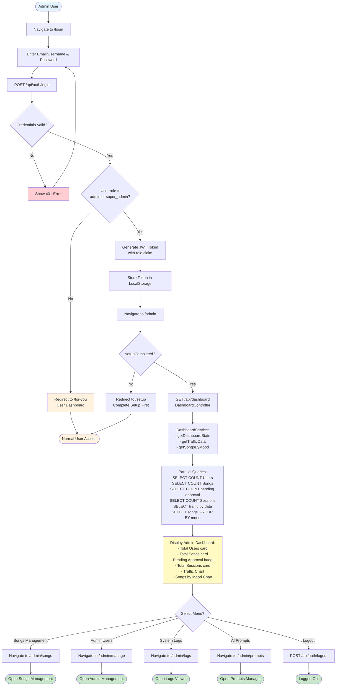
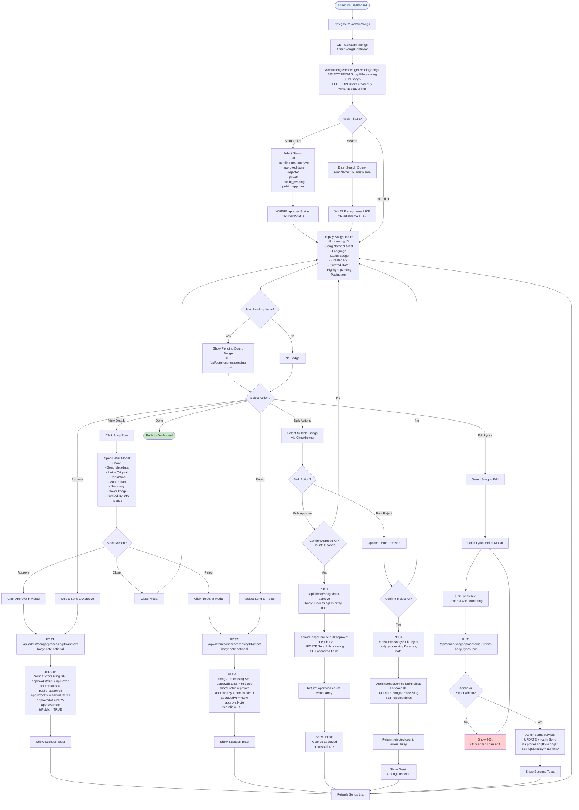
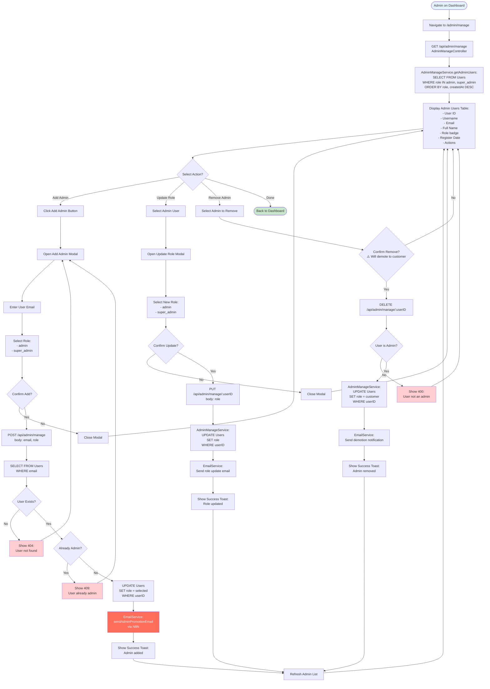
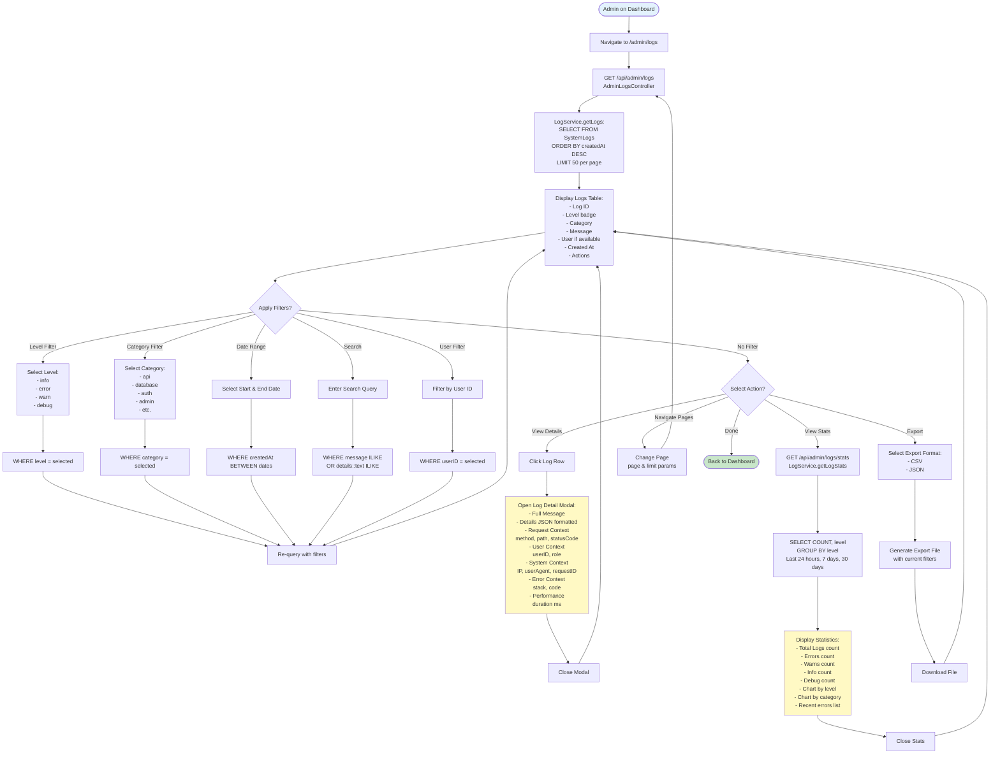
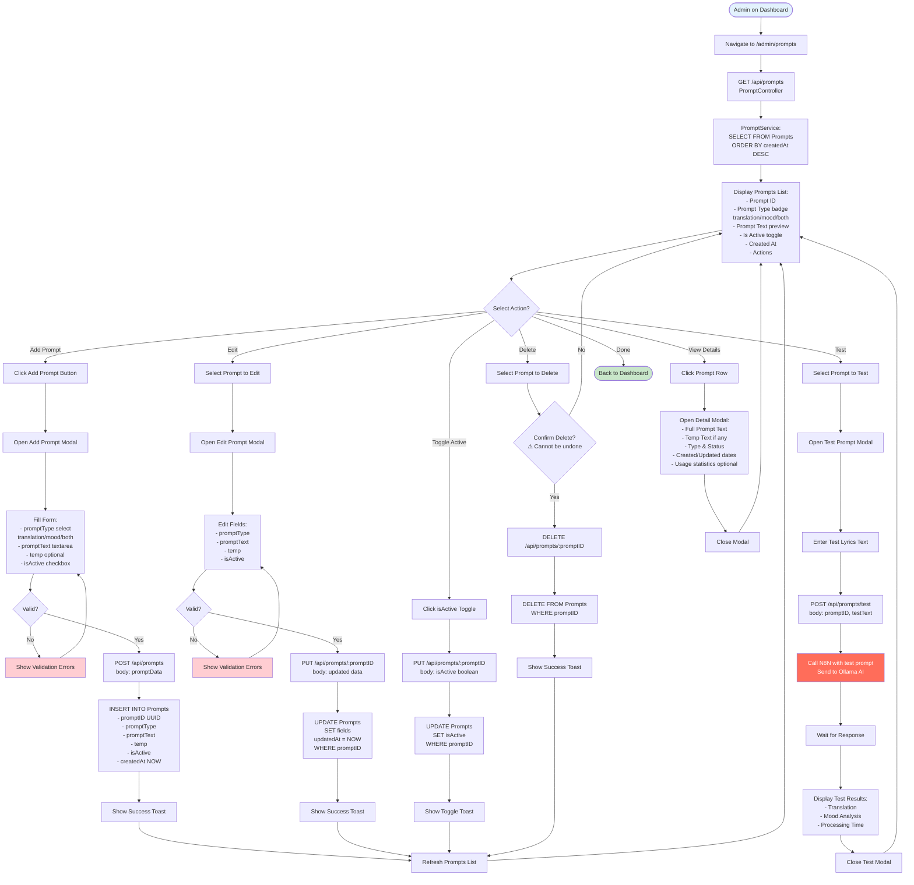

# MUSE MUSIC - Admin Activity Diagrams

## Overview
Activity diagrams showing actual admin workflows in MUSE MUSIC platform based on verified codebase inspection. All flows match actual routes, controllers, services, and database schema.

**Last Updated:** November 25, 2025  
**Repository:** tikpoptv/MUSE-MUSIC  
**Branch:** docs/diagrams  
**Actor:** Admin / Super Admin  
**Verification:** All activities verified against actual code

---

## 🔐 Activity 1: Admin Login & Dashboard

---

## 🎵 Activity 2: Songs Management (Approve/Reject)

---

## 👥 Activity 3: Admin User Management

---

## 📊 Activity 4: System Logs Viewer

---

## 🤖 Activity 5: AI Prompts Management

---

## 📝 Summary

### Verified Admin Activities (5 Activities)
1. ✅ **Admin Login & Dashboard** - Role check + statistics (verified against authController, dashboardController)
2. ✅ **Songs Management** - Approve/Reject/Bulk actions (verified against adminSongsController, adminSongsService)
3. ✅ **Admin User Management** - Add/Update/Remove admins (verified against adminManageController, adminManageService)
4. ✅ **System Logs Viewer** - Filter and view logs (verified against adminLogsController, logService)
5. ✅ **AI Prompts Management** - CRUD prompts (verified against promptController, promptService)

### Key Findings from Code Inspection
- **Admin role check at route level** - requireRole(['admin', 'super_admin']) middleware
- **NO user suspension feature** - only admin role management (add/remove/update)
- **NO separate share approval** - Song approval in SongAIProcessing table using approvalStatus field
- **Songs approval updates multiple fields** - approvalStatus, shareStatus, isPublic, approvedBy, approvedAt
- **Bulk operations return success count + errors array** - partial success handling
- **Email notifications via N8N** - admin promotion, role update, demotion
- **Logs filterable by level, category, date, user, search**
- **Prompts testable via N8N** - admin can test prompt before activating

### Database Tables Used
- **Users** - role field (customer, admin, super_admin)
- **SongAIProcessing** - approvalStatus, shareStatus, isPublic, approvedBy, approvedAt, approvalNote
- **SystemLogs** - level, category, message, details JSONB, user context, error context
- **Prompts** - promptType (translation/mood/both), promptText, temp, isActive

### Admin Privileges
- **View dashboard statistics** - users, songs, sessions, traffic, mood distribution
- **Approve/Reject songs** - single and bulk operations
- **Manage admin users** - promote/demote/update roles (email → admin → super_admin)
- **View system logs** - all levels with advanced filtering
- **Manage AI prompts** - CRUD operations with testing capability
- **Edit song lyrics** - restricted to admin/super_admin roles

### NO Features Found
- ❌ User suspension/ban system
- ❌ Separate SharedSongs table or approval queue
- ❌ Delete songs feature (not found in routes)
- ❌ Delete users feature (only remove admin role)
- ❌ Error logs separate table (uses SystemLogs with level filter)
- ❌ Audit logs separate table (uses SystemLogs)
- ❌ Health check monitoring UI (no route found)

**Verification Date:** November 25, 2025  
**Codebase State:** All admin activities verified against actual routes, controllers, services, and schema  
**Method:** File inspection + grep search + SQL schema analysis  
**Admin Routes Verified:** adminSongs, adminManage, adminLogs, adminAnalysis, dashboard, prompts
