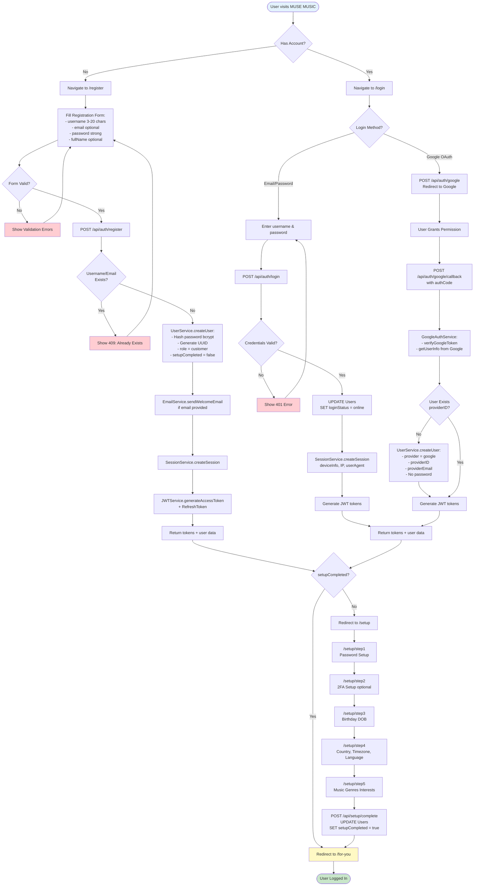
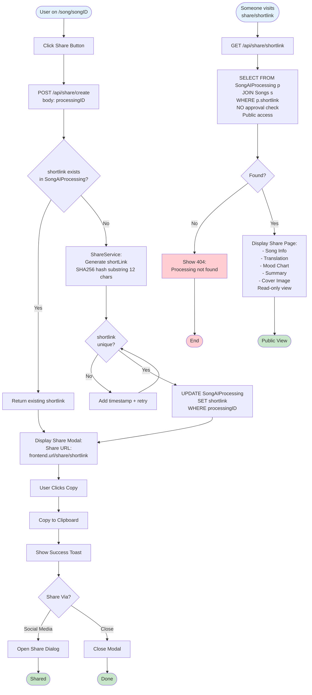
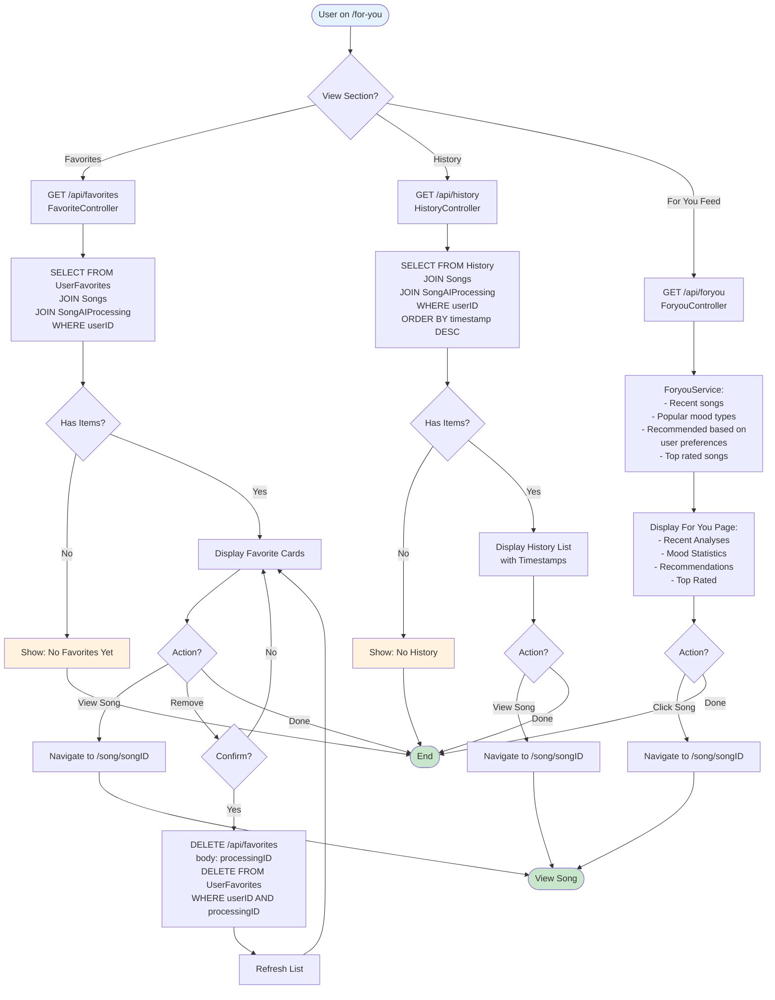
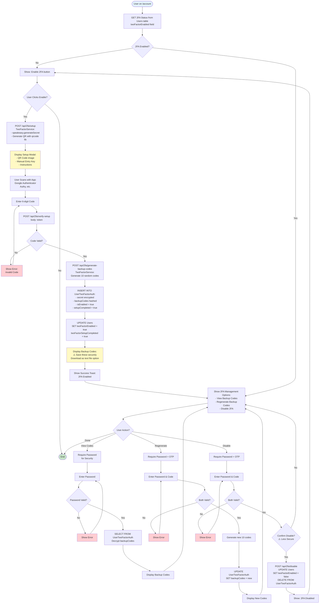
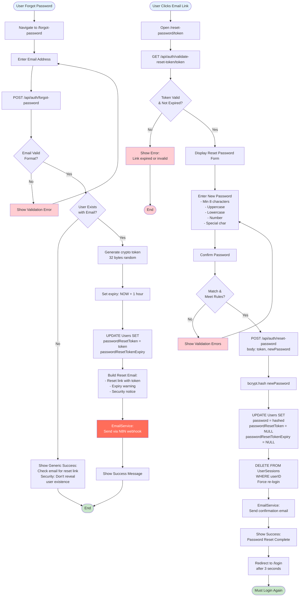

# MUSE MUSIC - User Activity Diagrams

## Overview
Activity diagrams showing actual user workflows in MUSE MUSIC platform based on verified codebase inspection. All flows match actual routes, controllers, services, and database schema.

**Last Updated:** November 25, 2025  
**Repository:** tikpoptv/MUSE-MUSIC  
**Branch:** docs/diagrams  
**Actor:** Registered User  
**Verification:** All activities verified against actual code

---

## 🔐 Activity 1: User Registration & Login

---

## 🎵 Activity 2: Song Search & AI Analysis

```mermaid
flowchart TD
    Start([User on /for-you]) --> SearchClick[Click Search Icon]
    SearchClick --> EnterQuery[Enter Song/Artist Name]
    EnterQuery --> SubmitSearch[POST /api/lyrics/search]
    
    SubmitSearch --> CallLRCLIB[LyricsService:<br/>Call LRCLIB API<br/>GET https://lrclib.net/api/search]
    CallLRCLIB --> CheckResults{Results Found?}
    CheckResults -->|No| ShowNoResults[Show: No Results]
    ShowNoResults --> End1([End])
    
    CheckResults -->|Yes| CacheResults[INSERT INTO<br/>LyricsSearchResults<br/>- externalID<br/>- trackName<br/>- artistName<br/>- instrumental<br/>- sourceAPI = lrclib]
    CacheResults --> DisplayResults[Display Search Results List]
    
    DisplayResults --> UserSelect[User Selects Song]
    UserSelect --> CheckExists{Song Already<br/>in Songs table?}
    
    CheckExists -->|Yes| LoadSong[Load existing Song]
    LoadSong --> CheckProcessed
    
    CheckExists -->|No| ConfirmCreate[Show: Create Song<br/>& Start Analysis?]
    ConfirmCreate --> UserConfirm{User Confirms?}
    UserConfirm -->|No| End1
    
    UserConfirm -->|Yes| FetchFullLyrics[LyricsService:<br/>Fetch full lyrics from LRCLIB]
    FetchFullLyrics --> CreateSong[INSERT INTO Songs:<br/>- songName<br/>- artistName<br/>- lyrics<br/>- syncedLyrics<br/>- lyricsSearchResultID<br/>- sourceStatus = from_lyrics_search<br/>- createdBy = userID]
    CreateSong --> UpdateUsage[UPDATE LyricsSearchResults<br/>SET usageCount++<br/>lastUsedAt = NOW]
    UpdateUsage --> CheckCover
    
    CheckCover{Has Cover Image?}
    CheckCover -->|No| PromptUpload[Optional: Upload Cover]
    PromptUpload --> UploadChoice{User Uploads?}
    UploadChoice -->|Yes| UploadToMinIO[POST /api/images/upload<br/>ImageController:<br/>- multer memory<br/>- MinIOService.uploadImage<br/>- Returns URL]
    UploadToMinIO --> StartAnalysis
    UploadChoice -->|No| StartAnalysis
    CheckCover -->|Yes| StartAnalysis
    
    %% AI Analysis
    StartAnalysis[Start AI Analysis]
    StartAnalysis --> FetchYouTube[Optional: Search YouTube<br/>POST /api/youtube/search]
    FetchYouTube --> CreateProcessing[INSERT INTO SongAIProcessing:<br/>- songID<br/>- status = processing<br/>- shareStatus = private<br/>- isPublic = false<br/>- coverImage URL<br/>- youtubeVideoId<br/>- createdBy = userID]
    CreateProcessing --> ShowLoading[Show Loading Screen]
    
    ShowLoading --> CallN8N[POST /api/analysis/translate<br/>TranslateService:<br/>Call N8N Webhook]
    CallN8N --> N8NProcess[N8N Workflow:<br/>- Send to Ollama AI<br/>- Translate lyrics<br/>- Detect mood 5 types<br/>- Generate summary]
    N8NProcess --> WaitResponse[Wait for N8N Response<br/>timeout 120s]
    
    WaitResponse --> CheckSuccess{Success?}
    CheckSuccess -->|No| UpdateFailed[UPDATE SongAIProcessing<br/>SET status = failed<br/>errorMessage]
    UpdateFailed --> ShowError[Show Error Message]
    ShowError --> RetryOption{Retry?}
    RetryOption -->|Yes| CallN8N
    RetryOption -->|No| End2([Analysis Failed])
    
    CheckSuccess -->|Yes| UpdateCompleted[UPDATE SongAIProcessing:<br/>- summary<br/>- translation<br/>- interpretation<br/>- moodType JSON array<br/>- originallanguage<br/>- targetLanguage<br/>- status = completed<br/>- isCompleteProcessing = true]
    UpdateCompleted --> AddHistory[INSERT INTO History:<br/>- songID<br/>- userID<br/>- processingID<br/>- actionType = view]
    AddHistory --> CheckProcessed
    
    CheckProcessed{Already<br/>Processed?}
    CheckProcessed -->|Yes| LoadExisting[SELECT FROM SongAIProcessing<br/>WHERE processingID]
    LoadExisting --> DisplaySong
    CheckProcessed -->|No| CreateProcessing
    
    DisplaySong["Navigate to /song/:songID<br/>Display:<br/>- SyncedLyricsPlayer<br/>- Original & Translation<br/>- Mood Radar Chart<br/>- Summary<br/>- Cover Image"]
    DisplaySong --> UserActions{User Action?}
    
    UserActions -->|Add Favorite| AddFav[POST /api/favorites<br/>body: processingID<br/>INSERT INTO UserFavorites<br/>UNIQUE userID,processingID]
    AddFav --> ShowToast1[Show Success Toast]
    ShowToast1 --> UserActions
    
    UserActions -->|Share| ShareFlow[Go to Activity 3: Share]
    
    UserActions -->|Rate| OpenFeedback[Open Feedback Form]
    OpenFeedback --> SubmitRating[POST /api/ratings/:processingID<br/>body: rating 1-5, comment optional]
    SubmitRating --> UpsertRating[INSERT/UPDATE<br/>AIProcessingRatings<br/>UNIQUE processingID,userID]
    UpsertRating --> TriggerUpdate[Trigger: update_rating_stats<br/>UPDATE SongAIProcessing<br/>- totalRatings<br/>- averageRating<br/>- starCount]
    TriggerUpdate --> ShowToast2[Show Thank You]
    ShowToast2 --> UserActions
    
    UserActions -->|Done| End3([Complete])
    
    style Start fill:#e3f2fd
    style End1 fill:#ffcdd2
    style End2 fill:#ffcdd2
    style End3 fill:#c8e6c9
    style DisplaySong fill:#fff9c4
    style N8NProcess fill:#ff6d5a,color:#fff
    style UpdateFailed fill:#ffcdd2
```

---

## 🔗 Activity 3: Share Song Analysis

---

## 💖 Activity 4: Favorites & History

---

## ⚙️ Activity 5: 2FA Setup & Management

---

## 🔄 Activity 6: Password Reset

---

## 📝 Summary

### Verified User Activities (6 Activities)
1. ✅ **Registration & Login** - Standard + Google OAuth (verified against authController)
2. ✅ **Song Search & AI Analysis** - LRCLIB + N8N + Ollama (verified against lyricsController, translateController)
3. ✅ **Share Links** - Simple share via shortlink (verified against shareController, shareService)
4. ✅ **Favorites & History** - Standard CRUD (verified against favoriteController, historyController)
5. ✅ **2FA Management** - Speakeasy + QRCode (verified against twoFactorController, twoFactorService)
6. ✅ **Password Reset** - Email token flow (verified against authController, emailService)

### Key Findings from Code Inspection
- **NO approval system for shares** - shares are public immediately via shortlink
- **NO SharedSongs table** - sharing uses shortlink field in SongAIProcessing
- **Rating system uses trigger** - update_rating_stats auto-updates averageRating
- **LyricsSearchResults has usage tracking** - usageCount and lastUsedAt auto-updated via trigger
- **Setup wizard** - setupCompleted flag determines if user needs onboarding
- **2FA is optional** - stored in UserTwoFactorAuth table with encrypted secrets

### Database Tables Used
- Users, Customers, UserSessions, UserTwoFactorAuth
- Songs, LyricsSearchResults, SongAIProcessing
- UserFavorites, History, AIProcessingRatings
- SystemLogs (via logger middleware)

### External Services
- **LRCLIB API** - lyrics search via https://lrclib.net/api/search
- **N8N** - AI workflow orchestration
- **Ollama** - AI model (gpt-oss:120b) via N8N
- **MinIO** - S3-compatible image storage
- **Email via N8N** - welcome, password reset, confirmation emails
- **Google OAuth** - google-auth-library

**Verification Date:** November 25, 2025  
**Codebase State:** All activities verified against actual routes, controllers, services, and schema  
**Method:** File inspection + grep search + SQL schema analysis
