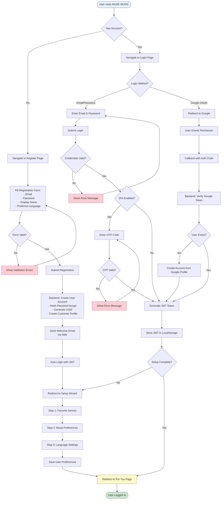
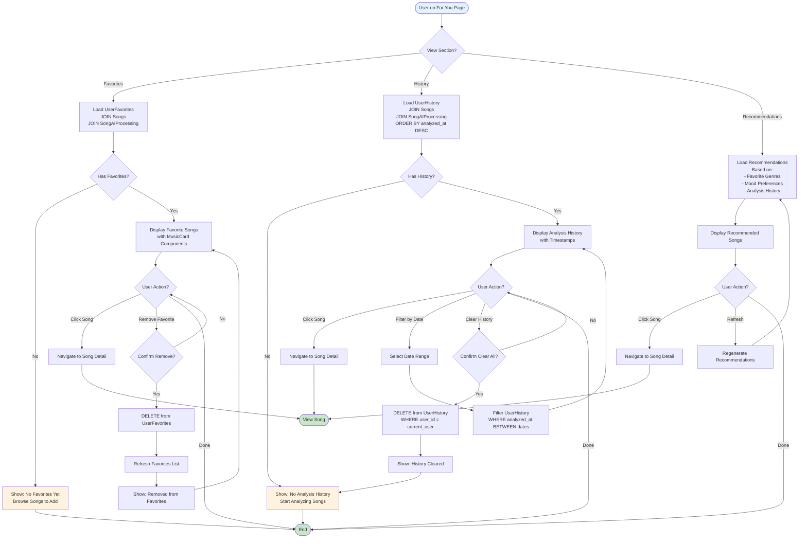
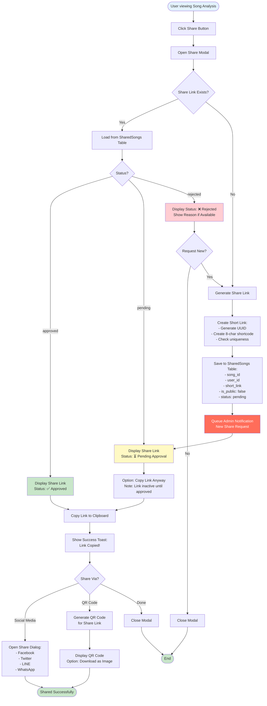
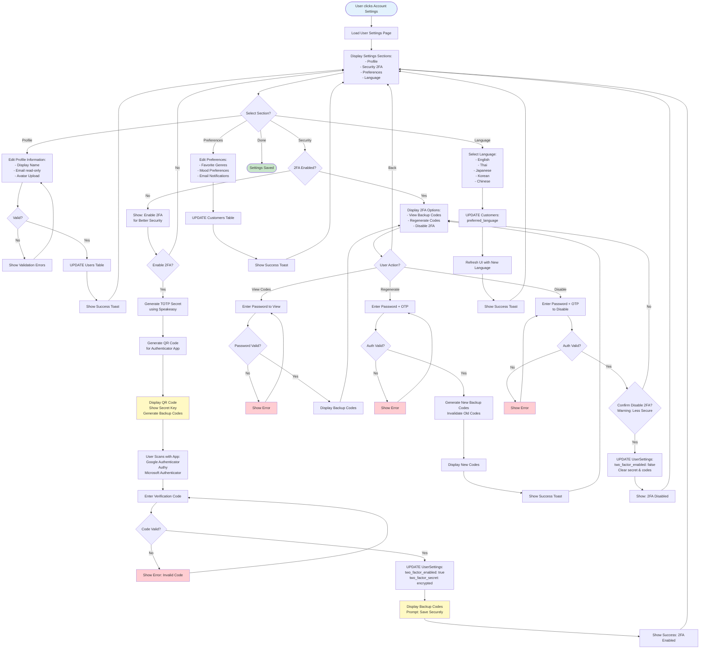
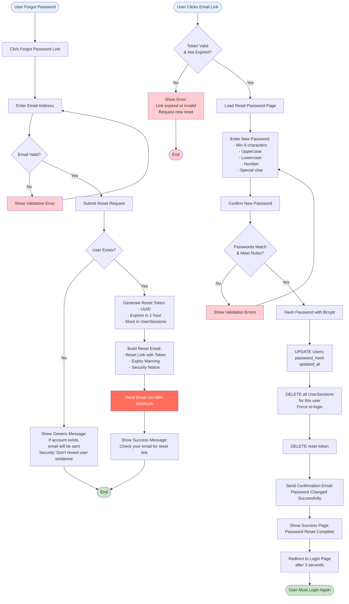

# MUSE MUSIC - User Activity Diagrams

## Overview
Activity diagrams showing the workflows and business processes for registered users in the MUSE MUSIC platform. These diagrams illustrate the step-by-step flows from user actions to system responses.

**Last Updated:** November 25, 2025  
**Repository:** tikpoptv/MUSE-MUSIC  
**Branch:** docs/diagrams  
**Actor:** Registered User

---

## 🔐 Activity 1: User Registration & Login

---

## 🎵 Activity 2: Song Search & Analysis

```mermaid
flowchart TD
    Start([User on For You / Home]) --> SearchAction[Click Search Icon]
    SearchAction --> EnterQuery[Enter Song/Artist Name]
    EnterQuery --> ChoiceSource{Search Source?}
    
    %% Local Catalog Search
    ChoiceSource -->|Local Catalog| SearchLocal[Search Songs Table]
    SearchLocal --> CheckLocalResults{Results Found?}
    CheckLocalResults -->|Yes| DisplayResults
    CheckLocalResults -->|No| ShowNoResults[Show: No Results in Catalog]
    ShowNoResults --> OfferExternal[Suggest: Search External Lyrics]
    OfferExternal --> ChoiceSource
    
    %% External Lyrics Search
    ChoiceSource -->|External LRCLIB| SearchLRCLIB[API Call to LRCLIB]
    SearchLRCLIB --> CheckLRCResults{Results Found?}
    CheckLRCResults -->|No| SearchYouTube[Suggest: Search YouTube]
    SearchYouTube --> End1([No Results])
    
    CheckLRCResults -->|Yes| CacheLyrics[Cache Results in<br/>LyricsSearchResults Table]
    CacheLyrics --> DisplayResults[Display Search Results<br/>List of Songs]
    
    %% Song Selection
    DisplayResults --> UserSelect[User Selects Song]
    UserSelect --> CheckAnalyzed{Already Analyzed?}
    
    CheckAnalyzed -->|Yes| LoadExisting[Load from<br/>SongAIProcessing Table]
    LoadExisting --> DisplaySong
    
    CheckAnalyzed -->|No| ConfirmAnalysis[Show: Start AI Analysis?<br/>- Translation<br/>- Mood Detection<br/>- Summary]
    ConfirmAnalysis --> UserConfirm{User Confirms?}
    UserConfirm -->|No| DisplaySong
    
    UserConfirm -->|Yes| CheckCover{Has Cover Image?}
    CheckCover -->|No| PromptUpload[Prompt: Upload Cover Image]
    PromptUpload --> UploadChoice{User Uploads?}
    UploadChoice -->|Yes| UploadImage[Upload to MinIO]
    UploadImage --> StartAnalysis
    UploadChoice -->|No| UseDefault[Use Default Placeholder]
    UseDefault --> StartAnalysis
    CheckCover -->|Yes| StartAnalysis
    
    %% AI Analysis Flow
    StartAnalysis[Start AI Analysis]
    StartAnalysis --> FetchLyrics[Fetch Lyrics:<br/>1. Check LyricsSearchResults<br/>2. Call LRCLIB API<br/>3. Try YouTube Transcript]
    FetchLyrics --> CheckLyricsFound{Lyrics Found?}
    CheckLyricsFound -->|No| AnalysisError[Show Error: No Lyrics Available]
    AnalysisError --> End2([Analysis Failed])
    
    CheckLyricsFound -->|Yes| SaveSong[Save Song to Songs Table]
    SaveSong --> CreateProcessing[Create SongAIProcessing Record<br/>Status: processing]
    CreateProcessing --> ShowLoading[Show Loading Screen<br/>with Progress Indicator]
    
    ShowLoading --> CallN8N[Call N8N Workflow Webhook]
    CallN8N --> N8NProcess[N8N: Send to Ollama AI<br/>- Translate Lyrics<br/>- Detect Mood<br/>- Generate Summary]
    N8NProcess --> WaitResponse[Wait for Response<br/>timeout: 120s]
    
    WaitResponse --> CheckSuccess{Analysis Success?}
    CheckSuccess -->|No| UpdateFailed[Update Status: failed]
    UpdateFailed --> ShowError[Show Error Message]
    ShowError --> Retry{User Retries?}
    Retry -->|Yes| StartAnalysis
    Retry -->|No| End2
    
    CheckSuccess -->|Yes| UpdateCompleted[Update SongAIProcessing:<br/>- translations<br/>- mood_percentages<br/>- summary<br/>Status: completed]
    UpdateCompleted --> AddToHistory[Add to UserHistory]
    AddToHistory --> DisplaySong
    
    %% Display Song
    DisplaySong[Display Song Analysis Page:<br/>- Synced Lyrics Player<br/>- Translation Side-by-Side<br/>- Mood Radar Chart<br/>- Summary<br/>- Cover Image]
    DisplaySong --> UserActions{User Action?}
    
    UserActions -->|Add to Favorites| AddFav[Save to UserFavorites]
    AddFav --> ShowToast1[Show Success Toast]
    ShowToast1 --> UserActions
    
    UserActions -->|Share| GenerateShare[Generate Share Link]
    GenerateShare --> CopyLink[Copy Link to Clipboard]
    CopyLink --> ShowToast2[Show Success Toast]
    ShowToast2 --> UserActions
    
    UserActions -->|Rate & Feedback| OpenFeedback[Open Feedback Form]
    OpenFeedback --> SubmitFeedback[Submit Rating 1-5 stars<br/>+ Optional Comment]
    SubmitFeedback --> SaveRating[Save to UserRatings]
    SaveRating --> ShowToast3[Show Thank You Message]
    ShowToast3 --> UserActions
    
    UserActions -->|Done| End3([Activity Complete])
    
    style Start fill:#e3f2fd
    style End1 fill:#ffcdd2
    style End2 fill:#ffcdd2
    style End3 fill:#c8e6c9
    style DisplaySong fill:#fff9c4
    style N8NProcess fill:#ff6d5a,color:#fff
    style AnalysisError fill:#ffcdd2
    style ShowError fill:#ffcdd2
```

---

## 💖 Activity 3: Manage Favorites & History

---

## 🔗 Activity 4: Share Song Analysis

---

## ⚙️ Activity 5: Account Settings & 2FA

---

## 🔄 Activity 6: Password Reset

---

## 📝 Activity Summary

### User Activities Covered
1. ✅ **Registration & Login** - Account creation, OAuth, 2FA, setup wizard
2. ✅ **Song Search & Analysis** - Search catalog/external, AI processing, display results
3. ✅ **Favorites & History** - Manage favorites, view history, recommendations
4. ✅ **Share Links** - Generate share links, approval status, social sharing
5. ✅ **Account Settings** - Profile edit, 2FA management, preferences, language
6. ✅ **Password Reset** - Forgot password flow, email verification, secure reset

### Key Components Used
- **Frontend Pages**: login, register, song, for-you, account, share, setup
- **Frontend Components**: Navbar, MusicCard, LyricsViewer, SyncedLyricsPlayer, FeedbackSection, Modals
- **Frontend Services**: authService, songService, analysisService, favoriteService, historyService
- **Backend Controllers**: authController, songController, analysisController, shareController
- **Backend Services**: userService, googleAuthService, lyricsService, translateService, shareService
- **External Services**: N8N, Ollama, LRCLIB, YouTube APIs, Google OAuth

### Database Tables Involved
- Users, Customers, UserSessions, UserSettings
- Songs, LyricsSearchResults, SongAIProcessing
- UserFavorites, UserHistory, UserRatings, SharedSongs
- SystemLogs, ErrorLogs

---

## 🔍 Notes

- All flows are based on actual codebase implementation
- Error handling and validation included in each flow
- Security measures (JWT, 2FA, password hashing) integrated
- External service integrations (N8N, Ollama, APIs) shown with proper timing
- Toast notifications and user feedback included
- Database operations match actual schema

**Verification Date:** November 25, 2025  
**Codebase State:** All activities verified against actual implementation
