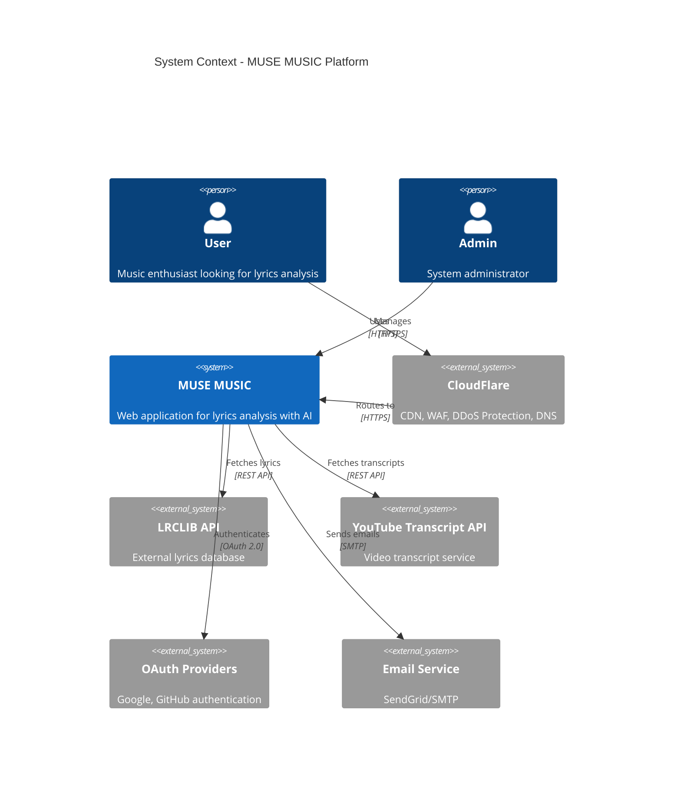
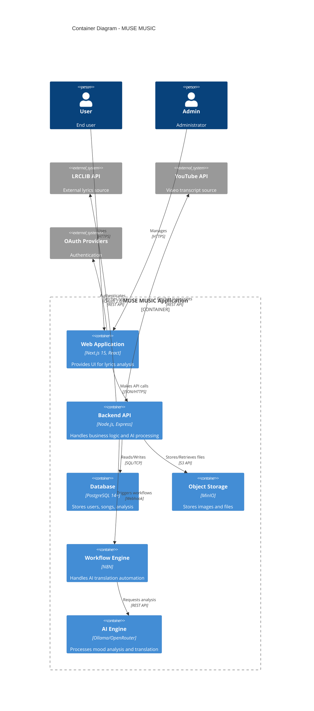
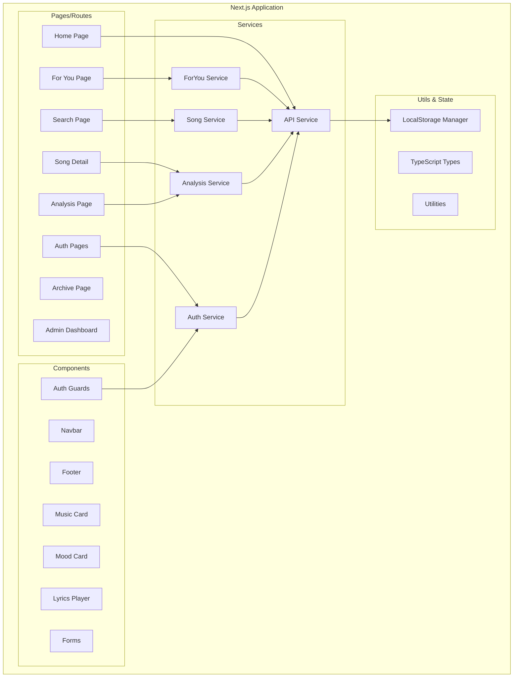
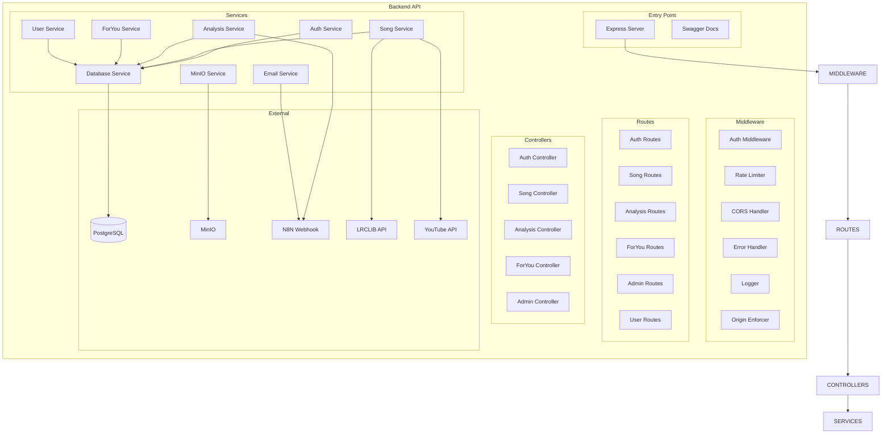
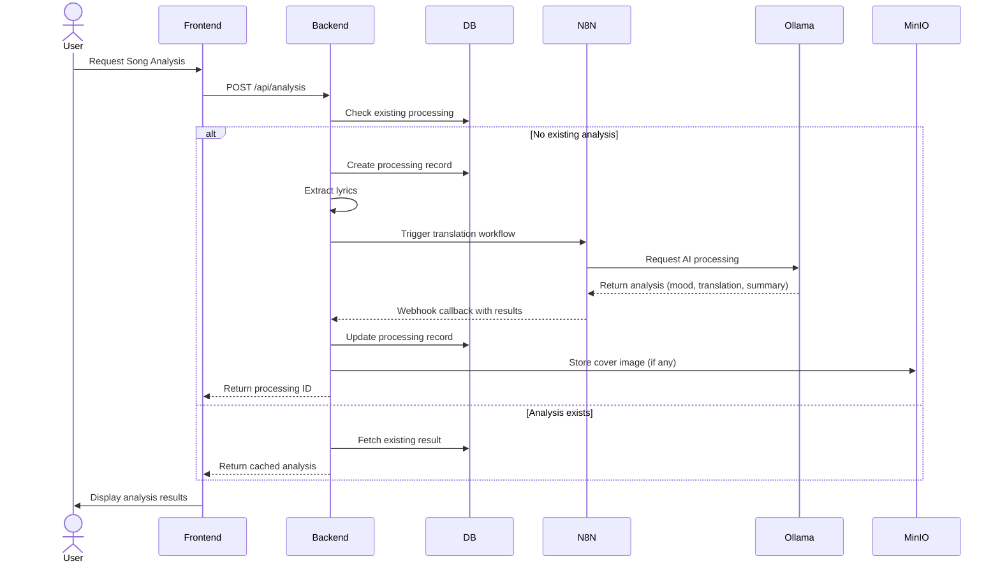
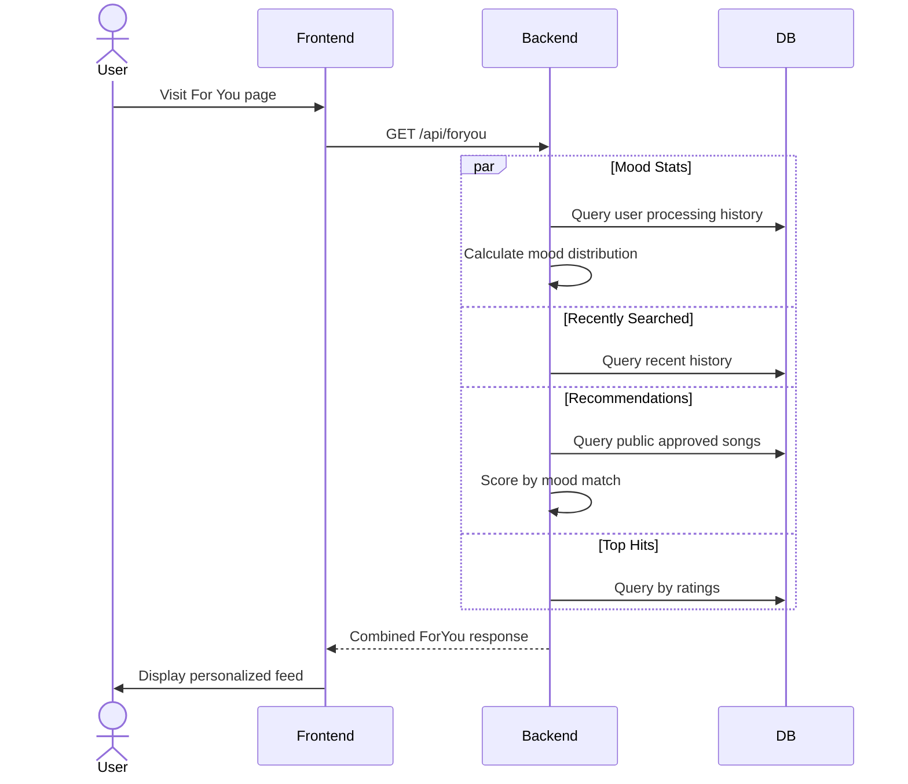
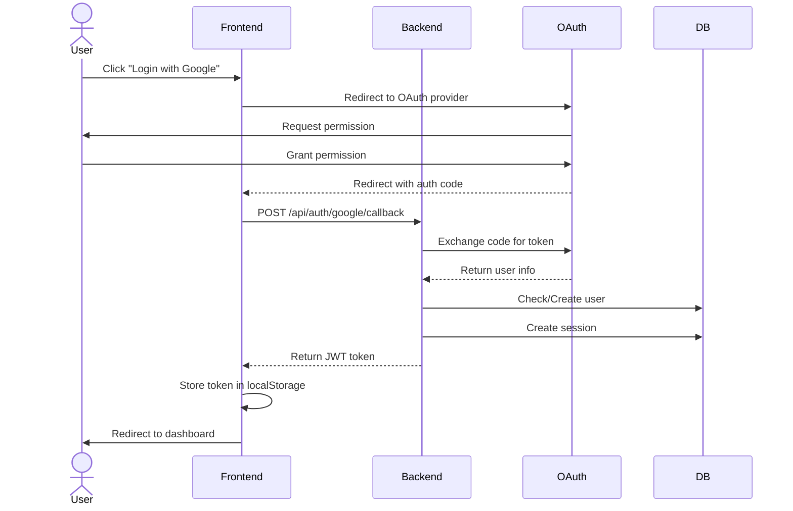
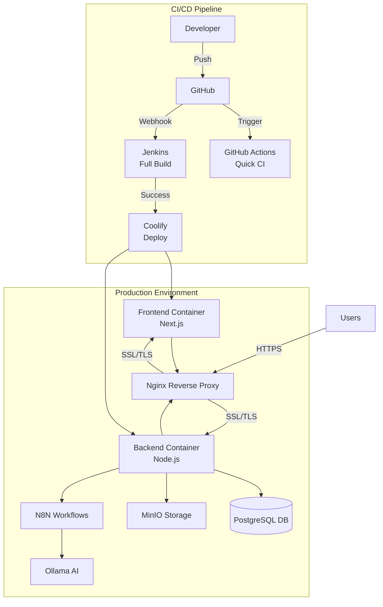
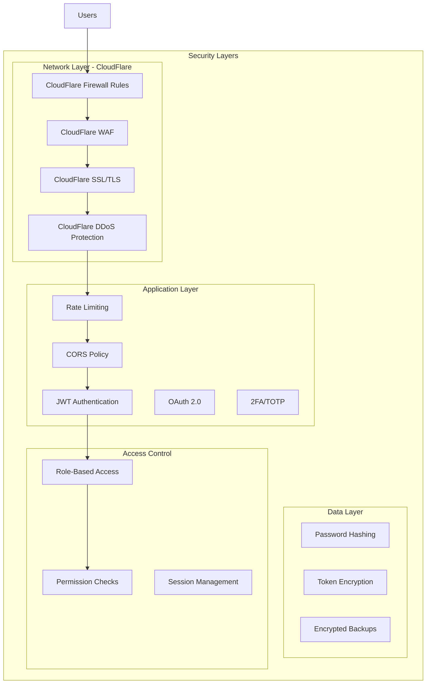
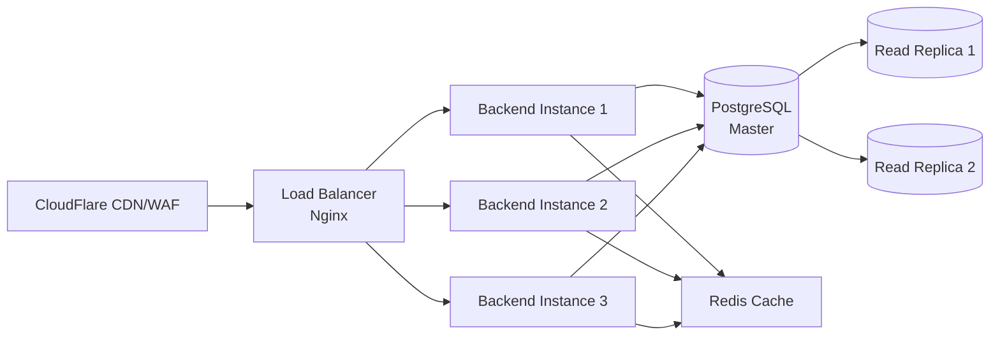

# MUSE MUSIC - Architecture Design

## Overview
System architecture showing the overall structure of the MUSE MUSIC system, including Frontend, Backend, Database, External Services, and Infrastructure

---

## 🏗️ High-Level Architecture

---

## 🎯 Container Architecture

---

## 🔧 Component Architecture

### Frontend (Next.js)

### Backend (Node.js/Express)

---

## 🗄️ Data Flow Architecture

### AI Analysis Flow

### For You Recommendation Flow

### Authentication Flow (OAuth)

---

## 🚀 Deployment Architecture

### Infrastructure Stack

| Component | Technology | Purpose | Scale |
|-----------|-----------|---------|-------|
| **Frontend** | Next.js 15 + React 19 | UI/UX | Serverless/Container |
| **Backend** | Node.js 24 + Express | API Server | 2-4 instances |
| **Database** | PostgreSQL 14+ | Primary data store | Managed DB |
| **Storage** | MinIO (S3-compatible) | File/image storage | 50-500 GB |
| **AI Engine** | Ollama + N8N | AI processing | GPU instance |
| **Reverse Proxy** | Nginx | Load balancer | 2+ instances |
| **CI/CD** | Jenkins + GitHub Actions | Automation | Dedicated server |
| **Monitoring** | (Future: Grafana/Prometheus) | Observability | TBD |

---

## 🔐 Security Architecture

### Security Features

- **CloudFlare Protection**:
  - **CDN**: Global content delivery network
  - **WAF**: Web Application Firewall with custom rules
  - **DDoS Protection**: Automatic mitigation of large-scale attacks
  - **SSL/TLS**: Universal SSL with TLS 1.3 support
  - **Bot Management**: Automated bot detection and blocking
  - **DNS Management**: Secure DNS resolution

- **Authentication**: JWT tokens + OAuth 2.0 (Google, GitHub)
- **Authorization**: Role-based access control (Customer, Admin, Super Admin)
- **2FA**: TOTP-based two-factor authentication
- **Rate Limiting**: Per-endpoint request throttling
- **CORS**: Frontend origin enforcement
- **Encryption**: 
  - Passwords: bcrypt hashing
  - Tokens: AES encryption
  - Database: PostgreSQL SSL
  - Storage: MinIO encryption at rest
- **Session Management**: Token expiry + refresh mechanism
- **Audit Logging**: System logs for admin actions

---

## 📊 Scalability Considerations

### Horizontal Scaling

### Performance Optimization

- **Database**: 
  - Connection pooling (pg-pool)
  - Indexed queries (see schema indexes)
  - Read replicas for heavy reads
- **Caching**: 
  - Redis for session storage
  - CDN for static assets (MinIO + CloudFlare)
- **API**: 
  - Rate limiting per endpoint
  - Response compression (gzip)
  - Pagination for large datasets
- **Frontend**: 
  - Next.js SSR/SSG
  - Image optimization
  - Code splitting

---

## 📁 File References

### Architecture Files
- **Deployment**: `DEPLOYMENT.md`
- **Database Schema**: `backend/database/migrations/001_create_initial_schema.sql`
- **Docker Compose**: `docker-compose.dev.yml`, `docker-compose.prod.yml`
- **CI/CD**: `Jenkinsfile`

### Service Files
- **Backend Services**: `backend/src/services/*.js`
- **Backend Routes**: `backend/src/routes/*.js`
- **Backend Controllers**: `backend/src/controllers/*.js`
- **Frontend Services**: `frontend/src/services/*.ts`
- **Frontend Components**: `frontend/src/components/*.tsx`

### Configuration
- **Backend Config**: `backend/src/config/*.js`
- **Frontend Config**: `frontend/next.config.ts`
- **Environment**: `backend/env.example`, `frontend/env.example`

---

## 🚀 Infrastructure & Performance

### Current Setup
- **CloudFlare**: CDN, WAF, DDoS Protection, SSL/TLS management, DNS
- **Coolify**: Container orchestration and deployment
- **Nginx**: Reverse proxy and load balancing
- **PostgreSQL**: Primary database with replication support
- **MinIO**: Object storage for media files
- **Redis**: Caching layer (planned)

### Performance Metrics
- **CDN Cache Hit Rate**: Target 90%+ (CloudFlare)
- **API Response Time**: < 200ms average
- **Database Query Time**: < 50ms average
- **Page Load Time**: < 2s (First Contentful Paint)
- **Uptime**: 99.9% SLA target

---

## 🔮 Future Enhancements

- **Real-time Features**: WebSocket for live updates
- **Mobile Apps**: React Native iOS/Android
- **Advanced AI**: Custom fine-tuned models
- **Premium Features**: Subscription management
- **Analytics**: User behavior tracking with Mixpanel
- **Monitoring**: Grafana + Prometheus dashboards
- **CloudFlare Analytics**: Advanced analytics and insights
- **Microservices**: Split monolith into services (if scale requires)

