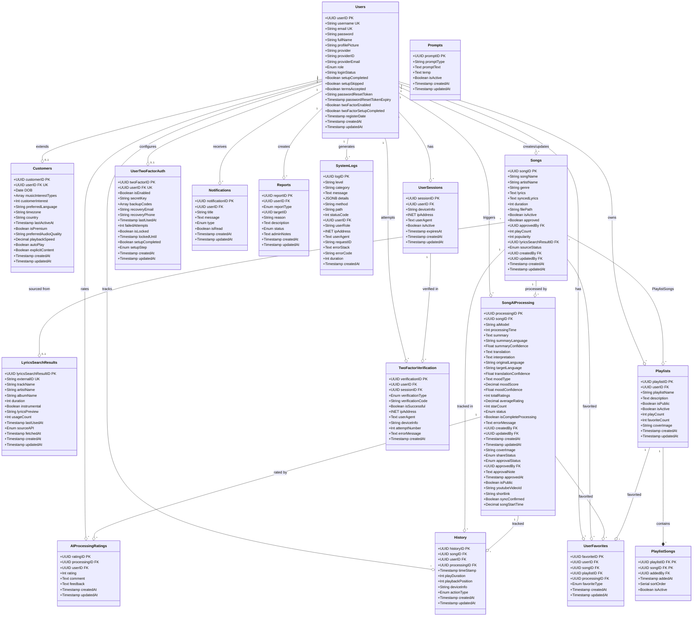

# MUSE MUSIC - Class Diagram

## Overview
Class diagram showing the data structure (Database Schema) and relationships of main entities in the MUSE MUSIC system

## Entity Relationship Diagram

## Database Schema Summary

**Total Tables: 18**
- **User Management**: Users, Customers, UserSessions, UserTwoFactorAuth, TwoFactorVerification (5 tables)
- **Music Content**: Songs, LyricsSearchResults, SongAIProcessing, AIProcessingRatings (4 tables)
- **Organization**: Playlists, PlaylistSongs (2 tables)
- **Activity**: History, UserFavorites (2 tables)
- **Communication**: Notifications, Reports (2 tables)
- **System**: Prompts, SystemLogs (2 tables)
- **Security**: UserSessions, UserTwoFactorAuth, TwoFactorVerification (integrated above)

## Key Relationships

### User Management
- **Users ↔ Customers**: One-to-one extension for customer-specific attributes
- **Users ↔ UserSessions**: One-to-many for tracking login sessions
- **Users ↔ UserTwoFactorAuth**: One-to-one for 2FA configuration
- **Users ↔ TwoFactorVerification**: One-to-many for 2FA verification attempts
- **Users ↔ SystemLogs**: One-to-many for system activity logging

### Content Management
- **Songs ↔ LyricsSearchResults**: Many-to-one linking songs to external API sources
- **Songs ↔ SongAIProcessing**: One-to-many for AI analysis results
- **SongAIProcessing ↔ AIProcessingRatings**: One-to-many for user ratings

### Music Organization
- **Playlists ↔ Songs**: Many-to-many through PlaylistSongs junction table
- **Users ↔ Playlists**: One-to-many ownership
- **Users ↔ UserFavorites**: One-to-many for favorites (songs/playlists)

### Activity Tracking
- **History**: Tracks user interactions with songs and AI processing
- **UserFavorites**: Tracks user favorites for songs and playlists
- **AIProcessingRatings**: Tracks user ratings for AI processing results

### Security & Communication
- **UserSessions**: Active login sessions per user
- **UserTwoFactorAuth**: 2FA configuration per user
- **TwoFactorVerification**: 2FA verification attempts
- **Notifications**: System notifications to users
- **Reports**: User-submitted reports

## Enum Types

### User Role
- `customer`: Regular user
- `admin`: Administrator
- `super_admin`: Super administrator

### Share Status (SongAIProcessing)
- `private`: Not shared
- `public_pending`: Pending approval
- `public_approved`: Approved and public

### Approval Status (SongAIProcessing)
- `pending`: Awaiting review
- `approved`: Approved
- `rejected`: Rejected

### Processing Status
- `processing`: In progress
- `completed`: Finished
- `failed`: Failed

### Source Status (Songs)
- `manual`: User-entered lyrics
- `from_lyrics_search`: From external API
- `external`: Other external sources

### Action Type (History)
- `view`: User viewed song
- `save`: User saved translation

### Report Type
- `song`: Report a song
- `playlist`: Report a playlist
- `user`: Report a user
- `ai`: Report AI processing result

### Verification Type (2FA)
- `totp`: Time-based OTP
- `backup_code`: Backup code
- `recovery_email`: Email recovery
- `recovery_sms`: SMS recovery

### Prompt Type
- `translation`: Translation prompts
- `mood`: Mood analysis prompts
- `both`: Combined prompts

### Log Level (SystemLogs)
- `info`: Information logs
- `error`: Error logs
- `warn`: Warning logs
- `debug`: Debug logs

## Database Files Reference
- Schema: `backend/database/migrations/001_create_initial_schema.sql`
- Services: `backend/src/services/*.js`
- Models: `backend/src/models/*.js`

