# MUSE MUSIC - C4 Component Diagram

## Overview
C4 Component Diagram showing the internal structure of MUSE MUSIC system, organized by layers with clear component responsibilities and data flow.

**Last Updated:** November 25, 2025  
**Repository:** tikpoptv/MUSE-MUSIC  
**Branch:** docs/diagrams  
**Diagram Type:** C4 Level 3 - Component Diagram

---

## 🏗️ MUSE MUSIC Component Diagram

```mermaid
graph TB
    subgraph "Client"
        CLIENT["<> Next.js Web App<br/>(React 19 + TypeScript)"]
    end
    
    subgraph "Application Core"
        subgraph "Frontend Layer"
            PAGES["<> Pages<br/>(Login/Register/Song/<br/>ForYou/Account/Admin)"]
            COMPONENTS["<> UI Components<br/>(Navbar/MusicCard/<br/>LyricsViewer/Player)"]
            SERVICES_F["<> Frontend Services<br/>(Auth/Song/Analysis/<br/>YouTube/Image)"]
        end
        
        subgraph "Backend Layer - API Orchestrator"
            API_GATEWAY["<> Express Server<br/>(Port 3001)"]
            
            ROUTES["<> API Routes<br/>(27 endpoints)"]
            
            CONTROLLERS["<> Controllers<br/>(Auth/Song/Lyrics/<br/>Translation/Admin)"]
            
            MIDDLEWARE["<> Security Middleware<br/>(Helmet/CORS/JWT/<br/>2FA/Rate Limiter)"]
        end
        
        subgraph "Business Logic Layer"
            AUTH_SVC["<> Authentication Service"]
            SONG_SVC["<> Song Management Service"]
            LYRICS_SVC["<> Lyrics Service"]
            TRANSLATE_SVC["<> Translation Service"]
            YOUTUBE_SVC["<> YouTube Service"]
            IMAGE_SVC["<> Image Storage Service"]
            ADMIN_SVC["<> Admin Service"]
            RECOMMEND_SVC["<> Recommendation Service"]
        end
        
        subgraph "Integration Layer"
            PYTHON_SCRIPT["<> YouTube Transcript<br/>(Python Script)"]
            EMAIL_SVC["<> Email Service"]
            N8N_WF["<> Workflow Service"]
        end
    end
    
    subgraph "Data Stores"
        subgraph "Primary Database"
            DB_USERS[("<> Users DB")]
            DB_SONGS[("<> Songs DB")]
            DB_PROCESSING[("<> AI Processing DB")]
            DB_ACTIVITY[("<> User Activity DB<br/>(Favorites/History/<br/>Ratings)")]
            DB_SYSTEM[("<> System Logs DB")]
        end
    end
    
    subgraph "External Services & Devices"
        subgraph "Storage"
            MINIO["<> MinIO<br/>(S3 Storage)"]
            CLOUDFLARE["<> CloudFlare CDN"]
        end
        
        subgraph "AI & Automation"
            N8N["<> N8N Workflow Engine"]
            OLLAMA["<> Ollama AI<br/>(gpt-oss:120b)"]
        end
        
        subgraph "External APIs"
            LRCLIB["<> LRCLIB API<br/>(Lyrics Database)"]
            YOUTUBE_API["<> YouTube Data API v3"]
            YOUTUBE_TRANSCRIPT["<> YouTube Transcript API"]
            GOOGLE_OAUTH["<> Google OAuth 2.0"]
        end
    end
    
    %% Client Connections
    CLIENT -->|REST/WebSocket| API_GATEWAY
    CLIENT -.->|Static Assets| CLOUDFLARE
    
    %% Frontend Layer Flow
    PAGES --> COMPONENTS
    PAGES --> SERVICES_F
    COMPONENTS --> SERVICES_F
    SERVICES_F -->|HTTP/JSON| API_GATEWAY
    
    %% Backend Entry Flow
    API_GATEWAY --> MIDDLEWARE
    MIDDLEWARE --> ROUTES
    ROUTES --> CONTROLLERS
    
    %% Controllers to Services
    CONTROLLERS --> AUTH_SVC
    CONTROLLERS --> SONG_SVC
    CONTROLLERS --> LYRICS_SVC
    CONTROLLERS --> TRANSLATE_SVC
    CONTROLLERS --> YOUTUBE_SVC
    CONTROLLERS --> IMAGE_SVC
    CONTROLLERS --> ADMIN_SVC
    CONTROLLERS --> RECOMMEND_SVC
    
    %% Business Logic to Integration
    TRANSLATE_SVC --> N8N_WF
    YOUTUBE_SVC --> PYTHON_SCRIPT
    AUTH_SVC --> EMAIL_SVC
    
    %% Integration to External
    N8N_WF -->|Webhook| N8N
    EMAIL_SVC -->|Webhook| N8N
    PYTHON_SCRIPT -->|HTTP| YOUTUBE_TRANSCRIPT
    
    %% Services to Database
    AUTH_SVC --> DB_USERS
    SONG_SVC --> DB_SONGS
    SONG_SVC --> DB_PROCESSING
    LYRICS_SVC --> DB_SONGS
    TRANSLATE_SVC --> DB_PROCESSING
    YOUTUBE_SVC --> DB_SONGS
    IMAGE_SVC --> DB_SONGS
    ADMIN_SVC --> DB_USERS
    ADMIN_SVC --> DB_SONGS
    ADMIN_SVC --> DB_PROCESSING
    ADMIN_SVC --> DB_SYSTEM
    RECOMMEND_SVC --> DB_ACTIVITY
    RECOMMEND_SVC --> DB_SONGS
    
    %% Services to External Storage
    IMAGE_SVC -->|S3 API| MINIO
    MINIO --> CLOUDFLARE
    
    %% Services to External APIs
    LYRICS_SVC -->|HTTP GET| LRCLIB
    YOUTUBE_SVC -->|API Call| YOUTUBE_API
    AUTH_SVC -->|OAuth 2.0| GOOGLE_OAUTH
    
    %% N8N to AI
    N8N -->|HTTP POST| OLLAMA
    
    %% Activity Tracking
    SONG_SVC --> DB_ACTIVITY
    
    %% Logging
    MIDDLEWARE --> DB_SYSTEM
    CONTROLLERS --> DB_SYSTEM
    
    style CLIENT fill:#e3f2fd
    style API_GATEWAY fill:#7B61FF,color:#fff
    style N8N fill:#ff6d5a,color:#fff
    style OLLAMA fill:#000,color:#fff
    style MINIO fill:#C72C48,color:#fff
    style GOOGLE_OAUTH fill:#4285F4,color:#fff
    style CLOUDFLARE fill:#F38020,color:#fff
```



---

## 📋 Component Descriptions

### Client Layer

| Component | Technology | Responsibilities |
|-----------|-----------|-----------------|
| **Next.js Web App** | React 19 + TypeScript 5 | • User interface rendering<br/>• Client-side routing<br/>• State management<br/>• API communication |

### Frontend Layer (Application Core)

| Component | Files | Responsibilities |
|-----------|-------|-----------------|
| **Pages** | 9+ page groups | • Route handling<br/>• Page-level layouts<br/>• Data fetching<br/>• SEO optimization |
| **UI Components** | 50+ components | • Reusable UI elements<br/>• Interactive widgets<br/>• Modal dialogs<br/>• Form controls |
| **Frontend Services** | 9 TypeScript services | • API abstraction<br/>• HTTP client configuration<br/>• Error handling<br/>• Token management |

### Backend Layer - API Orchestrator

| Component | Files | Responsibilities |
|-----------|-------|-----------------|
| **Express Server** | index.js | • HTTP server management<br/>• Port 3001<br/>• Route registration<br/>• Global error handling |
| **API Routes** | 27 route files | • Endpoint definitions<br/>• Request routing<br/>• Parameter validation<br/>• Response formatting |
| **Controllers** | 29 controller files | • Request handling<br/>• Input validation<br/>• Business logic delegation<br/>• Response construction |
| **Security Middleware** | 8 middleware modules | • JWT verification<br/>• 2FA validation<br/>• CORS policy<br/>• Rate limiting<br/>• Origin enforcement<br/>• Security headers |

### Business Logic Layer

| Component | Purpose | External Dependencies |
|-----------|---------|---------------------|
| **Authentication Service** | User login/register/OAuth | Google OAuth 2.0, JWT, Bcrypt |
| **Song Management Service** | CRUD operations for songs | PostgreSQL, MinIO |
| **Lyrics Service** | Fetch and cache lyrics | LRCLIB API |
| **Translation Service** | AI-powered translation | N8N Workflow Engine, Ollama |
| **YouTube Service** | Video search and transcript | YouTube Data API v3, Python Script |
| **Image Storage Service** | Upload/delete cover images | MinIO S3 API, CloudFlare CDN |
| **Admin Service** | Admin panel operations | PostgreSQL (all tables) |
| **Recommendation Service** | Personalized song recommendations | User activity data |

### Integration Layer

| Component | Technology | Purpose |
|-----------|-----------|---------|
| **YouTube Transcript** | Python 3.x | Fetch video transcripts via subprocess |
| **Email Service** | N8N Webhook | Send email notifications |
| **Workflow Service** | N8N API | Trigger AI translation workflows |

### Data Stores

| Database | Tables | Purpose |
|----------|--------|---------|
| **Users DB** | Users, Customers, UserSessions, UserSettings | Authentication and user preferences |
| **Songs DB** | Songs, LyricsSearchResults, SharedSongs | Song metadata and lyrics cache |
| **AI Processing DB** | SongAIProcessing, Prompts | Translation results and AI prompts |
| **User Activity DB** | UserFavorites, UserHistory, UserRatings | User interactions and feedback |
| **System Logs DB** | SystemLogs, ErrorLogs, AuditLogs, HealthCheckStatus | Monitoring and auditing |

### External Services

| Service | Provider | Integration Method | Purpose |
|---------|----------|-------------------|---------|
| **MinIO** | Self-hosted | S3 API (minio SDK) | Object storage for cover images |
| **CloudFlare** | CloudFlare | CDN | Content delivery and DDoS protection |
| **N8N Workflow Engine** | Self-hosted | Webhook POST | AI translation orchestration |
| **Ollama AI** | Self-hosted | HTTP POST (via N8N) | Lyrics translation (gpt-oss:120b) |
| **LRCLIB API** | External | HTTP GET | Lyrics database lookup |
| **YouTube Data API v3** | Google | REST API | Video search |
| **YouTube Transcript API** | Python Library | Python subprocess | Transcript extraction |
| **Google OAuth 2.0** | Google | OAuth flow | Social authentication |

---

## 🔄 Key Component Interactions

### 1. User Authentication Flow
```
Client → Express Server → Security Middleware → Auth Controller 
→ Authentication Service → Users DB + Google OAuth → JWT Token → Client
```

### 2. Song Analysis with AI Translation
```
Client → Frontend Services → API Routes → Translation Controller 
→ Translation Service → Workflow Service → N8N → Ollama AI 
→ AI Processing DB → Response → Client
```

### 3. Lyrics Fetching with Cache
```
Client → Frontend Services → Lyrics Controller → Lyrics Service 
→ Check Songs DB Cache → If miss: LRCLIB API → Cache → Response → Client
```

### 4. Cover Image Upload
```
Client → Image Service → Image Controller → Image Storage Service 
→ MinIO S3 → CloudFlare CDN → URL → Songs DB → Client
```

### 5. YouTube Integration
```
Client → YouTube Service → YouTube Controller → YouTube Service 
→ YouTube Data API v3 (search) → Results → Client

For Transcript:
YouTube Service → Python Script → YouTube Transcript API → Text → Client
```

---

## 🛡️ Security Components

### Middleware Chain (Order of Execution)
1. **Helmet** - Applies security headers (XSS, CSP, HSTS)
2. **CORS** - Validates origin headers
3. **Morgan** - Logs HTTP requests
4. **Logger** - Custom request/response logging
5. **enforceFrontendOrigin** - Strict origin validation
6. **authMiddleware** - JWT token verification (protected routes)
7. **twoFactorMiddleware** - 2FA verification (admin routes)
8. **Rate Limiters** - Prevents API abuse (analysis/transcript routes)
9. **Error Handler** - Global error catching

### Protected Route Layers
```
Public Routes → [CORS + Origin Check]
User Routes → [CORS + Origin Check + JWT Verify]
Admin Routes → [CORS + Origin Check + JWT Verify + 2FA Check]
High-Load Routes → [All above + Rate Limiter]
```

---

## 📊 Component Statistics

### Backend Components
- **Total Route Files**: 27
- **Total Controllers**: 29
- **Total Business Services**: 31
- **Middleware Modules**: 8
- **API Endpoints**: 100+ (across all routes)

### Database Components
- **Active Tables**: 14
- **Future Tables**: 4
- **Total Schemas**: 18

### External Integrations
- **Self-Hosted Services**: 3 (MinIO, N8N, Ollama)
- **External APIs**: 4 (LRCLIB, YouTube Data, YouTube Transcript, Google OAuth)
- **CDN Services**: 1 (CloudFlare)

### Frontend Components
- **Pages**: 9+ page groups
- **Reusable Components**: 50+
- **Services**: 9
- **Utilities**: 5+

---

## 🎯 Component Responsibilities Matrix

### Core Features Mapping

| Feature | Frontend Components | Backend Services | Database | External Services |
|---------|-------------------|-----------------|----------|------------------|
| **User Authentication** | Login Page, Register Page, AuthGuard | Authentication Service, JWT Service | Users DB, Sessions DB | Google OAuth 2.0 |
| **Song Search** | Song Page, MusicCard | Song Service, YouTube Service | Songs DB | YouTube Data API v3 |
| **Lyrics Display** | LyricsViewer, Player | Lyrics Service | Songs DB | LRCLIB API |
| **AI Translation** | MoodSection, FeedbackSection | Translation Service, Workflow Service | AI Processing DB | N8N, Ollama |
| **Image Upload** | CoverImageUpload | Image Storage Service | Songs DB | MinIO, CloudFlare |
| **User Activity** | ForYou Page, Favorites | Recommendation Service | User Activity DB | - |
| **Admin Panel** | Admin Pages, AdminGuard | Admin Service | All DBs | - |
| **2FA Security** | 2FA Modals | Two-Factor Service | User Settings DB | - |

---

## 🔧 Technology Stack per Layer

### Client Layer
- **Framework**: Next.js 15.5.4
- **UI Library**: React 19.1.0
- **Language**: TypeScript 5
- **Styling**: Tailwind CSS 4
- **Components**: Shadcn/ui + Radix UI
- **State Management**: React Context + Local Storage
- **HTTP Client**: Axios (configured in api.ts)

### Application Core
- **Runtime**: Node.js 24
- **Framework**: Express 4.18.2
- **Language**: JavaScript ES6+
- **Database Driver**: pg 8.11.3 + pg-pool 3.6.1

### Security Stack
- **Authentication**: jsonwebtoken 9.0.2
- **Password Hashing**: bcrypt 6.0.0
- **OAuth**: google-auth-library 10.3.0
- **2FA**: speakeasy 2.0.0 + qrcode 1.5.4
- **Security Headers**: helmet 7.1.0
- **CORS**: cors 2.8.5

### Storage & Processing
- **Object Storage**: minio 8.0.6
- **File Upload**: multer 2.0.2
- **Database**: PostgreSQL 14+

### External Integration
- **Python**: Python 3.x (youtube-transcript-api)
- **AI Model**: Ollama (gpt-oss:120b)
- **Workflow Engine**: N8N
- **CDN**: CloudFlare

---

## 📝 Implementation Notes

### ✅ Fully Operational Components
All components listed in this diagram are **fully implemented and operational** in the codebase, with the exception of:

### ⚠️ Future Components (Not Yet Implemented)
The following database tables exist in the schema but have no associated business logic:
- **Playlists** & **PlaylistSongs** (UC13: Playlist Management)
- **Notifications** (UC17: Notification System)
- **Reports** (UC18: Report System)

### Design Patterns Used
- **Layered Architecture**: Clear separation of Frontend, Backend, Business Logic, and Data layers
- **Service-Oriented**: Business logic encapsulated in service modules
- **Repository Pattern**: Database access abstracted through service layer
- **Middleware Chain**: Request processing pipeline
- **Adapter Pattern**: External API integrations wrapped in service interfaces

### Scalability Considerations
- **Stateless Backend**: JWT-based auth enables horizontal scaling
- **CDN Integration**: Static assets and images served via CloudFlare
- **Database Connection Pooling**: pg-pool for efficient database connections
- **Rate Limiting**: Protects high-load endpoints
- **Microservice-Ready**: N8N workflow engine allows AI processing to scale independently

---

## 🔍 Verification

- **Component Names**: Verified against actual file names in codebase
- **Route Paths**: Verified against `backend/src/routes/index.js`
- **Database Tables**: Verified against `backend/database/migrations/001_create_initial_schema.sql`
- **External Services**: Verified against `backend/.env.example` and service files
- **Technology Versions**: Verified against `package.json` files

**Last Verified**: November 25, 2025  
**Codebase Branch**: docs/diagrams  
**Verification Method**: File inspection + grep search + schema analysis
