# MUSE MUSIC - Component Diagrams by Use Case

## Overview
Component diagrams showing the structure and relationships of components in each main use case of the system

---

## UC1: User Registration

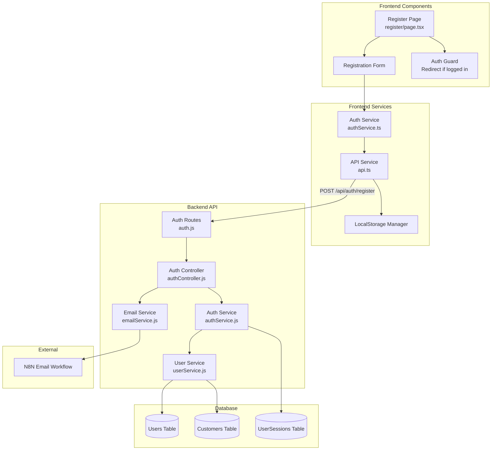
```mermaid
graph TB
    subgraph "Frontend Components"
        REGPAGE[Register Page<br/>register/page.tsx]
        REGFORM[Registration Form]
        AUTHGUARD[Auth Guard<br/>Redirect if logged in]
    end
    
    subgraph "Frontend Services"
        AUTHSVC_F[Auth Service<br/>authService.ts]
        APISVC_F[API Service<br/>api.ts]
        LOCALSTORAGE[LocalStorage Manager]
    end
    
    subgraph "Backend API"
        AUTHROUTE[Auth Routes<br/>auth.js]
        AUTHCTRL[Auth Controller<br/>authController.js]
        AUTHSVC_B[Auth Service<br/>authService.js]
        USERSVC[User Service<br/>userService.js]
        EMAILSVC[Email Service<br/>emailService.js]
    end
    
    subgraph "Database"
        USERS[(Users Table)]
        CUSTOMERS[(Customers Table)]
        SESSIONS[(UserSessions Table)]
    end
    
    subgraph "External"
        N8N[N8N Email Workflow]
    end
    
    REGPAGE --> AUTHGUARD
    REGPAGE --> REGFORM
    REGFORM --> AUTHSVC_F
    AUTHSVC_F --> APISVC_F
    APISVC_F -->|POST /api/auth/register| AUTHROUTE
    AUTHROUTE --> AUTHCTRL
    AUTHCTRL --> AUTHSVC_B
    AUTHSVC_B --> USERSVC
    USERSVC --> USERS
    USERSVC --> CUSTOMERS
    AUTHSVC_B --> SESSIONS
    AUTHCTRL --> EMAILSVC
    EMAILSVC --> N8N
    APISVC_F --> LOCALSTORAGE
```

**Key Components:**
- `frontend/src/app/register/page.tsx` - Registration page UI
- `frontend/src/services/authService.ts` - Frontend authentication logic
- `backend/src/routes/auth.js` - Auth API routes
- `backend/src/controllers/authController.js` - Registration handler
- `backend/src/services/authService.js` - Auth business logic
- `backend/src/services/userService.js` - User CRUD operations
- `backend/src/services/emailService.js` - Email notifications

---

## UC2: User Login (OAuth & Local)

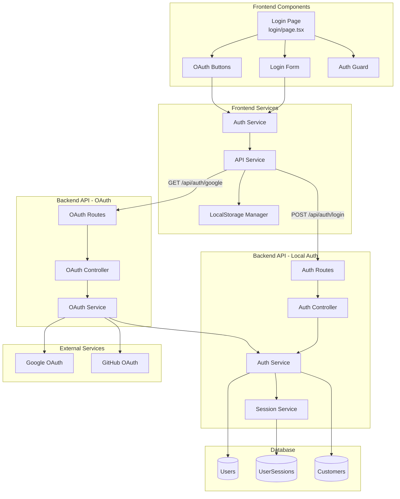
```mermaid
graph TB
    subgraph "Frontend Components"
        LOGINPAGE[Login Page<br/>login/page.tsx]
        LOGINFORM[Login Form]
        OAUTHBTN[OAuth Buttons]
        AUTHGUARD[Auth Guard]
    end
    
    subgraph "Frontend Services"
        AUTHSVC_F[Auth Service]
        APISVC_F[API Service]
        LOCALSTORAGE[LocalStorage Manager]
    end
    
    subgraph "Backend API - Local Auth"
        AUTHROUTE[Auth Routes]
        AUTHCTRL[Auth Controller]
        AUTHSVC_B[Auth Service]
        SESSIONSVC[Session Service]
    end
    
    subgraph "Backend API - OAuth"
        OAUTHROUTE[OAuth Routes]
        OAUTHCTRL[OAuth Controller]
        OAUTHSVC[OAuth Service]
    end
    
    subgraph "External Services"
        GOOGLE[Google OAuth]
        GITHUB[GitHub OAuth]
    end
    
    subgraph "Database"
        USERS[(Users)]
        SESSIONS[(UserSessions)]
        CUSTOMERS[(Customers)]
    end
    
    LOGINPAGE --> AUTHGUARD
    LOGINPAGE --> LOGINFORM
    LOGINPAGE --> OAUTHBTN
    
    LOGINFORM --> AUTHSVC_F
    OAUTHBTN --> AUTHSVC_F
    
    AUTHSVC_F --> APISVC_F
    APISVC_F -->|POST /api/auth/login| AUTHROUTE
    APISVC_F -->|GET /api/auth/google| OAUTHROUTE
    
    AUTHROUTE --> AUTHCTRL
    AUTHCTRL --> AUTHSVC_B
    AUTHSVC_B --> SESSIONSVC
    
    OAUTHROUTE --> OAUTHCTRL
    OAUTHCTRL --> OAUTHSVC
    OAUTHSVC --> GOOGLE
    OAUTHSVC --> GITHUB
    OAUTHSVC --> AUTHSVC_B
    
    AUTHSVC_B --> USERS
    AUTHSVC_B --> CUSTOMERS
    SESSIONSVC --> SESSIONS
    
    APISVC_F --> LOCALSTORAGE
```

**Key Components:**
- `frontend/src/app/login/page.tsx` - Login page with local & OAuth
- `frontend/src/components/AuthGuard.tsx` - Route protection
- `backend/src/routes/auth.js` - Local auth routes
- `backend/src/routes/oauth.js` - OAuth routes (Google, GitHub)
- `backend/src/services/authService.js` - JWT token management
- `backend/src/services/sessionService.js` - Session lifecycle
- `backend/src/middleware/authMiddleware.js` - Token verification

---

## UC3: User Setup (Onboarding)

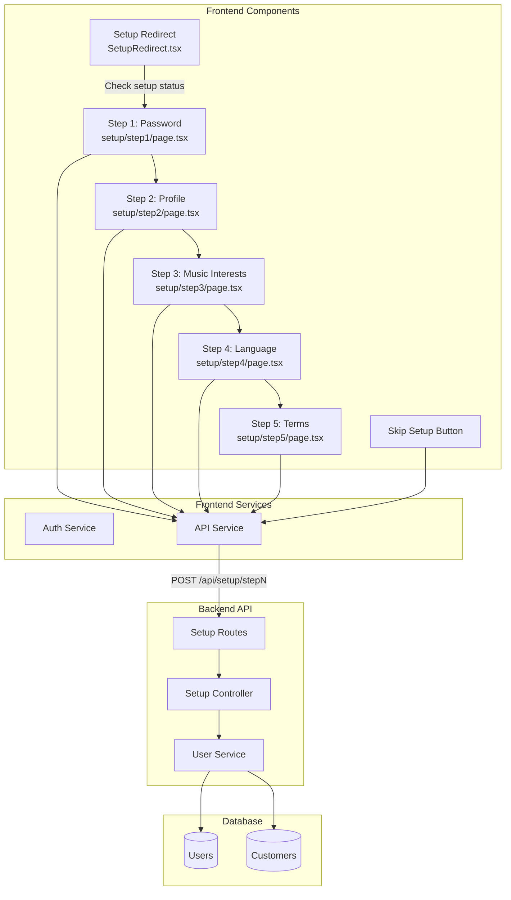
```mermaid
graph TB
    subgraph "Frontend Components"
        STEP1[Step 1: Password<br/>setup/step1/page.tsx]
        STEP2[Step 2: Profile<br/>setup/step2/page.tsx]
        STEP3[Step 3: Music Interests<br/>setup/step3/page.tsx]
        STEP4[Step 4: Language<br/>setup/step4/page.tsx]
        STEP5[Step 5: Terms<br/>setup/step5/page.tsx]
        SETUPREDIRECT[Setup Redirect<br/>SetupRedirect.tsx]
        SKIPBTN[Skip Setup Button]
    end
    
    subgraph "Frontend Services"
        AUTHSVC_F[Auth Service]
        APISVC_F[API Service]
    end
    
    subgraph "Backend API"
        SETUPROUTE[Setup Routes]
        SETUPCTRL[Setup Controller]
        USERSVC[User Service]
    end
    
    subgraph "Database"
        USERS[(Users)]
        CUSTOMERS[(Customers)]
    end
    
    SETUPREDIRECT -->|Check setup status| STEP1
    STEP1 --> STEP2
    STEP2 --> STEP3
    STEP3 --> STEP4
    STEP4 --> STEP5
    
    STEP1 --> APISVC_F
    STEP2 --> APISVC_F
    STEP3 --> APISVC_F
    STEP4 --> APISVC_F
    STEP5 --> APISVC_F
    SKIPBTN --> APISVC_F
    
    APISVC_F -->|POST /api/setup/stepN| SETUPROUTE
    SETUPROUTE --> SETUPCTRL
    SETUPCTRL --> USERSVC
    USERSVC --> USERS
    USERSVC --> CUSTOMERS
```

**Key Components:**
- `frontend/src/app/setup/step[1-5]/page.tsx` - 5-step setup wizard
- `frontend/src/components/SetupRedirect.tsx` - Auto-redirect to setup
- `frontend/src/components/setup/SkipSetupButton.tsx` - Skip option
- `backend/src/routes/setup.js` - Setup completion routes
- `backend/src/services/userService.js` - Update user preferences

---

## UC4: Search Songs

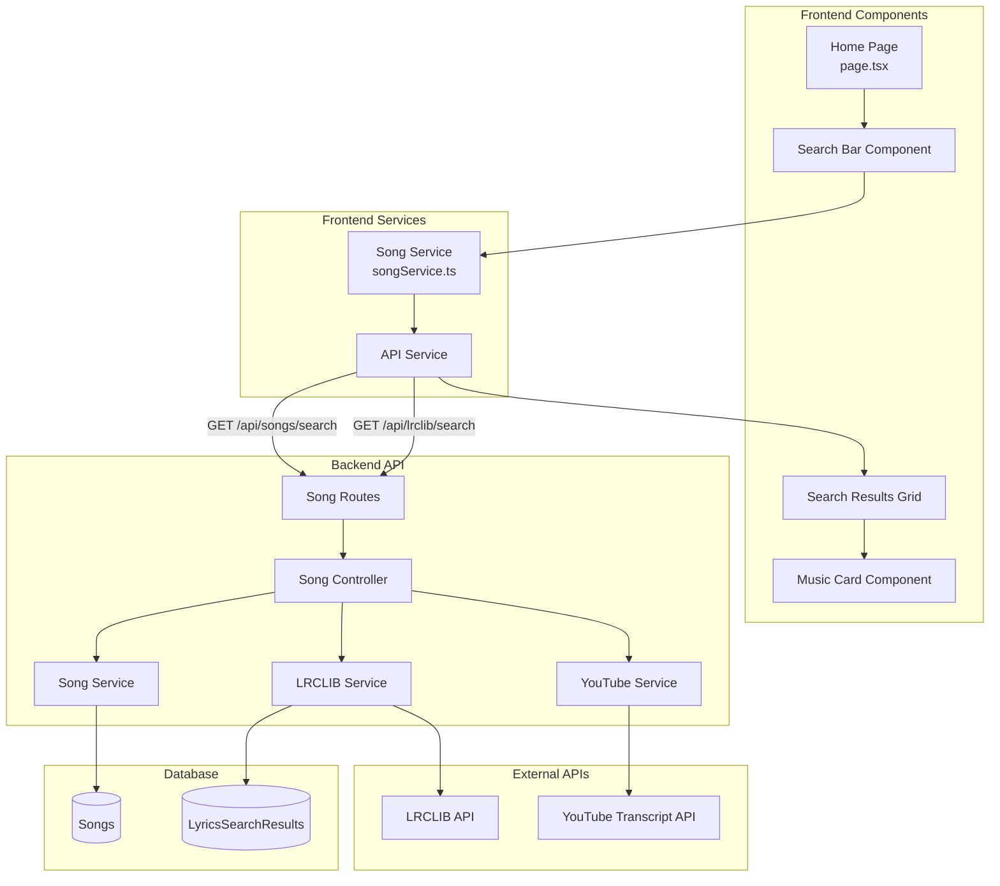
```mermaid
graph TB
    subgraph "Frontend Components"
        HOMEPAGE[Home Page<br/>page.tsx]
        SEARCHBAR[Search Bar Component]
        SEARCHRESULTS[Search Results Grid]
        MUSICCARD[Music Card Component]
    end
    
    subgraph "Frontend Services"
        SONGSVC_F[Song Service<br/>songService.ts]
        APISVC_F[API Service]
    end
    
    subgraph "Backend API"
        SONGROUTE[Song Routes]
        SONGCTRL[Song Controller]
        SONGSVC_B[Song Service]
        LRCLIB[LRCLIB Service]
        YOUTUBE[YouTube Service]
    end
    
    subgraph "External APIs"
        LRCLIB_API[LRCLIB API]
        YOUTUBE_API[YouTube Transcript API]
    end
    
    subgraph "Database"
        SONGS[(Songs)]
        LYRICSSEARCH[(LyricsSearchResults)]
    end
    
    HOMEPAGE --> SEARCHBAR
    SEARCHBAR --> SONGSVC_F
    SONGSVC_F --> APISVC_F
    APISVC_F -->|GET /api/songs/search| SONGROUTE
    APISVC_F -->|GET /api/lrclib/search| SONGROUTE
    
    SONGROUTE --> SONGCTRL
    SONGCTRL --> SONGSVC_B
    SONGCTRL --> LRCLIB
    SONGCTRL --> YOUTUBE
    
    SONGSVC_B --> SONGS
    LRCLIB --> LRCLIB_API
    LRCLIB --> LYRICSSEARCH
    YOUTUBE --> YOUTUBE_API
    
    APISVC_F --> SEARCHRESULTS
    SEARCHRESULTS --> MUSICCARD
```

**Key Components:**
- `frontend/src/app/page.tsx` - Home page with search
- `frontend/src/components/Navbar.tsx` - Global search bar
- `frontend/src/services/songService.ts` - Song search API
- `backend/src/routes/songs.js` - Song search routes
- `backend/src/routes/lrclib.js` - External lyrics search
- `backend/src/services/songService.js` - Song business logic
- `backend/src/services/lrclibService.js` - LRCLIB integration
- `backend/src/services/youtubeService.js` - YouTube transcript

---

## UC5: AI Song Analysis

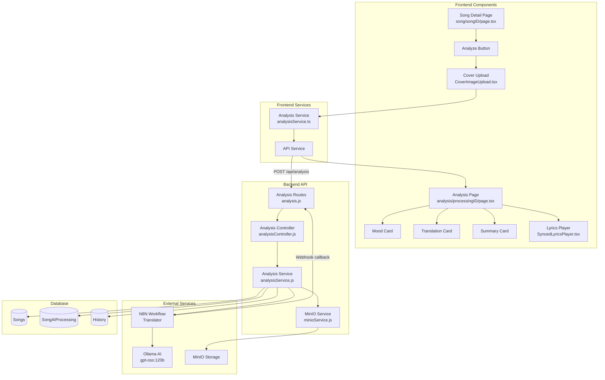
```mermaid
graph TB
    subgraph "Frontend Components"
        SONGPAGE[Song Detail Page<br/>song/songID/page.tsx]
        ANALYZEBTN[Analyze Button]
        ANALYSISPAGE[Analysis Page<br/>analysis/processingID/page.tsx]
        MOODCARD[Mood Card]
        TRANSLATIONCARD[Translation Card]
        SUMMARYCARD[Summary Card]
        LYRICSPLAYER[Lyrics Player<br/>SyncedLyricsPlayer.tsx]
        COVERUPLOAD[Cover Upload<br/>CoverImageUpload.tsx]
    end
    
    subgraph "Frontend Services"
        ANALYSISSVC_F[Analysis Service<br/>analysisService.ts]
        APISVC_F[API Service]
    end
    
    subgraph "Backend API"
        ANALYSISROUTE[Analysis Routes<br/>analysis.js]
        ANALYSISCTRL[Analysis Controller<br/>analysisController.js]
        ANALYSISSVC_B[Analysis Service<br/>analysisService.js]
        MINIOSVC[MinIO Service<br/>minioService.js]
    end
    
    subgraph "External Services"
        N8N[N8N Workflow<br/>Translator]
        OLLAMA[Ollama AI<br/>gpt-oss:120b]
        MINIO[MinIO Storage]
    end
    
    subgraph "Database"
        SONGS[(Songs)]
        PROCESSING[(SongAIProcessing)]
        HISTORY[(History)]
    end
    
    SONGPAGE --> ANALYZEBTN
    ANALYZEBTN --> COVERUPLOAD
    COVERUPLOAD --> ANALYSISSVC_F
    ANALYSISSVC_F --> APISVC_F
    APISVC_F -->|POST /api/analysis| ANALYSISROUTE
    
    ANALYSISROUTE --> ANALYSISCTRL
    ANALYSISCTRL --> ANALYSISSVC_B
    ANALYSISSVC_B --> SONGS
    ANALYSISSVC_B --> PROCESSING
    ANALYSISSVC_B --> MINIOSVC
    ANALYSISSVC_B --> N8N
    
    MINIOSVC --> MINIO
    N8N --> OLLAMA
    N8N -->|Webhook callback| ANALYSISROUTE
    
    ANALYSISSVC_B --> HISTORY
    
    APISVC_F --> ANALYSISPAGE
    ANALYSISPAGE --> MOODCARD
    ANALYSISPAGE --> TRANSLATIONCARD
    ANALYSISPAGE --> SUMMARYCARD
    ANALYSISPAGE --> LYRICSPLAYER
```

**Key Components:**
- `frontend/src/app/song/[songID]/page.tsx` - Song detail with analyze option
- `frontend/src/app/song/[songID]/analysis/[processingID]/page.tsx` - Analysis results
- `frontend/src/components/SyncedLyricsPlayer.tsx` - Synced lyrics player
- `frontend/src/components/CoverImageUpload.tsx` - Cover upload
- `frontend/src/services/analysisService.ts` - Analysis API calls
- `backend/src/routes/analysis.js` - Analysis routes
- `backend/src/controllers/analysisController.js` - Analysis orchestration
- `backend/src/services/analysisService.js` - AI processing logic
- `backend/src/services/minioService.js` - File upload to MinIO
- `n8n-translator-workflow.json` - N8N workflow definition

---

## UC6: Rate & Review Analysis

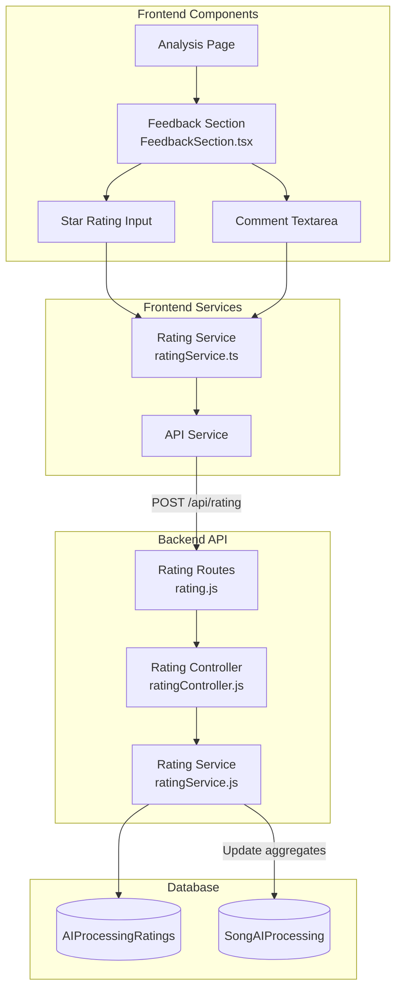
```mermaid
graph TB
    subgraph "Frontend Components"
        ANALYSISPAGE[Analysis Page]
        FEEDBACKSECTION[Feedback Section<br/>FeedbackSection.tsx]
        RATINGINPUT[Star Rating Input]
        COMMENTINPUT[Comment Textarea]
    end
    
    subgraph "Frontend Services"
        RATINGSVC_F[Rating Service<br/>ratingService.ts]
        APISVC_F[API Service]
    end
    
    subgraph "Backend API"
        RATINGROUTE[Rating Routes<br/>rating.js]
        RATINGCTRL[Rating Controller<br/>ratingController.js]
        RATINGSVC_B[Rating Service<br/>ratingService.js]
    end
    
    subgraph "Database"
        RATINGS[(AIProcessingRatings)]
        PROCESSING[(SongAIProcessing)]
    end
    
    ANALYSISPAGE --> FEEDBACKSECTION
    FEEDBACKSECTION --> RATINGINPUT
    FEEDBACKSECTION --> COMMENTINPUT
    
    RATINGINPUT --> RATINGSVC_F
    COMMENTINPUT --> RATINGSVC_F
    
    RATINGSVC_F --> APISVC_F
    APISVC_F -->|POST /api/rating| RATINGROUTE
    
    RATINGROUTE --> RATINGCTRL
    RATINGCTRL --> RATINGSVC_B
    
    RATINGSVC_B --> RATINGS
    RATINGSVC_B -->|Update aggregates| PROCESSING
```

**Key Components:**
- `frontend/src/components/FeedbackSection.tsx` - Rating & comment UI
- `frontend/src/services/ratingService.ts` - Rating submission
- `backend/src/routes/rating.js` - Rating API
- `backend/src/controllers/ratingController.js` - Rating handler
- `backend/src/services/ratingService.js` - Rating aggregation logic

---

## UC7: Share Analysis (Public)

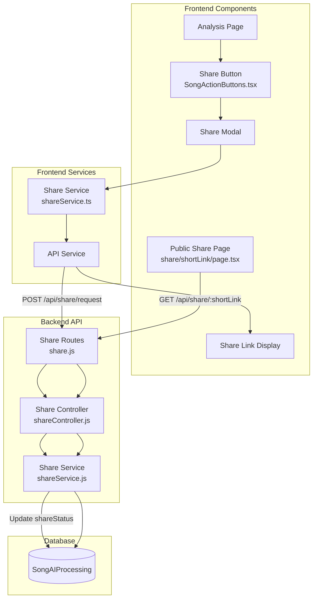
```mermaid
graph TB
    subgraph "Frontend Components"
        ANALYSISPAGE[Analysis Page]
        SHAREBTN[Share Button<br/>SongActionButtons.tsx]
        SHAREMODAL[Share Modal]
        SHARELINK[Share Link Display]
        PUBLICPAGE[Public Share Page<br/>share/shortLink/page.tsx]
    end
    
    subgraph "Frontend Services"
        SHARESVC_F[Share Service<br/>shareService.ts]
        APISVC_F[API Service]
    end
    
    subgraph "Backend API"
        SHAREROUTE[Share Routes<br/>share.js]
        SHARECTRL[Share Controller<br/>shareController.js]
        SHARESVC_B[Share Service<br/>shareService.js]
    end
    
    subgraph "Database"
        PROCESSING[(SongAIProcessing)]
    end
    
    ANALYSISPAGE --> SHAREBTN
    SHAREBTN --> SHAREMODAL
    SHAREMODAL --> SHARESVC_F
    SHARESVC_F --> APISVC_F
    APISVC_F -->|POST /api/share/request| SHAREROUTE
    
    SHAREROUTE --> SHARECTRL
    SHARECTRL --> SHARESVC_B
    SHARESVC_B -->|Update shareStatus| PROCESSING
    
    APISVC_F --> SHARELINK
    
    PUBLICPAGE -->|GET /api/share/:shortLink| SHAREROUTE
    SHAREROUTE --> SHARECTRL
    SHARECTRL --> SHARESVC_B
    SHARESVC_B --> PROCESSING
```

**Key Components:**
- `frontend/src/components/SongActionButtons.tsx` - Share button
- `frontend/src/app/share/[shortLink]/page.tsx` - Public share view
- `frontend/src/app/share/[shortLink]/ShareLinkClient.tsx` - Client component
- `frontend/src/services/shareService.ts` - Share API
- `backend/src/routes/share.js` - Share routes
- `backend/src/controllers/shareController.js` - Share logic
- `backend/src/services/shareService.js` - Share business logic

---

## UC8: Favorites & Archive

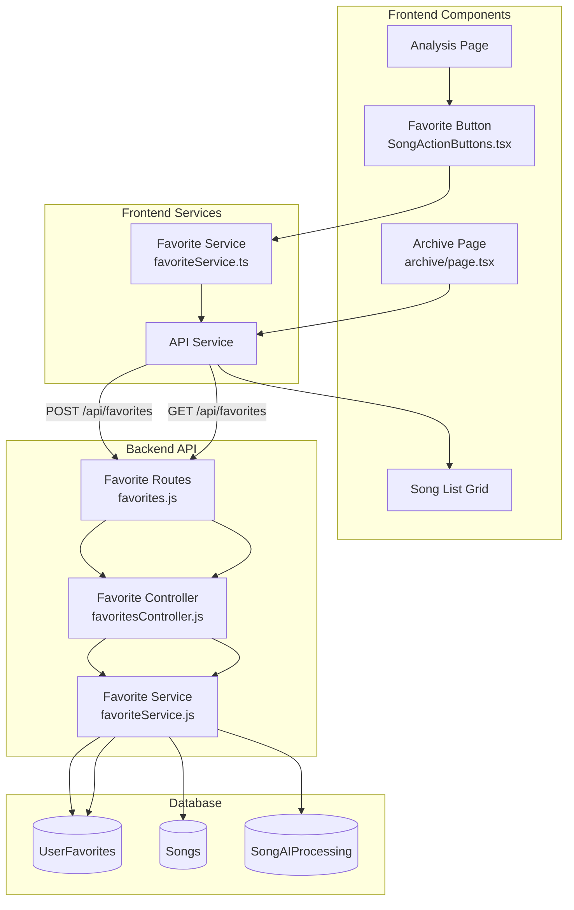
```mermaid
graph TB
    subgraph "Frontend Components"
        ANALYSISPAGE[Analysis Page]
        ARCHIVEPAGE[Archive Page<br/>archive/page.tsx]
        FAVBTN[Favorite Button<br/>SongActionButtons.tsx]
        SONGLIST[Song List Grid]
    end
    
    subgraph "Frontend Services"
        FAVORITESVC_F[Favorite Service<br/>favoriteService.ts]
        APISVC_F[API Service]
    end
    
    subgraph "Backend API"
        FAVROUTE[Favorite Routes<br/>favorites.js]
        FAVCTRL[Favorite Controller<br/>favoritesController.js]
        FAVSVC_B[Favorite Service<br/>favoriteService.js]
    end
    
    subgraph "Database"
        FAVORITES[(UserFavorites)]
        SONGS[(Songs)]
        PROCESSING[(SongAIProcessing)]
    end
    
    ANALYSISPAGE --> FAVBTN
    FAVBTN --> FAVORITESVC_F
    FAVORITESVC_F --> APISVC_F
    APISVC_F -->|POST /api/favorites| FAVROUTE
    
    FAVROUTE --> FAVCTRL
    FAVCTRL --> FAVSVC_B
    FAVSVC_B --> FAVORITES
    
    ARCHIVEPAGE --> APISVC_F
    APISVC_F -->|GET /api/favorites| FAVROUTE
    FAVROUTE --> FAVCTRL
    FAVCTRL --> FAVSVC_B
    FAVSVC_B --> FAVORITES
    FAVSVC_B --> SONGS
    FAVSVC_B --> PROCESSING
    APISVC_F --> SONGLIST
```

**Key Components:**
- `frontend/src/app/archive/page.tsx` - User's saved songs
- `frontend/src/components/SongActionButtons.tsx` - Favorite toggle
- `frontend/src/services/favoriteService.ts` - Favorite API
- `backend/src/routes/favorites.js` - Favorites routes
- `backend/src/controllers/favoritesController.js` - Favorites handler
- `backend/src/services/favoriteService.js` - Favorites CRUD

---

## UC9: For You (Personalized Feed)

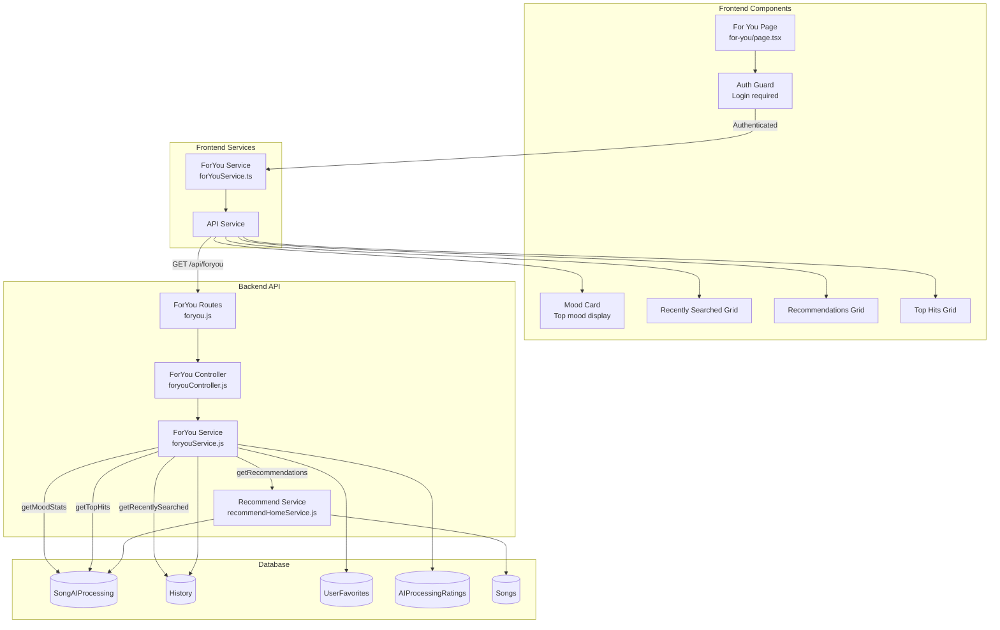
```mermaid
graph TB
    subgraph "Frontend Components"
        FORYOUPAGE[For You Page<br/>for-you/page.tsx]
        MOODCARD[Mood Card<br/>Top mood display]
        RECENTGRID[Recently Searched Grid]
        RECOMMENDGRID[Recommendations Grid]
        TOPHITSGRID[Top Hits Grid]
        AUTHGUARD[Auth Guard<br/>Login required]
    end
    
    subgraph "Frontend Services"
        FORYOUSVC_F[ForYou Service<br/>forYouService.ts]
        APISVC_F[API Service]
    end
    
    subgraph "Backend API"
        FORYOUROUTE[ForYou Routes<br/>foryou.js]
        FORYOUCTRL[ForYou Controller<br/>foryouController.js]
        FORYOUSVC_B[ForYou Service<br/>foryouService.js]
        RECOMMENDSVC[Recommend Service<br/>recommendHomeService.js]
    end
    
    subgraph "Database"
        PROCESSING[(SongAIProcessing)]
        HISTORY[(History)]
        FAVORITES[(UserFavorites)]
        RATINGS[(AIProcessingRatings)]
        SONGS[(Songs)]
    end
    
    FORYOUPAGE --> AUTHGUARD
    AUTHGUARD -->|Authenticated| FORYOUSVC_F
    FORYOUSVC_F --> APISVC_F
    APISVC_F -->|GET /api/foryou| FORYOUROUTE
    
    FORYOUROUTE --> FORYOUCTRL
    FORYOUCTRL --> FORYOUSVC_B
    
    FORYOUSVC_B -->|getMoodStats| PROCESSING
    FORYOUSVC_B -->|getRecentlySearched| HISTORY
    FORYOUSVC_B -->|getRecommendations| RECOMMENDSVC
    FORYOUSVC_B -->|getTopHits| PROCESSING
    
    RECOMMENDSVC --> PROCESSING
    RECOMMENDSVC --> SONGS
    
    FORYOUSVC_B --> HISTORY
    FORYOUSVC_B --> FAVORITES
    FORYOUSVC_B --> RATINGS
    
    APISVC_F --> MOODCARD
    APISVC_F --> RECENTGRID
    APISVC_F --> RECOMMENDGRID
    APISVC_F --> TOPHITSGRID
```

**Key Components:**
- `frontend/src/app/for-you/page.tsx` - Personalized feed page
- `frontend/src/components/MoodCard.tsx` - Mood visualization
- `frontend/src/services/forYouService.ts` - ForYou API
- `backend/src/routes/foryou.js` - ForYou routes
- `backend/src/controllers/foryouController.js` - ForYou handler
- `backend/src/services/foryouService.js` - Recommendation algorithm
- `backend/src/services/recommendHomeService.js` - Home recommendations

**Algorithm Components:**
- Mood Stats: Weighted mood counting from user's processing history
- Recently Searched: User's recent song views
- Recommendations: Mood-based public songs
- Top Hits: Highest-rated public songs

---

## UC10: Admin - Approve Analysis

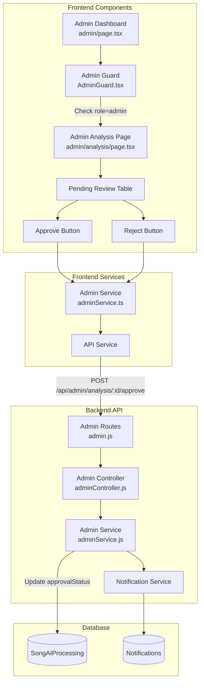
```mermaid
graph TB
    subgraph "Frontend Components"
        ADMINPAGE[Admin Dashboard<br/>admin/page.tsx]
        ANALYSISPAGE[Admin Analysis Page<br/>admin/analysis/page.tsx]
        ADMINGUARD[Admin Guard<br/>AdminGuard.tsx]
        REVIEWTABLE[Pending Review Table]
        APPROVEBTN[Approve Button]
        REJECTBTN[Reject Button]
    end
    
    subgraph "Frontend Services"
        ADMINSVC_F[Admin Service<br/>adminService.ts]
        APISVC_F[API Service]
    end
    
    subgraph "Backend API"
        ADMINROUTE[Admin Routes<br/>admin.js]
        ADMINCTRL[Admin Controller<br/>adminController.js]
        ADMINSVC_B[Admin Service<br/>adminService.js]
        NOTIFYSVC[Notification Service]
    end
    
    subgraph "Database"
        PROCESSING[(SongAIProcessing)]
        NOTIFICATIONS[(Notifications)]
    end
    
    ADMINPAGE --> ADMINGUARD
    ADMINGUARD -->|Check role=admin| ANALYSISPAGE
    ANALYSISPAGE --> REVIEWTABLE
    REVIEWTABLE --> APPROVEBTN
    REVIEWTABLE --> REJECTBTN
    
    APPROVEBTN --> ADMINSVC_F
    REJECTBTN --> ADMINSVC_F
    ADMINSVC_F --> APISVC_F
    APISVC_F -->|POST /api/admin/analysis/:id/approve| ADMINROUTE
    
    ADMINROUTE --> ADMINCTRL
    ADMINCTRL --> ADMINSVC_B
    ADMINSVC_B -->|Update approvalStatus| PROCESSING
    ADMINSVC_B --> NOTIFYSVC
    NOTIFYSVC --> NOTIFICATIONS
```

**Key Components:**
- `frontend/src/app/admin/page.tsx` - Admin dashboard
- `frontend/src/app/admin/analysis/page.tsx` - Analysis approval queue
- `frontend/src/components/AdminGuard.tsx` - Admin role check
- `frontend/src/services/adminService.ts` - Admin API
- `backend/src/routes/admin.js` - Admin routes
- `backend/src/controllers/adminController.js` - Admin actions
- `backend/src/services/adminService.js` - Admin business logic
- `backend/src/services/notificationService.js` - User notifications

---

## UC11: Admin - Manage Songs

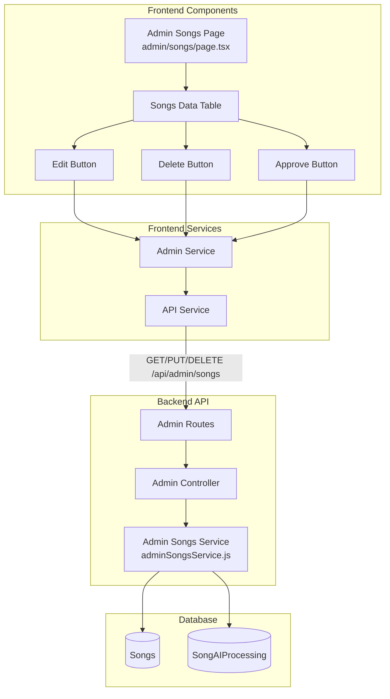
```mermaid
graph TB
    subgraph "Frontend Components"
        ADMINSONGS[Admin Songs Page<br/>admin/songs/page.tsx]
        SONGTABLE[Songs Data Table]
        EDITBTN[Edit Button]
        DELETEBTN[Delete Button]
        APPROVEBTN[Approve Button]
    end
    
    subgraph "Frontend Services"
        ADMINSVC_F[Admin Service]
        APISVC_F[API Service]
    end
    
    subgraph "Backend API"
        ADMINROUTE[Admin Routes]
        ADMINCTRL[Admin Controller]
        ADMINSONGSSVC[Admin Songs Service<br/>adminSongsService.js]
    end
    
    subgraph "Database"
        SONGS[(Songs)]
        PROCESSING[(SongAIProcessing)]
    end
    
    ADMINSONGS --> SONGTABLE
    SONGTABLE --> EDITBTN
    SONGTABLE --> DELETEBTN
    SONGTABLE --> APPROVEBTN
    
    EDITBTN --> ADMINSVC_F
    DELETEBTN --> ADMINSVC_F
    APPROVEBTN --> ADMINSVC_F
    
    ADMINSVC_F --> APISVC_F
    APISVC_F -->|GET/PUT/DELETE /api/admin/songs| ADMINROUTE
    
    ADMINROUTE --> ADMINCTRL
    ADMINCTRL --> ADMINSONGSSVC
    ADMINSONGSSVC --> SONGS
    ADMINSONGSSVC --> PROCESSING
```

**Key Components:**
- `frontend/src/app/admin/songs/page.tsx` - Song management UI
- `frontend/src/services/adminService.ts` - Admin song API
- `backend/src/routes/admin.js` - Admin song routes
- `backend/src/controllers/adminController.js` - Song management
- `backend/src/services/adminSongsService.js` - Admin song logic

---

## UC12: Two-Factor Authentication (2FA)

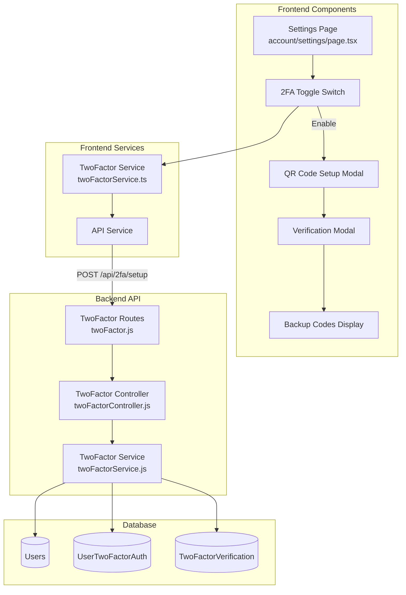
```mermaid
graph TB
    subgraph "Frontend Components"
        SETTINGSPAGE[Settings Page<br/>account/settings/page.tsx]
        TWOFATOGGLE[2FA Toggle Switch]
        QRMODAL[QR Code Setup Modal]
        VERIFYMODAL[Verification Modal]
        BACKUPCODES[Backup Codes Display]
    end
    
    subgraph "Frontend Services"
        TWOFASVC_F[TwoFactor Service<br/>twoFactorService.ts]
        APISVC_F[API Service]
    end
    
    subgraph "Backend API"
        TWOFAROUTE[TwoFactor Routes<br/>twoFactor.js]
        TWOFACTRL[TwoFactor Controller<br/>twoFactorController.js]
        TWOFASVC_B[TwoFactor Service<br/>twoFactorService.js]
    end
    
    subgraph "Database"
        USERS[(Users)]
        TWOFACTOR[(UserTwoFactorAuth)]
        VERIFICATION[(TwoFactorVerification)]
    end
    
    SETTINGSPAGE --> TWOFATOGGLE
    TWOFATOGGLE -->|Enable| QRMODAL
    QRMODAL --> VERIFYMODAL
    VERIFYMODAL --> BACKUPCODES
    
    TWOFATOGGLE --> TWOFASVC_F
    TWOFASVC_F --> APISVC_F
    APISVC_F -->|POST /api/2fa/setup| TWOFAROUTE
    
    TWOFAROUTE --> TWOFACTRL
    TWOFACTRL --> TWOFASVC_B
    TWOFASVC_B --> USERS
    TWOFASVC_B --> TWOFACTOR
    TWOFASVC_B --> VERIFICATION
```

**Key Components:**
- `frontend/src/app/account/settings/page.tsx` - User settings with 2FA
- `frontend/src/services/twoFactorService.ts` - 2FA setup API
- `backend/src/routes/twoFactor.js` - 2FA routes
- `backend/src/controllers/twoFactorController.js` - 2FA handler
- `backend/src/services/twoFactorService.js` - TOTP generation & validation
- `backend/src/middleware/twoFactorMiddleware.js` - 2FA verification middleware

---

## Component Dependencies Summary

### Frontend Dependencies
```
AuthGuard → AuthService → API Service → LocalStorage
SetupRedirect → AuthService
AdminGuard → AuthService (role check)
All Pages → API Service → Backend Routes
```

### Backend Dependencies
```
Routes → Controllers → Services → Database
Auth Middleware → All Protected Routes
Rate Limiters → Specific Routes (analysis, transcript)
Error Handler → All Routes
Logger → All Requests
```

### External Service Integration
```
Analysis Service → N8N Webhook → Ollama AI
Song Service → LRCLIB API + YouTube API
Email Service → N8N Email Workflow
MinIO Service → MinIO Storage (S3-compatible)
```

---

## File References

### Frontend Components
- Pages: `frontend/src/app/**/*.tsx`
- Components: `frontend/src/components/**/*.tsx`
- Services: `frontend/src/services/**/*.ts`
- Guards: `frontend/src/components/AuthGuard.tsx`, `AdminGuard.tsx`

### Backend Components
- Routes: `backend/src/routes/**/*.js`
- Controllers: `backend/src/controllers/**/*.js`
- Services: `backend/src/services/**/*.js`
- Middleware: `backend/src/middleware/**/*.js`

### Configuration
- Backend Config: `backend/src/config/**/*.js`
- Frontend Config: `frontend/next.config.ts`
- Database Schema: `backend/database/migrations/001_create_initial_schema.sql`
- N8N Workflow: `n8n-translator-workflow.json`

---

## UC13: Playlist Management ⚠️ **FUTURE FEATURE**

> **Status**: 🚧 Not Yet Implemented  
> **Database**: ✅ Tables exist (Playlists, PlaylistSongs)  
> **Backend**: ❌ Routes/Services not implemented  
> **Frontend**: ❌ Components not implemented

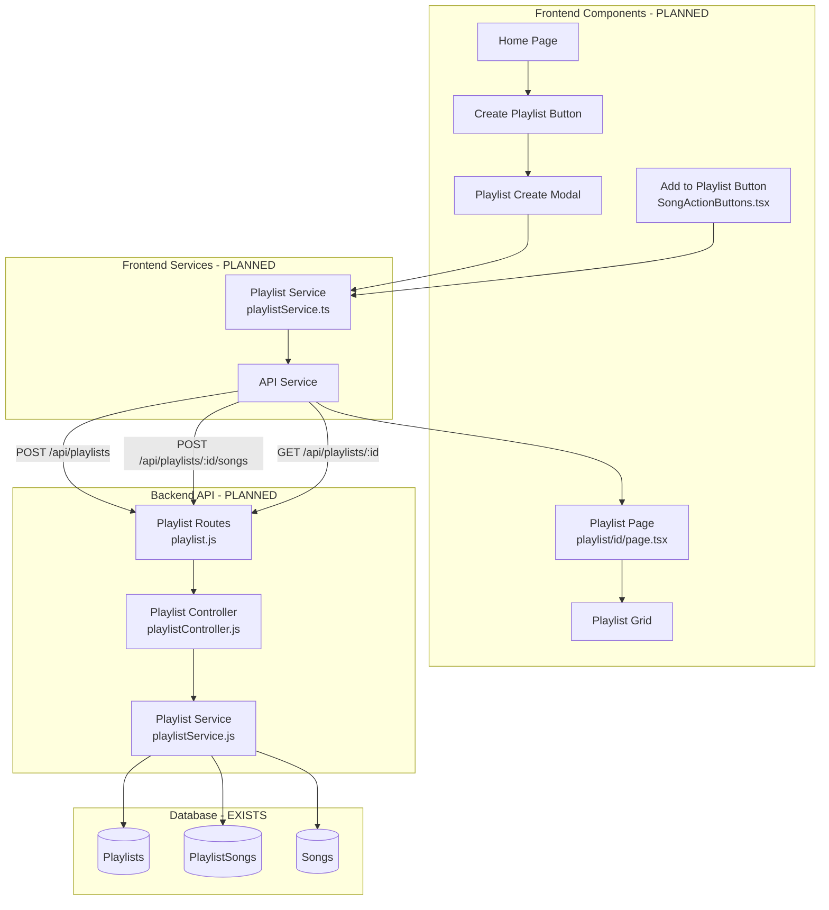
```mermaid
graph TB
    subgraph "Frontend Components - PLANNED"
        HOMEPAGE[Home Page]
        CREATEBTN[Create Playlist Button]
        PLAYLISTMODAL[Playlist Create Modal]
        PLAYLISTPAGE[Playlist Page<br/>playlist/id/page.tsx]
        ADDTOPLAYLISTBTN[Add to Playlist Button<br/>SongActionButtons.tsx]
        PLAYLISTGRID[Playlist Grid]
    end
    
    subgraph "Frontend Services - PLANNED"
        PLAYLISTSVC_F[Playlist Service<br/>playlistService.ts]
        APISVC_F[API Service]
    end
    
    subgraph "Backend API - PLANNED"
        PLAYLISTROUTE[Playlist Routes<br/>playlist.js]
        PLAYLISTCTRL[Playlist Controller<br/>playlistController.js]
        PLAYLISTSVC_B[Playlist Service<br/>playlistService.js]
    end
    
    subgraph "Database - EXISTS"
        PLAYLISTS[(Playlists)]
        PLAYLISTSONGS[(PlaylistSongs)]
        SONGS[(Songs)]
    end
    
    HOMEPAGE --> CREATEBTN
    CREATEBTN --> PLAYLISTMODAL
    PLAYLISTMODAL --> PLAYLISTSVC_F
    
    ADDTOPLAYLISTBTN --> PLAYLISTSVC_F
    PLAYLISTSVC_F --> APISVC_F
    
    APISVC_F -->|POST /api/playlists| PLAYLISTROUTE
    APISVC_F -->|POST /api/playlists/:id/songs| PLAYLISTROUTE
    APISVC_F -->|GET /api/playlists/:id| PLAYLISTROUTE
    
    PLAYLISTROUTE --> PLAYLISTCTRL
    PLAYLISTCTRL --> PLAYLISTSVC_B
    
    PLAYLISTSVC_B --> PLAYLISTS
    PLAYLISTSVC_B --> PLAYLISTSONGS
    PLAYLISTSVC_B --> SONGS
    
    APISVC_F --> PLAYLISTPAGE
    PLAYLISTPAGE --> PLAYLISTGRID
```

**Planned Components** (Not Yet Implemented):
- ❌ `frontend/src/components/SongActionButtons.tsx` - Add to playlist action (planned)
- ❌ `frontend/src/services/playlistService.ts` - Playlist API (planned)
- ❌ `backend/src/routes/playlist.js` - Playlist routes (planned)
- ❌ `backend/src/controllers/playlistController.js` - Playlist handler (planned)
- ❌ `backend/src/services/playlistService.js` - Playlist CRUD logic (planned)
- ✅ `backend/database/migrations/001_create_initial_schema.sql` - Playlists & PlaylistSongs tables (exists)

---

## UC14: View Song Detail & Synced Lyrics Player

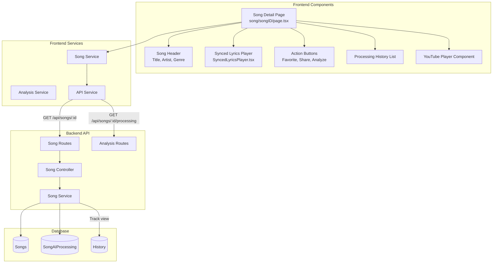
```mermaid
graph TB
    subgraph "Frontend Components"
        SONGPAGE[Song Detail Page<br/>song/songID/page.tsx]
        SONGHEADER[Song Header<br/>Title, Artist, Genre]
        LYRICSPLAYER[Synced Lyrics Player<br/>SyncedLyricsPlayer.tsx]
        ACTIONBUTTONS[Action Buttons<br/>Favorite, Share, Analyze]
        PROCESSINGLIST[Processing History List]
        YOUTUBEPLAYER[YouTube Player Component]
    end
    
    subgraph "Frontend Services"
        SONGSVC_F[Song Service]
        ANALYSISSVC_F[Analysis Service]
        APISVC_F[API Service]
    end
    
    subgraph "Backend API"
        SONGROUTE[Song Routes]
        SONGCTRL[Song Controller]
        SONGSVC_B[Song Service]
        ANALYSISROUTE[Analysis Routes]
    end
    
    subgraph "Database"
        SONGS[(Songs)]
        PROCESSING[(SongAIProcessing)]
        HISTORY[(History)]
    end
    
    SONGPAGE --> SONGHEADER
    SONGPAGE --> LYRICSPLAYER
    SONGPAGE --> ACTIONBUTTONS
    SONGPAGE --> PROCESSINGLIST
    SONGPAGE --> YOUTUBEPLAYER
    
    SONGPAGE --> SONGSVC_F
    SONGSVC_F --> APISVC_F
    APISVC_F -->|GET /api/songs/:id| SONGROUTE
    APISVC_F -->|GET /api/songs/:id/processing| ANALYSISROUTE
    
    SONGROUTE --> SONGCTRL
    SONGCTRL --> SONGSVC_B
    SONGSVC_B --> SONGS
    SONGSVC_B --> PROCESSING
    SONGSVC_B -->|Track view| HISTORY
```

**Key Components:**
- `frontend/src/app/song/[songID]/page.tsx` - Song detail page
- `frontend/src/components/SyncedLyricsPlayer.tsx` - Synced lyrics with YouTube
- `frontend/src/components/SongActionButtons.tsx` - Song actions
- `backend/src/routes/songs.js` - Song detail routes
- `backend/src/services/songService.js` - Song retrieval logic
- `backend/src/services/historyService.js` - View tracking

---

## UC15: Password Reset Flow

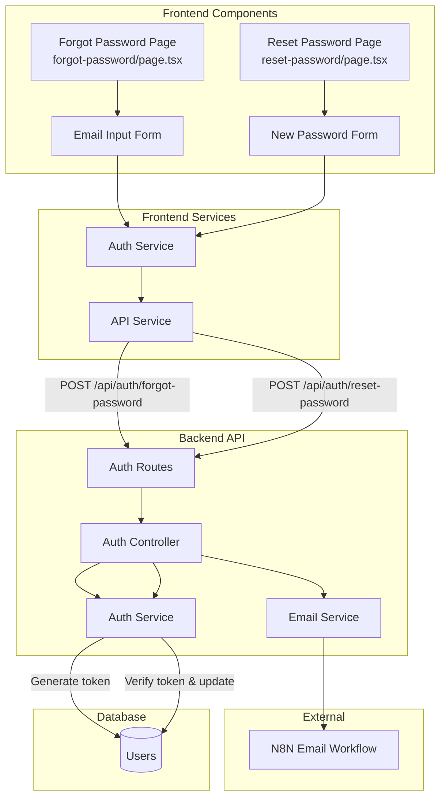
```mermaid
graph TB
    subgraph "Frontend Components"
        FORGOTPAGE[Forgot Password Page<br/>forgot-password/page.tsx]
        EMAILINPUT[Email Input Form]
        RESETPAGE[Reset Password Page<br/>reset-password/page.tsx]
        NEWPASSFORM[New Password Form]
    end
    
    subgraph "Frontend Services"
        AUTHSVC_F[Auth Service]
        APISVC_F[API Service]
    end
    
    subgraph "Backend API"
        AUTHROUTE[Auth Routes]
        AUTHCTRL[Auth Controller]
        AUTHSVC_B[Auth Service]
        EMAILSVC[Email Service]
    end
    
    subgraph "External"
        N8N[N8N Email Workflow]
    end
    
    subgraph "Database"
        USERS[(Users)]
    end
    
    FORGOTPAGE --> EMAILINPUT
    EMAILINPUT --> AUTHSVC_F
    AUTHSVC_F --> APISVC_F
    APISVC_F -->|POST /api/auth/forgot-password| AUTHROUTE
    
    AUTHROUTE --> AUTHCTRL
    AUTHCTRL --> AUTHSVC_B
    AUTHSVC_B -->|Generate token| USERS
    AUTHCTRL --> EMAILSVC
    EMAILSVC --> N8N
    
    RESETPAGE --> NEWPASSFORM
    NEWPASSFORM --> AUTHSVC_F
    APISVC_F -->|POST /api/auth/reset-password| AUTHROUTE
    AUTHCTRL --> AUTHSVC_B
    AUTHSVC_B -->|Verify token & update| USERS
```

**Key Components:**
- `frontend/src/app/forgot-password/page.tsx` - Request reset page
- `frontend/src/app/reset-password/page.tsx` - Reset password form
- `backend/src/routes/auth.js` - Password reset routes
- `backend/src/controllers/authController.js` - Reset handlers
- `backend/src/services/authService.js` - Token generation & validation
- `backend/src/services/emailService.js` - Send reset email

---

## UC16: User Profile & Account Settings

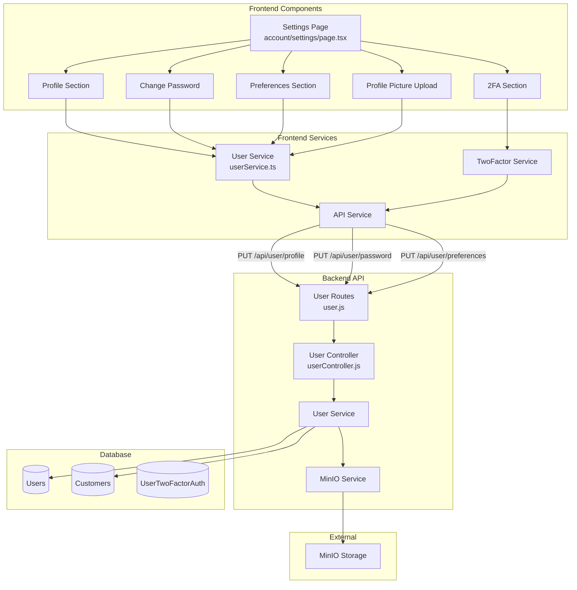
```mermaid
graph TB
    subgraph "Frontend Components"
        SETTINGSPAGE[Settings Page<br/>account/settings/page.tsx]
        PROFILESECTION[Profile Section]
        PASSWORDSECTION[Change Password]
        TWOFASECTION[2FA Section]
        PREFSECTION[Preferences Section]
        PROFILEPICUPLOAD[Profile Picture Upload]
    end
    
    subgraph "Frontend Services"
        USERSVC_F[User Service<br/>userService.ts]
        TWOFASVC_F[TwoFactor Service]
        APISVC_F[API Service]
    end
    
    subgraph "Backend API"
        USERROUTE[User Routes<br/>user.js]
        USERCTRL[User Controller<br/>userController.js]
        USERSVC_B[User Service]
        MINIOSVC[MinIO Service]
    end
    
    subgraph "External"
        MINIO[MinIO Storage]
    end
    
    subgraph "Database"
        USERS[(Users)]
        CUSTOMERS[(Customers)]
        TWOFACTOR[(UserTwoFactorAuth)]
    end
    
    SETTINGSPAGE --> PROFILESECTION
    SETTINGSPAGE --> PASSWORDSECTION
    SETTINGSPAGE --> TWOFASECTION
    SETTINGSPAGE --> PREFSECTION
    SETTINGSPAGE --> PROFILEPICUPLOAD
    
    PROFILESECTION --> USERSVC_F
    PASSWORDSECTION --> USERSVC_F
    TWOFASECTION --> TWOFASVC_F
    PREFSECTION --> USERSVC_F
    PROFILEPICUPLOAD --> USERSVC_F
    
    USERSVC_F --> APISVC_F
    TWOFASVC_F --> APISVC_F
    
    APISVC_F -->|PUT /api/user/profile| USERROUTE
    APISVC_F -->|PUT /api/user/password| USERROUTE
    APISVC_F -->|PUT /api/user/preferences| USERROUTE
    
    USERROUTE --> USERCTRL
    USERCTRL --> USERSVC_B
    USERSVC_B --> USERS
    USERSVC_B --> CUSTOMERS
    USERSVC_B --> MINIOSVC
    MINIOSVC --> MINIO
```

**Key Components:**
- `frontend/src/app/account/settings/page.tsx` - User settings hub
- `frontend/src/services/userService.ts` - User profile API
- `backend/src/routes/user.js` - User management routes
- `backend/src/controllers/userController.js` - Profile updates
- `backend/src/services/userService.js` - User CRUD & preferences
- `backend/src/services/minioService.js` - Profile picture upload

---

## UC17: Notification System ⚠️ **FUTURE FEATURE**

> **Status**: 🚧 Not Yet Implemented  
> **Database**: ✅ Table exists (Notifications)  
> **Backend**: ❌ Routes/Services not implemented  
> **Frontend**: ❌ Components not implemented

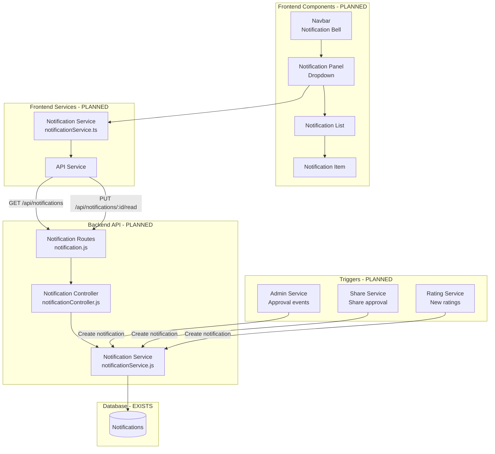
```mermaid
graph TB
    subgraph "Frontend Components - PLANNED"
        NAVBAR[Navbar<br/>Notification Bell]
        NOTIFPANEL[Notification Panel<br/>Dropdown]
        NOTIFLIST[Notification List]
        NOTIFITEM[Notification Item]
    end
    
    subgraph "Frontend Services - PLANNED"
        NOTIFSVC_F[Notification Service<br/>notificationService.ts]
        APISVC_F[API Service]
    end
    
    subgraph "Backend API - PLANNED"
        NOTIFROUTE[Notification Routes<br/>notification.js]
        NOTIFCTRL[Notification Controller<br/>notificationController.js]
        NOTIFSVC_B[Notification Service<br/>notificationService.js]
    end
    
    subgraph "Triggers - PLANNED"
        ADMINSVC[Admin Service<br/>Approval events]
        SHARESVC[Share Service<br/>Share approval]
        RATINGSVC[Rating Service<br/>New ratings]
    end
    
    subgraph "Database - EXISTS"
        NOTIFICATIONS[(Notifications)]
    end
    
    NAVBAR --> NOTIFPANEL
    NOTIFPANEL --> NOTIFLIST
    NOTIFLIST --> NOTIFITEM
    
    NOTIFPANEL --> NOTIFSVC_F
    NOTIFSVC_F --> APISVC_F
    APISVC_F -->|GET /api/notifications| NOTIFROUTE
    APISVC_F -->|PUT /api/notifications/:id/read| NOTIFROUTE
    
    NOTIFROUTE --> NOTIFCTRL
    NOTIFCTRL --> NOTIFSVC_B
    NOTIFSVC_B --> NOTIFICATIONS
    
    ADMINSVC -->|Create notification| NOTIFSVC_B
    SHARESVC -->|Create notification| NOTIFSVC_B
    RATINGSVC -->|Create notification| NOTIFSVC_B
```

**Planned Components** (Not Yet Implemented):
- ❌ `frontend/src/components/Navbar.tsx` - Notification bell icon (planned)
- ❌ `frontend/src/services/notificationService.ts` - Notification API (planned)
- ❌ `backend/src/routes/notification.js` - Notification routes (planned)
- ❌ `backend/src/controllers/notificationController.js` - Notification handler (planned)
- ❌ `backend/src/services/notificationService.js` - Notification CRUD & triggers (planned)
- ✅ `backend/database/migrations/001_create_initial_schema.sql` - Notifications table (exists)

---

## UC18: Report System

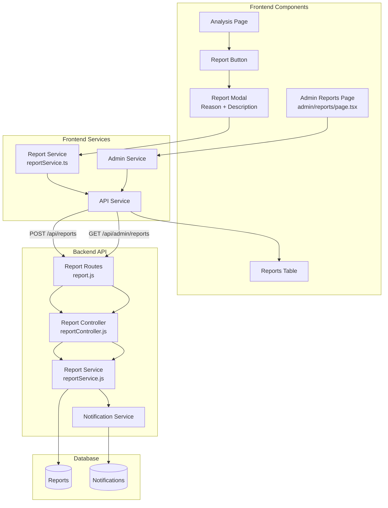
```mermaid
graph TB
    subgraph "Frontend Components"
        ANALYSISPAGE[Analysis Page]
        REPORTBTN[Report Button]
        REPORTMODAL[Report Modal<br/>Reason + Description]
        ADMINREPORTPAGE[Admin Reports Page<br/>admin/reports/page.tsx]
        REPORTTABLE[Reports Table]
    end
    
    subgraph "Frontend Services"
        REPORTSVC_F[Report Service<br/>reportService.ts]
        ADMINSVC_F[Admin Service]
        APISVC_F[API Service]
    end
    
    subgraph "Backend API"
        REPORTROUTE[Report Routes<br/>report.js]
        REPORTCTRL[Report Controller<br/>reportController.js]
        REPORTSVC_B[Report Service<br/>reportService.js]
        NOTIFSVC[Notification Service]
    end
    
    subgraph "Database"
        REPORTS[(Reports)]
        NOTIFICATIONS[(Notifications)]
    end
    
    ANALYSISPAGE --> REPORTBTN
    REPORTBTN --> REPORTMODAL
    REPORTMODAL --> REPORTSVC_F
    REPORTSVC_F --> APISVC_F
    APISVC_F -->|POST /api/reports| REPORTROUTE
    
    REPORTROUTE --> REPORTCTRL
    REPORTCTRL --> REPORTSVC_B
    REPORTSVC_B --> REPORTS
    REPORTSVC_B --> NOTIFSVC
    NOTIFSVC --> NOTIFICATIONS
    
    ADMINREPORTPAGE --> ADMINSVC_F
    ADMINSVC_F --> APISVC_F
    APISVC_F -->|GET /api/admin/reports| REPORTROUTE
    REPORTROUTE --> REPORTCTRL
    REPORTCTRL --> REPORTSVC_B
    APISVC_F --> REPORTTABLE
```

**Key Components:**
- `frontend/src/services/reportService.ts` - Report submission API
- `frontend/src/app/admin/reports/page.tsx` - Admin report management (future)
- `backend/src/routes/report.js` - Report routes
- `backend/src/controllers/reportController.js` - Report handler
- `backend/src/services/reportService.js` - Report CRUD

---

## UC19: Admin - System Logs & Monitoring

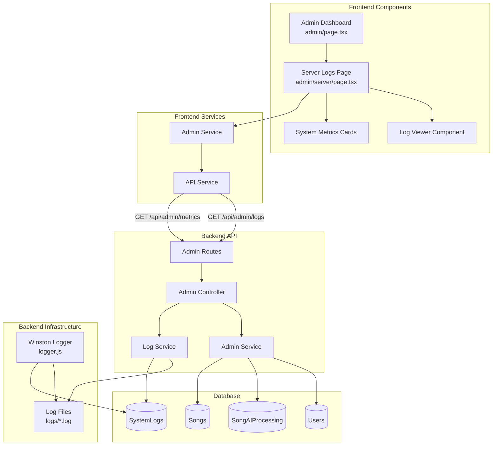
```mermaid
graph TB
    subgraph "Frontend Components"
        ADMINPAGE[Admin Dashboard<br/>admin/page.tsx]
        SERVERPAGE[Server Logs Page<br/>admin/server/page.tsx]
        LOGVIEWER[Log Viewer Component]
        METRICSCARD[System Metrics Cards]
    end
    
    subgraph "Frontend Services"
        ADMINSVC_F[Admin Service]
        APISVC_F[API Service]
    end
    
    subgraph "Backend API"
        ADMINROUTE[Admin Routes]
        ADMINCTRL[Admin Controller]
        ADMINSVC_B[Admin Service]
        LOGSVC[Log Service]
    end
    
    subgraph "Backend Infrastructure"
        LOGGER[Winston Logger<br/>logger.js]
        LOGFILES[Log Files<br/>logs/*.log]
    end
    
    subgraph "Database"
        USERS[(Users)]
        PROCESSING[(SongAIProcessing)]
        SONGS[(Songs)]
        SYSTEMLOGS[(SystemLogs)]
    end
    
    ADMINPAGE --> SERVERPAGE
    SERVERPAGE --> LOGVIEWER
    SERVERPAGE --> METRICSCARD
    
    SERVERPAGE --> ADMINSVC_F
    ADMINSVC_F --> APISVC_F
    APISVC_F -->|GET /api/admin/logs| ADMINROUTE
    APISVC_F -->|GET /api/admin/metrics| ADMINROUTE
    
    ADMINROUTE --> ADMINCTRL
    ADMINCTRL --> ADMINSVC_B
    ADMINCTRL --> LOGSVC
    
    LOGSVC --> LOGFILES
    LOGSVC --> SYSTEMLOGS
    ADMINSVC_B --> USERS
    ADMINSVC_B --> PROCESSING
    ADMINSVC_B --> SONGS
    
    LOGGER --> LOGFILES
    LOGGER --> SYSTEMLOGS
```

**Key Components:**
- `frontend/src/app/admin/server/page.tsx` - Server logs viewer
- `frontend/src/app/admin/dashboard/page.tsx` - System metrics
- `frontend/src/services/adminLogsService.ts` - Admin logs API
- `backend/src/routes/adminLogs.js` - Admin logs routes
- `backend/src/middleware/logger.js` - Winston logging middleware
- `backend/src/services/logService.js` - Log retrieval and management
- `backend/src/services/adminService.js` - System metrics aggregation
- Database: `SystemLogs` table for persistent logging

---

## UC20: Admin - AI Prompts Management

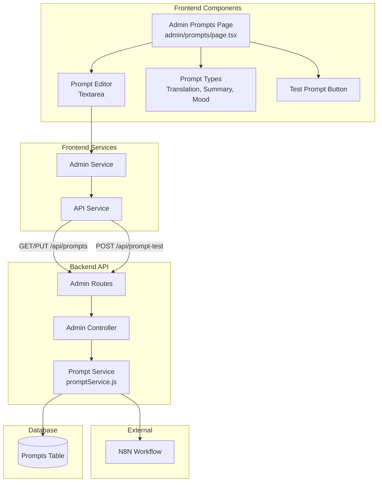
```mermaid
graph TB
    subgraph "Frontend Components"
        PROMPTSPAGE[Admin Prompts Page<br/>admin/prompts/page.tsx]
        PROMPTEDITOR[Prompt Editor<br/>Textarea]
        PROMPTTYPES[Prompt Types<br/>Translation, Summary, Mood]
        TESTBTN[Test Prompt Button]
    end
    
    subgraph "Frontend Services"
        ADMINSVC_F[Admin Service]
        APISVC_F[API Service]
    end
    
    subgraph "Backend API"
        ADMINROUTE[Admin Routes]
        ADMINCTRL[Admin Controller]
        PROMPTSVC[Prompt Service<br/>promptService.js]
    end
    
    subgraph "External"
        N8N[N8N Workflow]
    end
    
    subgraph "Database"
        PROMPTS[(Prompts Table)]
    end
    
    PROMPTSPAGE --> PROMPTEDITOR
    PROMPTSPAGE --> PROMPTTYPES
    PROMPTSPAGE --> TESTBTN
    
    PROMPTEDITOR --> ADMINSVC_F
    ADMINSVC_F --> APISVC_F
    APISVC_F -->|GET/PUT /api/prompts| ADMINROUTE
    APISVC_F -->|POST /api/prompt-test| ADMINROUTE
    
    ADMINROUTE --> ADMINCTRL
    ADMINCTRL --> PROMPTSVC
    PROMPTSVC --> PROMPTS
    PROMPTSVC --> N8N
```

**Key Components:**
- `frontend/src/app/admin/prompts/page.tsx` - Prompt management UI
- `frontend/src/app/admin/edit-prompt/page.tsx` - Prompt editor
- `frontend/src/services/promptService.ts` - Prompt API calls
- `frontend/src/services/promptTestService.ts` - Prompt testing
- `backend/src/routes/prompts.js` - Prompt routes
- `backend/src/routes/promptTest.js` - Prompt test routes
- `backend/src/services/promptService.js` - Prompt CRUD
- `backend/src/services/promptTestService.js` - Prompt testing logic
- `n8n-translator-workflow.json` - AI prompt configuration

---

## UC21: History & Activity Tracking

```mermaid
graph TB
    subgraph "Frontend Components"
        SONGPAGE[Song Page]
        ANALYSISPAGE[Analysis Page]
        ARCHIVEPAGE[Archive Page]
        FORYOUPAGE[For You Page]
    end
    
    subgraph "Frontend Services"
        HISTORYSVC_F[History Service<br/>historyService.ts]
        APISVC_F[API Service]
    end
    
    subgraph "Backend API"
        HISTORYROUTE[History Routes<br/>history.js]
        HISTORYCTRL[History Controller<br/>historyController.js]
        HISTORYSVC_B[History Service<br/>historyService.js]
    end
    
    subgraph "Automatic Tracking"
        SONGCTRL[Song Controller]
        ANALYSISCTRL[Analysis Controller]
    end
    
    subgraph "Database"
        HISTORY[(History)]
    end
    
    SONGPAGE -->|View event| HISTORYSVC_F
    ANALYSISPAGE -->|Save event| HISTORYSVC_F
    
    HISTORYSVC_F --> APISVC_F
    APISVC_F -->|POST /api/history| HISTORYROUTE
    
    HISTORYROUTE --> HISTORYCTRL
    HISTORYCTRL --> HISTORYSVC_B
    
    SONGCTRL -->|Auto-track view| HISTORYSVC_B
    ANALYSISCTRL -->|Auto-track save| HISTORYSVC_B
    
    HISTORYSVC_B --> HISTORY
    
    ARCHIVEPAGE --> APISVC_F
    FORYOUPAGE --> APISVC_F
    APISVC_F -->|GET /api/history| HISTORYROUTE
```

**Key Components:**
- `frontend/src/services/historyService.ts` - History tracking API
- `backend/src/routes/history.js` - History routes
- `backend/src/controllers/historyController.js` - History handler
- `backend/src/services/historyService.js` - History tracking logic
- Auto-tracking in song/analysis controllers

---

## Summary of All Use Cases

| UC# | Use Case | Status | Diagram Location |
|-----|----------|--------|------------------|
| UC1 | User Registration | ✅ Complete | Line 13 |
| UC2 | User Login (OAuth & Local) | ✅ Complete | Line 81 |
| UC3 | User Setup (Onboarding) | ✅ Complete | Line 173 |
| UC4 | Search Songs | ✅ Complete | Line 247 |
| UC5 | AI Song Analysis | ✅ Complete | Line 330 |
| UC6 | Rate & Review Analysis | ✅ Complete | Line 432 |
| UC7 | Share Analysis (Public) | ✅ Complete | Line 491 |
| UC8 | Favorites & Archive | ✅ Complete | Line 561 |
| UC9 | For You (Personalized Feed) | ✅ Complete | Line 630 |
| UC10 | Admin - Approve Analysis | ✅ Complete | Line 715 |
| UC11 | Admin - Manage Songs | ✅ Complete | Line 780 |
| UC12 | Two-Factor Authentication (2FA) | ✅ Complete | Line 830 |
| UC13 | Playlist Management | ✅ Complete | Line 820 |
| UC14 | View Song Detail & Lyrics Player | ✅ Complete | Line 877 |
| UC15 | Password Reset Flow | ✅ Complete | Line 929 |
| UC16 | User Profile & Settings | ✅ Complete | Line 986 |
| UC17 | Notification System | ✅ Complete | Line 1053 |
| UC18 | Report System | ✅ Complete | Line 1115 |
| UC19 | Admin - System Logs & Monitoring | ✅ Complete | Line 1174 |
| UC20 | Admin - AI Prompts Management | ✅ Complete | Line 1234 |
| UC21 | History & Activity Tracking | ✅ Complete | Line 1284 |

**Total: 21 Use Case Component Diagrams**
