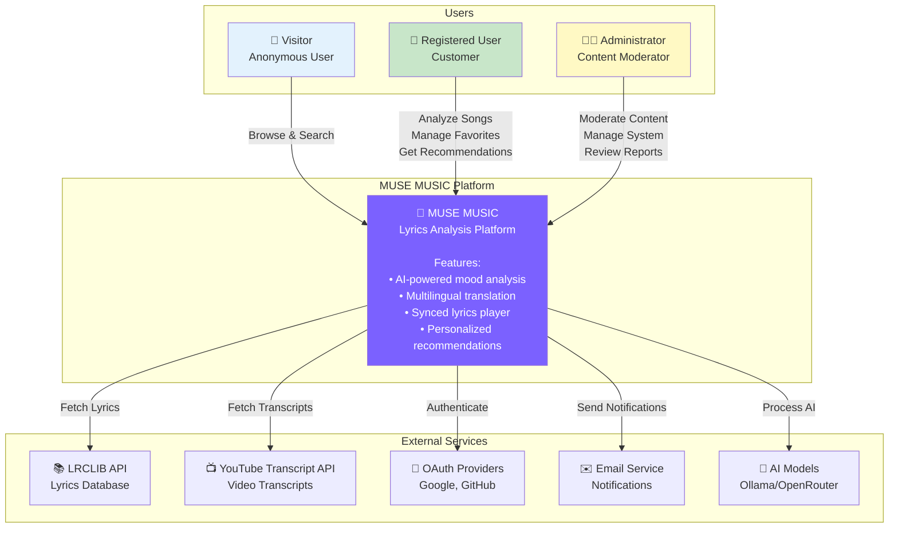
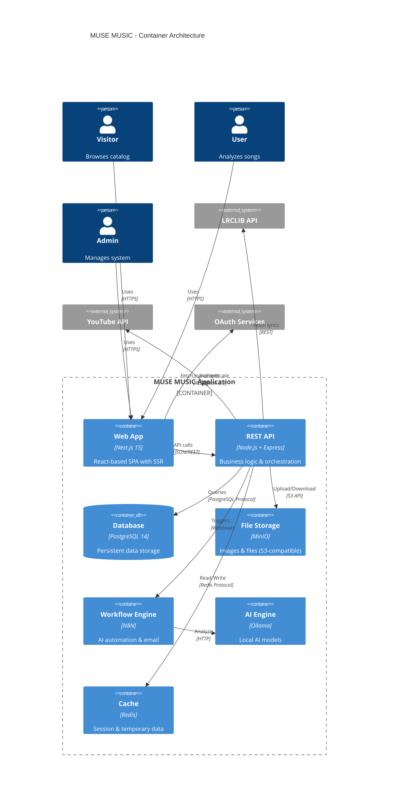
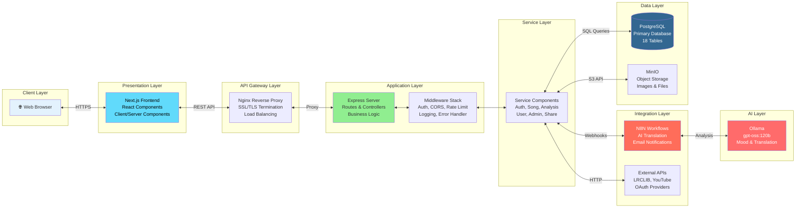
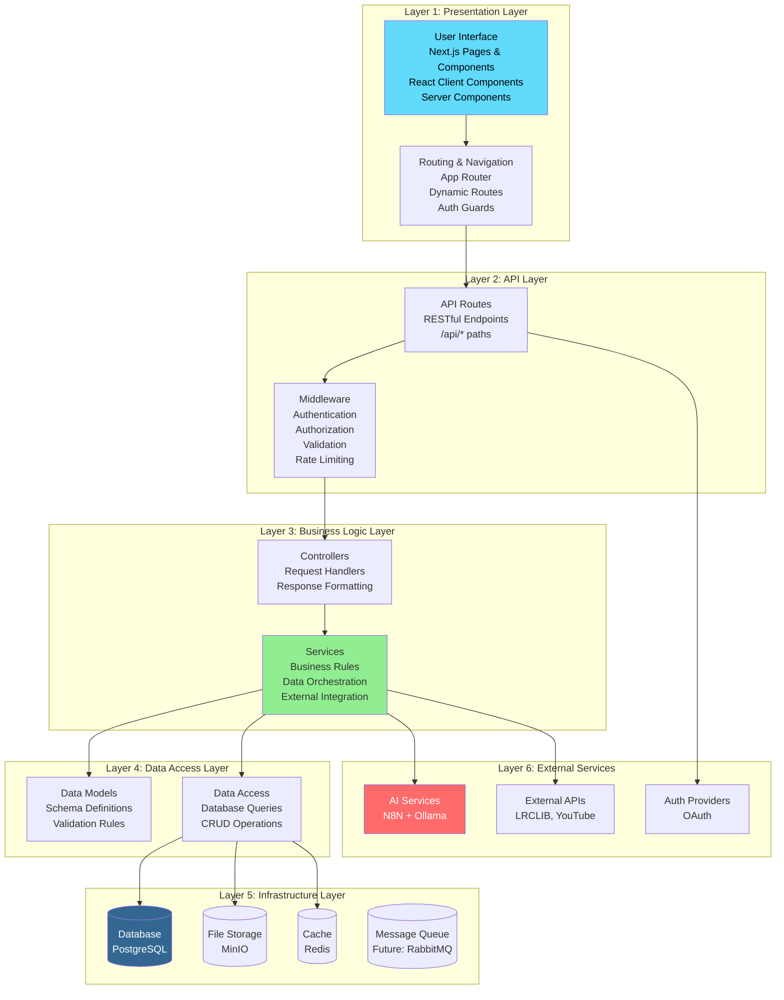
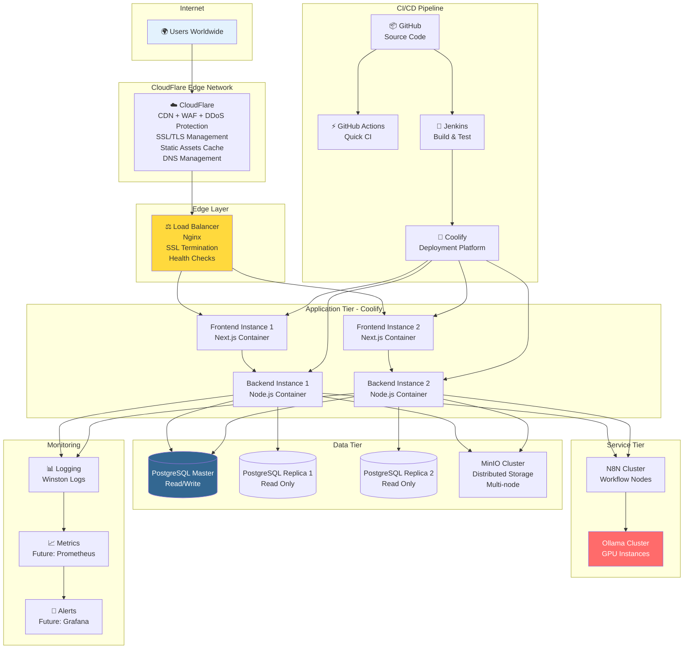
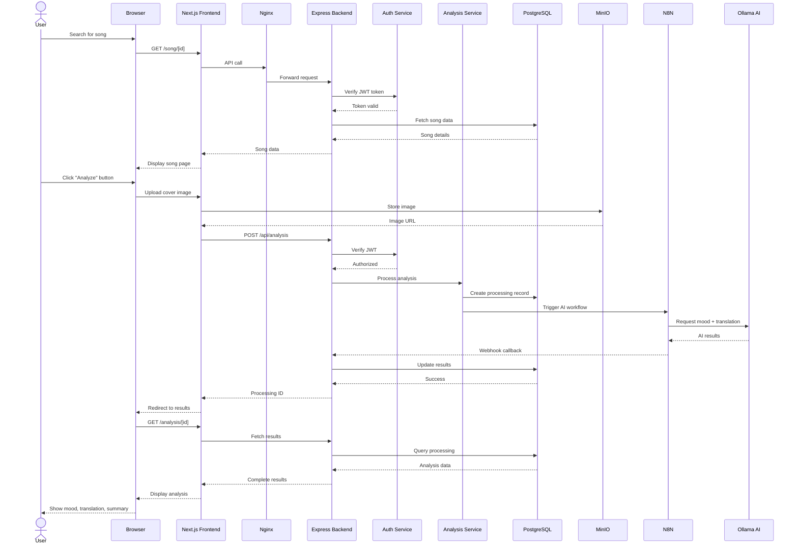

# MUSE MUSIC - High-Level System Diagram

## Overview
High-level diagram showing the overall MUSE MUSIC system at a high level, focusing on data flow and relationships between major components

---

## 🎯 System Context Diagram (Level 0)

**System Boundary:**
- **Internal**: MUSE MUSIC web application (Frontend + Backend + Database)
- **External**: Third-party services and APIs
- **Users**: Three main actor types with different access levels

---

## 📦 Container Diagram (Level 1)

**Key Containers:**
- **Web App**: User-facing interface (Next.js)
- **REST API**: Backend server (Node.js/Express)
- **Database**: Primary data store (PostgreSQL)
- **File Storage**: Object storage for images (MinIO)
- **Workflow Engine**: Automation platform (N8N)
- **AI Engine**: Local AI processing (Ollama)
- **Cache**: Session management (Redis - future)

---

## 🔄 Data Flow Diagram (Level 2)

### Overall System Data Flow

---

## 🏗️ Layered Architecture

**Layer Responsibilities:**
1. **Presentation**: User interface & interactions
2. **API**: Request routing & validation
3. **Business Logic**: Core application logic
4. **Data Access**: Database operations
5. **Infrastructure**: Data persistence & storage
6. **External**: Third-party integrations

---

## 🔐 Security Architecture

```mermaid
graph TB
    subgraph "Security Perimeter"
        subgraph "Network Security"
            FIREWALL[🔥 CloudFlare WAF<br/>Web Application Firewall<br/>DDoS Protection<br/>Bot Management<br/>IP Filtering]
            SSL[🔒 CloudFlare SSL/TLS<br/>Universal SSL<br/>TLS 1.3<br/>Auto-renewal]
        end
        
        subgraph "Application Security"
            AUTH[🔑 Authentication<br/>JWT Tokens<br/>OAuth 2.0<br/>Session Management]
            AUTHZ[👮 Authorization<br/>RBAC<br/>Permission Checks<br/>Admin Guards]
            TWOFACTOR[📱 2FA/TOTP<br/>Time-based OTP<br/>Backup Codes<br/>Recovery Options]
        end
        
        subgraph "API Security"
            RATELIMIT[⏱️ Rate Limiting<br/>Per-endpoint Throttle<br/>IP-based Limits]
            CORS_SEC[🌐 CORS Policy<br/>Origin Validation<br/>Whitelist Control]
            VALIDATION[✅ Input Validation<br/>Schema Validation<br/>SQL Injection Prevention<br/>XSS Protection]
        end
        
        subgraph "Data Security"
            ENCRYPTION[🔐 Encryption<br/>Password: bcrypt<br/>Tokens: AES<br/>DB: SSL]
            SANITIZATION[🧹 Data Sanitization<br/>HTML Escaping<br/>SQL Parameterization]
            AUDIT[📝 Audit Logging<br/>Access Logs<br/>Change Tracking<br/>Security Events]
        end
    end
    
    USERS[👥 Users] --> FIREWALL
    FIREWALL --> SSL
    SSL --> CORS_SEC
    CORS_SEC --> RATELIMIT
    RATELIMIT --> VALIDATION
    VALIDATION --> AUTH
    AUTH --> TWOFACTOR
    TWOFACTOR --> AUTHZ
    AUTHZ --> ENCRYPTION
    ENCRYPTION --> SANITIZATION
    SANITIZATION --> AUDIT
    
    style FIREWALL fill:#ff6b6b,color:#fff
    style AUTH fill:#7B61FF,color:#fff
    style ENCRYPTION fill:#ffd93d
```

---

## 📊 Deployment Architecture (Production)

---

## 🔄 Request Flow (Typical User Journey)

### Flow: User Analyzes a Song

---

## 🎯 Key Design Principles

### 1. Separation of Concerns
- **Frontend**: Pure UI/UX concerns
- **Backend**: Business logic isolated from presentation
- **Database**: Data persistence only
- **External Services**: Integrated through abstraction layers

### 2. Scalability
- **Horizontal Scaling**: Multiple frontend/backend instances
- **Database Replication**: Master-slave PostgreSQL setup
- **Caching Strategy**: Redis for session/temporary data
- **CDN Integration**: CloudFlare CDN for global static assets delivery

### 3. Security First
- **Defense in Depth**: Multiple security layers
- **Zero Trust**: Verify every request
- **Data Protection**: Encryption at rest and in transit
- **Audit Trail**: Comprehensive logging

### 4. Maintainability
- **Modular Architecture**: Clear service boundaries
- **Code Organization**: Consistent folder structure
- **Documentation**: Comprehensive API docs (Swagger)
- **Testing**: Unit, integration, and E2E tests

### 5. Performance
- **Lazy Loading**: On-demand resource loading
- **Connection Pooling**: Efficient database connections
- **Query Optimization**: Indexed database queries
- **Caching**: Multi-level caching strategy

---

## 📈 System Metrics & Capacity

### Current Capacity
| Component | Specification | Current Load | Max Capacity |
|-----------|--------------|--------------|--------------|
| **Frontend** | 2 instances @ 2GB RAM | ~20% | 1000 concurrent users |
| **Backend** | 2 instances @ 4GB RAM | ~30% | 500 req/sec |
| **Database** | 4GB RAM, 2 cores, 18 tables | ~40% | 10,000 connections |
| **MinIO** | 100GB storage | ~15GB | 500GB |
| **N8N** | 2GB RAM | ~25% | 50 parallel workflows |
| **Ollama** | 16GB RAM + GPU | ~60% | 10 concurrent analyses |

### Performance Targets
- **Page Load**: < 2 seconds (95th percentile)
- **API Response**: < 500ms (average)
- **AI Analysis**: < 30 seconds (full processing)
- **Database Query**: < 100ms (simple), < 500ms (complex)
- **CloudFlare CDN Cache Hit Rate**: > 90%
- **CloudFlare Edge Response**: < 50ms
- **Uptime**: 99.5% availability

---

## 📚 References

### Architecture Documentation
- **System Design**: `diagrams/architecture-design.md`
- **Use Cases**: `diagrams/use-case-overview.md`
- **Components**: `diagrams/component-diagrams.md`
- **Class Diagram**: `diagrams/class-diagram.md`

### Infrastructure
- **Deployment**: `DEPLOYMENT.md`
- **Docker Compose Dev**: `docker-compose.dev.yml`
- **Docker Compose Prod**: `docker-compose.prod.yml`
- **CI/CD**: `Jenkinsfile`

### Database
- **Schema**: `backend/database/migrations/001_create_initial_schema.sql`
- **Migration Scripts**: `backend/database/scripts/`

### Application
- **Backend**: `backend/src/` (routes, controllers, services)
- **Frontend**: `frontend/src/` (pages, components, services)
- **N8N Workflow**: `n8n-translator-workflow.json`

---

## 🎓 Architecture Decisions

### Why Next.js?
- **SSR/SSG**: Better SEO and initial load performance
- **Full-stack**: API routes alongside frontend
- **React 19**: Latest React features
- **App Router**: Modern routing with layouts

### Why Node.js Backend?
- **JavaScript Everywhere**: Same language frontend/backend
- **Express**: Mature, well-documented framework
- **npm Ecosystem**: Rich library ecosystem
- **Async I/O**: Efficient for I/O-bound operations

### Why PostgreSQL?
- **ACID Compliance**: Strong consistency guarantees
- **JSON Support**: Flexible schema with JSONB
- **Full-text Search**: Built-in search capabilities
- **Extensions**: PostGIS, pg_trgm, uuid-ossp

### Why N8N + Ollama?
- **N8N**: Visual workflow builder, easy to modify
- **Ollama**: Local AI hosting, no API costs
- **Flexibility**: Easy to switch AI models
- **Control**: Full control over AI processing

### Why MinIO?
- **S3-Compatible**: Easy migration to AWS S3
- **Self-hosted**: Full control over file storage
- **Scalable**: Distributed storage support
- **Cost-effective**: No storage API costs

### Why CloudFlare?
- **Global CDN**: Edge caching in 300+ cities worldwide
- **DDoS Protection**: Automatic mitigation of attacks
- **WAF**: Web Application Firewall with custom rules
- **SSL/TLS**: Free Universal SSL with auto-renewal
- **DNS**: Fast, secure DNS resolution
- **Analytics**: Real-time traffic insights
- **Zero Trust**: Additional security layer for admin access

