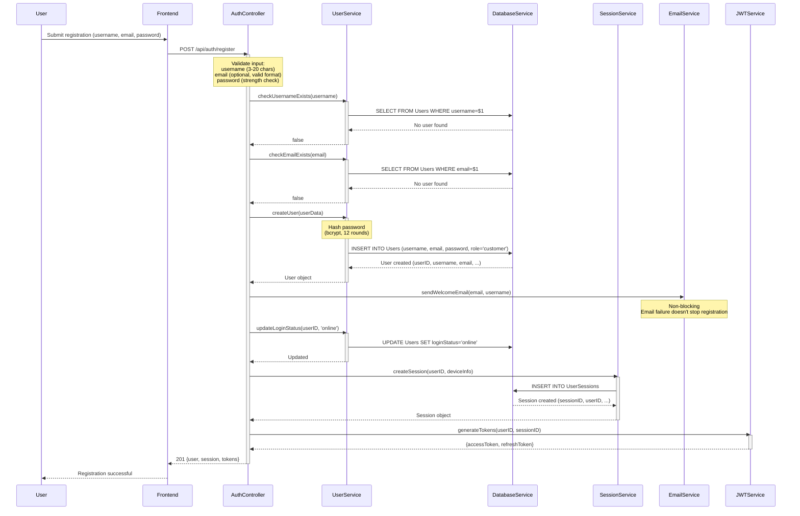
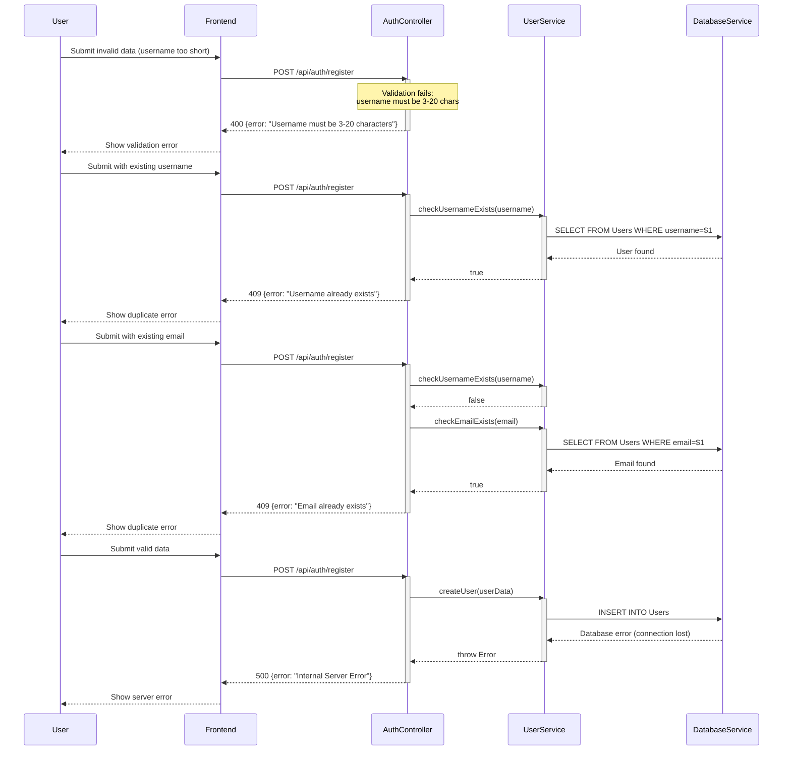
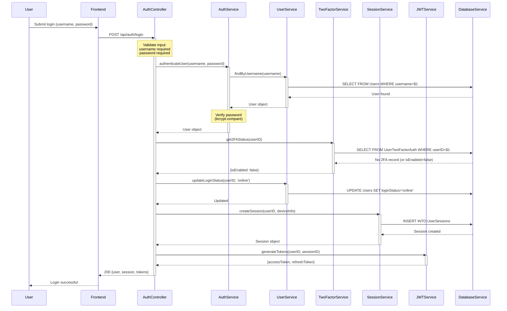
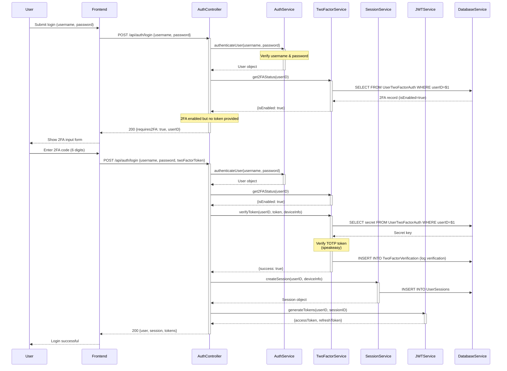
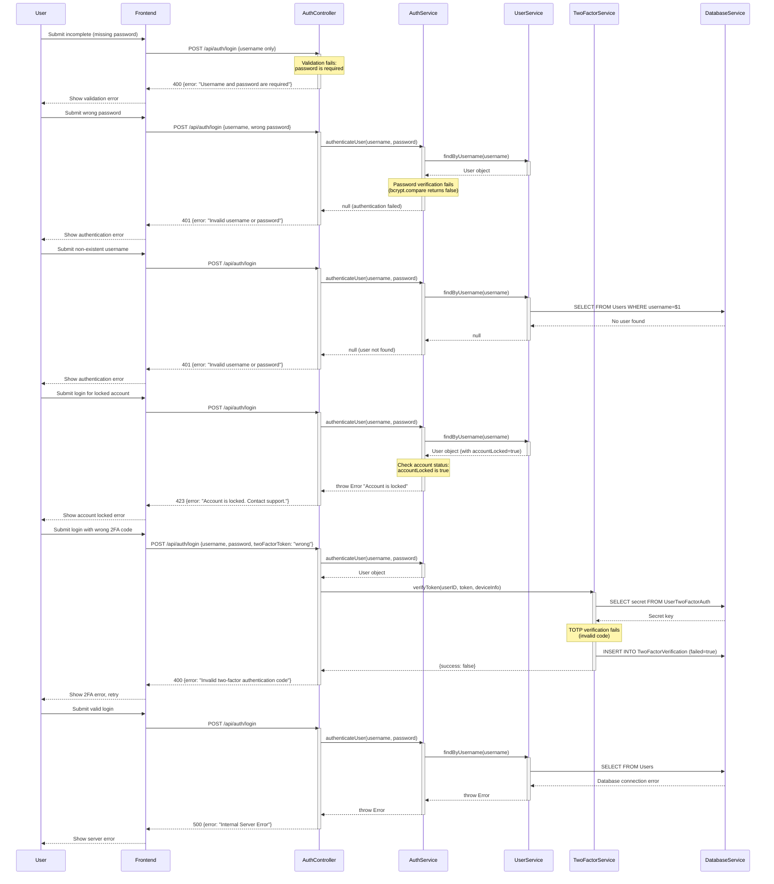
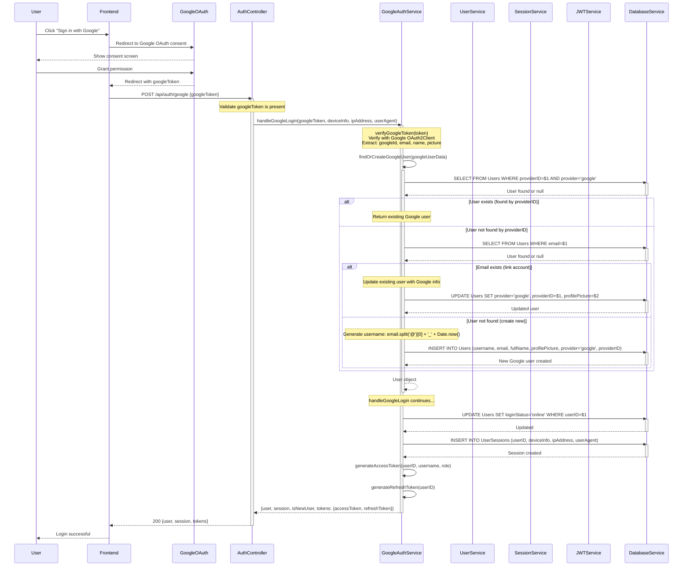
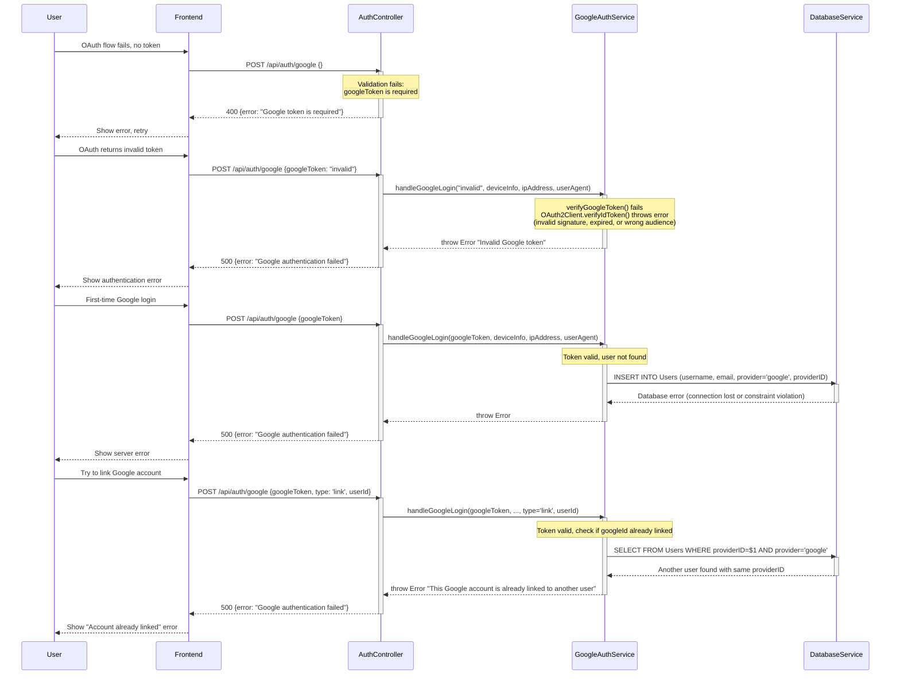

# Sequence Diagrams - Authentication Flows

> **Verification Status**: ✅ All flows verified against actual code
> - Source files: `backend/src/controllers/authController.js`, `backend/src/services/userService.js`, `backend/src/services/sessionService.js`, `backend/src/services/googleAuthService.js`
> - All error codes, validation rules, and flow steps documented from actual implementation
> - Last verified: 25 November 2025

---

## 1. User Registration Flow

### Happy Path - Successful Registration

### Error Path - Registration Failures

---

## 2. User Login Flow

### Happy Path - Successful Login (Without 2FA)

### Happy Path - Successful Login (With 2FA)

### Error Path - Login Failures

---

## 3. Google OAuth Login Flow

### Happy Path - Successful Google Login

### Error Path - Google Login Failures

---

## Summary of Error Codes

| Endpoint | Status Code | Error Scenario | Message |
|----------|-------------|----------------|---------|
| **POST /api/auth/register** | 400 | Validation failure | "Username must be 3-20 characters", "Invalid email format", "Password too weak" |
| | 409 | Duplicate username | "Username already exists" |
| | 409 | Duplicate email | "Email already exists" |
| | 500 | Server error | "Internal Server Error" |
| **POST /api/auth/login** | 400 | Missing fields | "Username and password are required" |
| | 400 | Invalid 2FA code | "Invalid two-factor authentication code" |
| | 401 | Invalid credentials | "Invalid username or password" |
| | 423 | Account locked | "Account is locked. Contact support." |
| | 500 | Server error | "Internal Server Error" |
| **POST /api/auth/google** | 400 | Missing token | "Google token is required" |
| | 500 | Invalid token | "Google authentication failed" |
| | 500 | Google account already linked | "Google authentication failed" |
| | 500 | Server error | "Google authentication failed" |

---

## Verification Notes

**Registration Flow** (lines 13-120 in authController.js):
- Username validation: 3-20 characters (line 20-25)
- Email optional but validated if provided (line 26-33)
- Password strength check (line 34-38)
- Duplicate checks: username (line 40-45), email (line 47-55)
- User creation with bcrypt hash (12 rounds) (line 57-60)
- Email service non-blocking (line 62-67)
- Session creation (line 69-75)
- Token generation (line 77-82)

**Login Flow** (lines 122-220 in authController.js):
- Username & password required (line 126-132)
- Authentication via authenticateUser() (line 134-143)
- 2FA check and handling (line 145-175)
- Account locked check returns 423 (line 177-181)
- Session creation and token generation (line 183-200)

**Google Login Flow** (lines 227-275 in authController.js, googleAuthService.js lines 1-257):
- Google token required (authController line 230-234)
- handleGoogleLogin() in GoogleAuthService:
  1. verifyGoogleToken() with OAuth2Client (line 15-32)
  2. findOrCreateGoogleUser() - checks by providerID, then email, or creates new (line 35-85)
  3. Updates user with Google info if email exists (line 117-165)
  4. Creates new user with auto-generated username if not found (line 167-215)
  5. updateLoginStatus('online') (line 230)
  6. createSession() (line 232-236)
  7. generateAccessToken() and generateRefreshToken() (line 238-239)
  8. Returns {user, session, isNewUser, tokens} (line 241-250)
- Welcome email sent to new Google users (non-blocking) (line 202-213)

**Services Involved**:
- GoogleAuthService: verifyGoogleToken(), findOrCreateGoogleUser(), handleGoogleLogin() (googleAuthService.js lines 1-257)
- UserService: createUser(), findByUsername(), checkUsernameExists(), checkEmailExists(), findByID(), updateLoginStatus() (userService.js lines 7-483)
- SessionService: createSession() (sessionService.js)
- JWTService: generateAccessToken(), generateRefreshToken() (jwtService.js)
- TwoFactorService: get2FAStatus(), verifyToken() (twoFactorService.js)
- EmailService: sendWelcomeEmail() (emailService.js)
- DatabaseService: query() for all database operations
