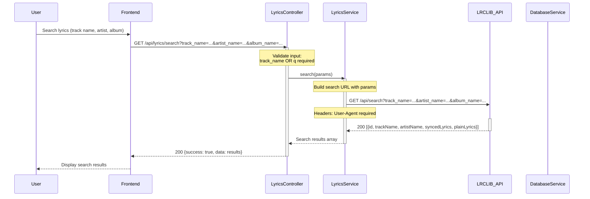
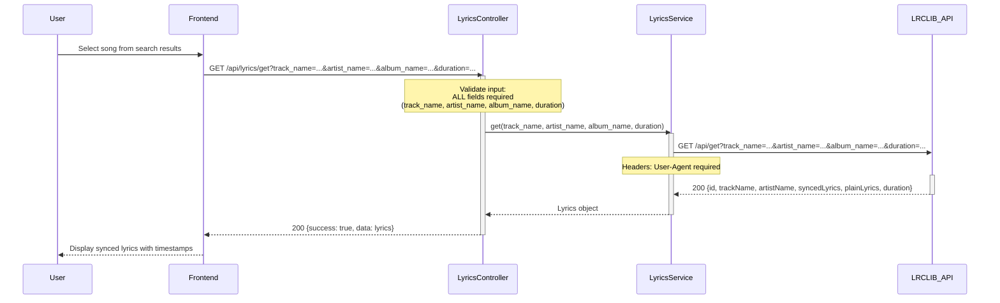
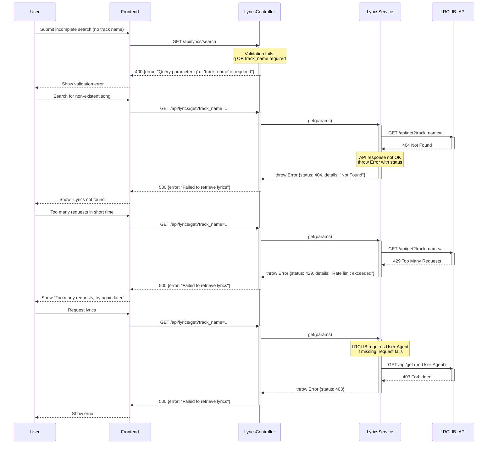
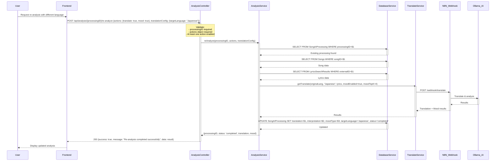

# Sequence Diagrams - Lyrics Search & AI Analysis Flows

> **Verification Status**: ✅ All flows verified against actual code
> - Source files: `backend/src/controllers/lyricsController.js`, `backend/src/services/lyricsService.js`, `backend/src/controllers/analysisController.js`, `backend/src/services/analysisService.js`, `backend/src/services/translateService.js`
> - All error codes, LRCLIB API integration, N8N webhook flow, and Ollama AI integration documented from actual implementation
> - Last verified: 25 November 2025

---

## 1. Lyrics Search Flow

### Happy Path - Successful Lyrics Search

### Happy Path - Get Specific Lyrics by Metadata

### Error Path - Lyrics Search Failures

---

## 2. AI Analysis Flow (Translation + Mood Analysis)

### Happy Path - Start Analysis with Translation & Mood

```mermaid
sequenceDiagram
    participant User
    participant Frontend
    participant AnalysisController
    participant AnalysisService
    participant DatabaseService
    participant TranslateService
    participant N8N_Webhook
    participant Ollama_AI
    participant LyricsService
    participant LRCLIB_API

    User->>Frontend: Request translation to Thai with mood analysis
    Frontend->>AnalysisController: POST /api/analysis/start {lyricsRecord, actions: {translate: true, mood: true}, translationConfig: {targetLanguage: "Thai"}}
    
    activate AnalysisController
    Note over AnalysisController: Validate input:<br/>- lyricsRecord required<br/>- actions object required<br/>- At least one action enabled<br/>- targetLanguage required if translate=true
    
    AnalysisController->>AnalysisService: process(lyricsRecord, actions, translationConfig, userId)
    activate AnalysisService
    
    %% Ensure lyrics exist in LyricsSearchResults
    AnalysisService->>DatabaseService: Check if lyricsRecord exists in LyricsSearchResults
    activate DatabaseService
    DatabaseService-->>AnalysisService: Lyrics found or created
    deactivate DatabaseService
    
    %% Ensure song exists in Songs table
    AnalysisService->>DatabaseService: Check if song exists in Songs (by externalID or metadata)
    activate DatabaseService
    alt Song exists
        DatabaseService-->>AnalysisService: Existing song
    else Song not found
        DatabaseService-->>AnalysisService: Create new song
    end
    deactivate DatabaseService
    
    %% Check for existing approved processing with same targetLanguage
    AnalysisService->>DatabaseService: SELECT FROM SongAIProcessing WHERE songID=$1 AND targetLanguage=$2 AND approvalStatus='approved' AND shareStatus='public_approved'
    activate DatabaseService
    DatabaseService-->>AnalysisService: No existing processing found
    deactivate DatabaseService
    
    %% Create new processing record
    AnalysisService->>DatabaseService: INSERT INTO SongAIProcessing (songID, aiModel='n8n-translate', status='processing')
    activate DatabaseService
    DatabaseService-->>AnalysisService: processingID created
    deactivate DatabaseService
    
    %% Apply metadata (coverImage, youtubeVideoId)
    AnalysisService->>DatabaseService: UPDATE SongAIProcessing SET coverImage=$1, youtubeVideoId=$2
    activate DatabaseService
    DatabaseService-->>AnalysisService: Metadata updated
    deactivate DatabaseService
    
    %% Fetch full lyrics if needed
    alt Lyrics not plain
        AnalysisService->>LyricsService: getById(externalID)
        activate LyricsService
        LyricsService->>LRCLIB_API: GET /api/get/{id}
        activate LRCLIB_API
        LRCLIB_API-->>LyricsService: Full lyrics with timestamps
        deactivate LRCLIB_API
        LyricsService-->>AnalysisService: Full lyrics
        deactivate LyricsService
    end
    
    %% Process translation with mood enabled
    AnalysisService->>TranslateService: getTranslate(originalLang, targetLang, lyrics, moodEnabled=true, moodTopK=4)
    activate TranslateService
    
    Note over TranslateService: Validate:<br/>- Translate webhook URL configured<br/>- Lyrics not empty
    
    TranslateService->>N8N_Webhook: POST /webhook/translate {language1, language2, lyrics, moodEnabled: true, moodTopK: 4}
    Note over TranslateService: Headers: Content-Type: application/json
    
    activate N8N_Webhook
    Note over N8N_Webhook: N8N Workflow:<br/>1. Parse input<br/>2. Call Ollama AI (gpt-oss:120b)<br/>3. Process translation<br/>4. Call Ollama for mood analysis<br/>5. Return combined result
    
    N8N_Webhook->>Ollama_AI: Translate lyrics to target language
    activate Ollama_AI
    Ollama_AI-->>N8N_Webhook: Translation result
    deactivate Ollama_AI
    
    N8N_Webhook->>Ollama_AI: Analyze mood (with topK=4)
    activate Ollama_AI
    Note over Ollama_AI: Mood classification:<br/>22 classes (Happy, Sad, Anger, Love, etc.)
    Ollama_AI-->>N8N_Webhook: Mood result {moods: [{class, score}], topScore, confidence}
    deactivate Ollama_AI
    
    N8N_Webhook-->>TranslateService: 200 {translation, interpretation, summary, mood: {moods, topScore, confidence}}
    deactivate N8N_Webhook
    
    TranslateService-->>AnalysisService: {success: true, data: {translation, interpretation, summary, mood}}
    deactivate TranslateService
    
    %% Extract mood result from translation result
    Note over AnalysisService: Extract mood from translation result<br/>moodResult = translationResult.mood
    
    %% Update processing record with results
    AnalysisService->>DatabaseService: UPDATE SongAIProcessing SET translation=$1, interpretation=$2, summary=$3, moodType=$4, moodScore=$5, moodConfidence=$6, status='completed', targetLanguage=$7, processingTime=$8
    activate DatabaseService
    DatabaseService-->>AnalysisService: Processing updated
    deactivate DatabaseService
    
    AnalysisService-->>AnalysisController: {processingID, songID, status: 'completed', translation, mood}
    deactivate AnalysisService
    
    AnalysisController-->>Frontend: 200 {success: true, message: "Analysis completed successfully", data: result}
    deactivate AnalysisController
    Frontend-->>User: Display translated lyrics with mood analysis
```

### Happy Path - Re-analyze Existing Processing

### Error Path - AI Analysis Failures

```mermaid
sequenceDiagram
    participant User
    participant Frontend
    participant AnalysisController
    participant AnalysisService
    participant TranslateService
    participant N8N_Webhook
    participant Ollama_AI
    participant DatabaseService

    %% Error 1: Missing required fields
    User->>Frontend: Submit analysis without actions
    Frontend->>AnalysisController: POST /api/analysis/start {lyricsRecord}
    activate AnalysisController
    Note over AnalysisController: Validation fails:<br/>actions object required
    AnalysisController-->>Frontend: 400 {error: "actions object is required"}
    deactivate AnalysisController
    Frontend-->>User: Show validation error

    %% Error 2: No actions enabled
    User->>Frontend: Submit with all actions disabled
    Frontend->>AnalysisController: POST /api/analysis/start {lyricsRecord, actions: {translate: false, mood: false}}
    activate AnalysisController
    Note over AnalysisController: Validation fails:<br/>at least one action must be enabled
    AnalysisController-->>Frontend: 400 {error: "At least one action (translate or mood) must be enabled"}
    deactivate AnalysisController
    Frontend-->>User: Show validation error

    %% Error 3: Missing targetLanguage when translate enabled
    User->>Frontend: Enable translation without target language
    Frontend->>AnalysisController: POST /api/analysis/start {lyricsRecord, actions: {translate: true}, translationConfig: {}}
    activate AnalysisController
    Note over AnalysisController: Validation fails:<br/>targetLanguage required when translate enabled
    AnalysisController-->>Frontend: 400 {error: "translationConfig.targetLanguage is required when translate is enabled"}
    deactivate AnalysisController
    Frontend-->>User: Show validation error

    %% Error 4: Mood analysis without translation
    User->>Frontend: Request mood only (no translation)
    Frontend->>AnalysisController: POST /api/analysis/start {lyricsRecord, actions: {translate: false, mood: true}}
    activate AnalysisController
    AnalysisController->>AnalysisService: process(lyricsRecord, actions, ...)
    activate AnalysisService
    Note over AnalysisService: Mood analysis requires translation<br/>(N8N webhook handles both together)
    AnalysisService-->>AnalysisController: throw Error "Mood analysis requires translation to be enabled"
    deactivate AnalysisService
    AnalysisController-->>Frontend: 400 {error: "Mood analysis requires translation to be enabled"}
    deactivate AnalysisController
    Frontend-->>User: Show error, enable translation

    %% Error 5: N8N webhook URL not configured
    User->>Frontend: Request translation
    Frontend->>AnalysisController: POST /api/analysis/start {valid data}
    activate AnalysisController
    AnalysisController->>AnalysisService: process(...)
    activate AnalysisService
    AnalysisService->>TranslateService: getTranslate(...)
    activate TranslateService
    Note over TranslateService: Check config.n8n.translateWebHook<br/>URL not configured
    TranslateService-->>AnalysisService: {success: false, error: "TRANSLATE_WEBHOOK environment variable is missing"}
    deactivate TranslateService
    AnalysisService-->>AnalysisController: throw Error
    deactivate AnalysisService
    AnalysisController-->>Frontend: 500 {error: "Failed to process analysis"}
    deactivate AnalysisController
    Frontend-->>User: Show configuration error

    %% Error 6: Empty lyrics text
    User->>Frontend: Submit empty lyrics
    Frontend->>AnalysisController: POST /api/analysis/start {lyricsRecord: {lyrics: ""}, ...}
    activate AnalysisController
    AnalysisController->>AnalysisService: process(...)
    activate AnalysisService
    AnalysisService->>TranslateService: getTranslate("", ...)
    activate TranslateService
    Note over TranslateService: Validate lyrics not empty<br/>Validation fails
    TranslateService-->>AnalysisService: {success: false, error: "Lyrics cannot be empty"}
    deactivate TranslateService
    AnalysisService-->>AnalysisController: throw Error
    deactivate AnalysisService
    AnalysisController-->>Frontend: 500 {error: "Failed to process analysis"}
    deactivate AnalysisController
    Frontend-->>User: Show validation error

    %% Error 7: N8N webhook timeout
    User->>Frontend: Request translation
    Frontend->>AnalysisController: POST /api/analysis/start {valid data}
    activate AnalysisController
    AnalysisController->>AnalysisService: process(...)
    activate AnalysisService
    AnalysisService->>TranslateService: getTranslate(...)
    activate TranslateService
    TranslateService->>N8N_Webhook: POST /webhook/translate
    activate N8N_Webhook
    Note over N8N_Webhook: N8N workflow processing...<br/>Connection timeout or N8N error
    N8N_Webhook-->>TranslateService: Timeout or 500 error
    deactivate N8N_Webhook
    TranslateService-->>AnalysisService: {success: false, error: "Failed to call translate webhook"}
    deactivate TranslateService
    AnalysisService-->>AnalysisController: throw Error
    deactivate AnalysisService
    AnalysisController-->>Frontend: 500 {error: "Failed to process analysis"}
    deactivate AnalysisController
    Frontend-->>User: Show error, retry

    %% Error 8: Ollama AI model error
    User->>Frontend: Request translation
    Frontend->>AnalysisController: POST /api/analysis/start {valid data}
    activate AnalysisController
    AnalysisController->>AnalysisService: process(...)
    activate AnalysisService
    AnalysisService->>TranslateService: getTranslate(...)
    activate TranslateService
    TranslateService->>N8N_Webhook: POST /webhook/translate
    activate N8N_Webhook
    N8N_Webhook->>Ollama_AI: Request translation
    activate Ollama_AI
    Note over Ollama_AI: Ollama model error<br/>(gpt-oss:120b not loaded or crashed)
    Ollama_AI-->>N8N_Webhook: 500 Model error
    deactivate Ollama_AI
    N8N_Webhook-->>TranslateService: 500 N8N workflow failed
    deactivate N8N_Webhook
    Note over TranslateService: Parse error response
    TranslateService-->>AnalysisService: {success: false, error: "N8N webhook failed: 500"}
    deactivate TranslateService
    AnalysisService-->>AnalysisController: throw Error
    deactivate AnalysisService
    AnalysisController-->>Frontend: 500 {error: "Failed to process analysis"}
    deactivate AnalysisController
    Frontend-->>User: Show AI processing error

    %% Error 9: Processing not found (re-analyze)
    User->>Frontend: Re-analyze non-existent processing
    Frontend->>AnalysisController: POST /api/analysis/invalid-id/re-analyze
    activate AnalysisController
    AnalysisController->>AnalysisService: reAnalyze("invalid-id", ...)
    activate AnalysisService
    AnalysisService->>DatabaseService: SELECT FROM SongAIProcessing WHERE processingID=$1
    activate DatabaseService
    DatabaseService-->>AnalysisService: No rows found
    deactivate DatabaseService
    AnalysisService-->>AnalysisController: throw Error "Processing not found"
    deactivate AnalysisService
    AnalysisController-->>Frontend: 404 {error: "Processing not found"}
    deactivate AnalysisController
    Frontend-->>User: Show not found error

    %% Error 10: Database error during processing update
    User->>Frontend: Request translation
    Frontend->>AnalysisController: POST /api/analysis/start {valid data}
    activate AnalysisController
    AnalysisController->>AnalysisService: process(...)
    activate AnalysisService
    Note over AnalysisService: Translation successful
    AnalysisService->>DatabaseService: UPDATE SongAIProcessing SET translation=$1, ...
    activate DatabaseService
    DatabaseService-->>AnalysisService: Database connection error
    deactivate DatabaseService
    AnalysisService-->>AnalysisController: throw Error
    deactivate AnalysisService
    AnalysisController-->>Frontend: 500 {error: "Failed to process analysis"}
    deactivate AnalysisController
    Frontend-->>User: Show server error
```

---

## Summary of Error Codes

| Endpoint | Status Code | Error Scenario | Message |
|----------|-------------|----------------|---------|
| **GET /api/lyrics/search** | 400 | Missing query parameter | "Query parameter 'q' or 'track_name' is required" |
| | 500 | LRCLIB API error | "Failed to retrieve lyrics" |
| **GET /api/lyrics/get** | 400 | Missing required fields | "track_name, artist_name, album_name, duration are required" |
| | 500 | LRCLIB 404 | "Failed to retrieve lyrics" |
| | 500 | LRCLIB 429 | "Failed to retrieve lyrics" (rate limit) |
| | 500 | LRCLIB 403 | "Failed to retrieve lyrics" (missing User-Agent) |
| **POST /api/analysis/start** | 400 | Missing lyricsRecord | "lyricsRecord is required" |
| | 400 | Missing actions | "actions object is required" |
| | 400 | No actions enabled | "At least one action (translate or mood) must be enabled" |
| | 400 | Missing targetLanguage | "translationConfig.targetLanguage is required when translate is enabled" |
| | 400 | Mood without translation | "Mood analysis requires translation to be enabled" |
| | 500 | N8N webhook not configured | "Failed to process analysis" |
| | 500 | Empty lyrics | "Failed to process analysis" |
| | 500 | N8N webhook timeout | "Failed to process analysis" |
| | 500 | Ollama AI error | "Failed to process analysis" |
| | 500 | Database error | "Failed to process analysis" |
| **POST /api/analysis/{processingID}/re-analyze** | 400 | Missing actions | "actions object is required" |
| | 400 | No actions enabled | "At least one action (translate or mood) must be enabled" |
| | 404 | Processing not found | "Processing not found" |
| | 500 | Any processing error | "Failed to re-analyze" |

---

## Verification Notes

**Lyrics Search Flow** (lyricsController.js lines 1-100, lyricsService.js lines 1-150):
- **search**: Requires `q` OR `track_name` (line 13-20 in controller)
- **get**: Requires ALL fields: track_name, artist_name, album_name, duration (line 23-38)
- **LRCLIB API**: Base URL from config, User-Agent header required (lyricsService.js line 10-15)
- **Error handling**: doGet helper throws error with status and details on non-OK response (line 20-30)

**AI Analysis Flow** (analysisController.js lines 1-266, analysisService.js lines 1-1147):
- **startAnalysis**: Validates lyricsRecord, actions object, at least one action enabled (controller lines 20-38)
- **Translation + Mood**: Both processed by single N8N webhook call (service lines 100-150)
- **Mood requirement**: Mood analysis ONLY works with translation enabled (service line 173-177)
- **N8N webhook**: URL from config.n8n.translateWebHook, POST with JSON body (translateService.js lines 10-80)
- **Parameters**: language1, language2, lyrics, moodEnabled (bool), moodTopK (int, default 4)
- **N8N workflow**: Calls Ollama AI (gpt-oss:120b) for translation and mood classification
- **Mood classes**: 22 classes mapped (0-21: Happy, Sad, Anger, Love, etc.) (service lines 5-28)
- **Processing record**: Created BEFORE calling N8N, updated AFTER with results (service lines 90-240)
- **Existing check**: Before creating new processing, checks for approved processing with same targetLanguage (service lines 55-80)

**Translation Service Flow** (translateService.js lines 1-150):
- **Validation**: Checks webhook URL configured and lyrics not empty (lines 10-25)
- **Webhook call**: fetch() with POST, JSON body, Content-Type header (lines 40-55)
- **Error handling**: Catches fetch errors, logs, returns {success: false, error} (lines 70-95)
- **Response parsing**: Tries to parse JSON, falls back to text if parse fails (lines 60-75)

**Database Tables**:
- **LyricsSearchResults**: Stores LRCLIB search results (externalID, trackName, lyrics)
- **Songs**: Stores song metadata (songID, songName, artistName)
- **SongAIProcessing**: Stores AI processing results (processingID, songID, translation, interpretation, moodType, moodScore, targetLanguage, status)

**External Services**:
- **LRCLIB API**: https://lrclib.net/api (lyrics search and retrieval)
- **N8N**: Workflow automation (webhook receives requests, calls Ollama, returns results)
- **Ollama**: AI model gpt-oss:120b (translation and mood analysis)
