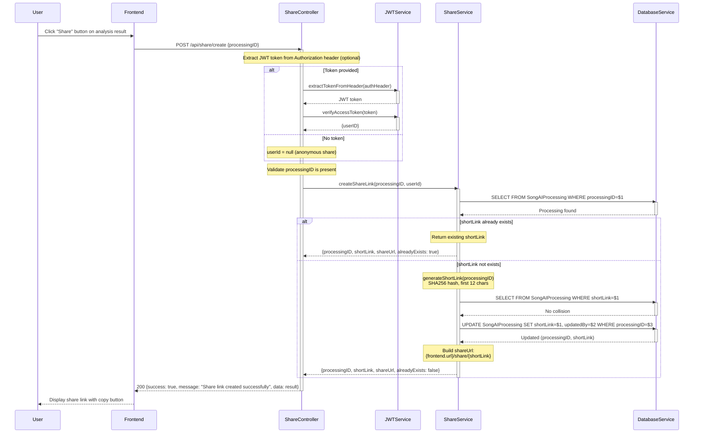
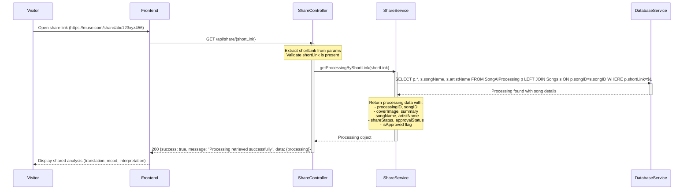
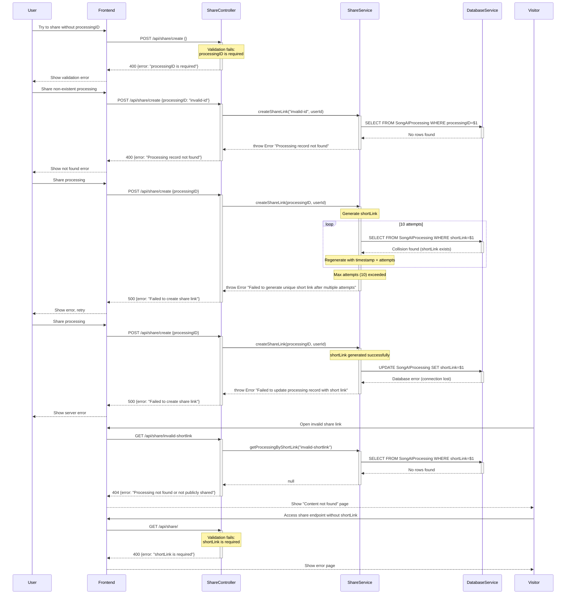
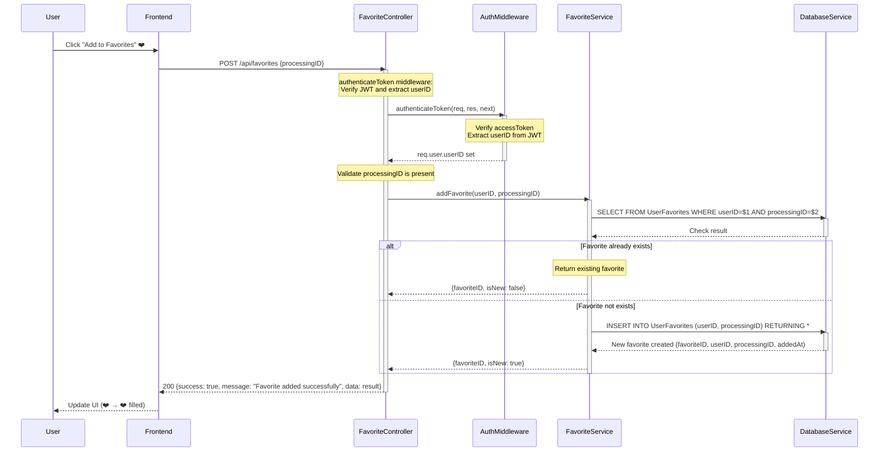
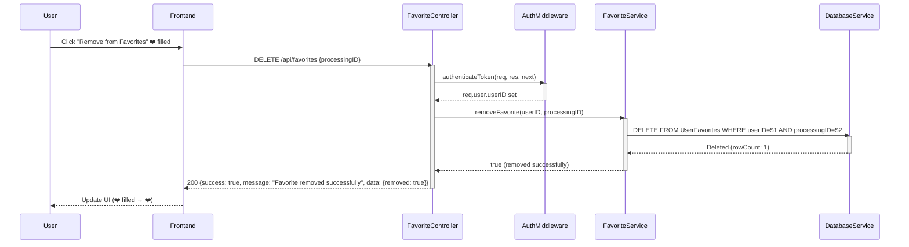
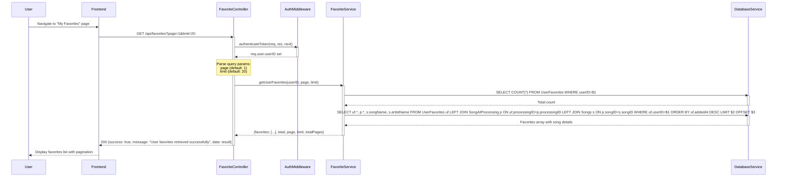
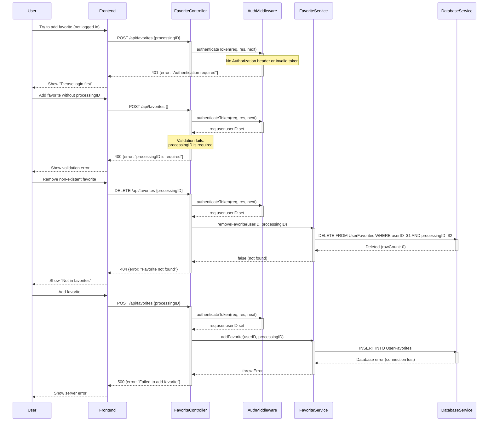
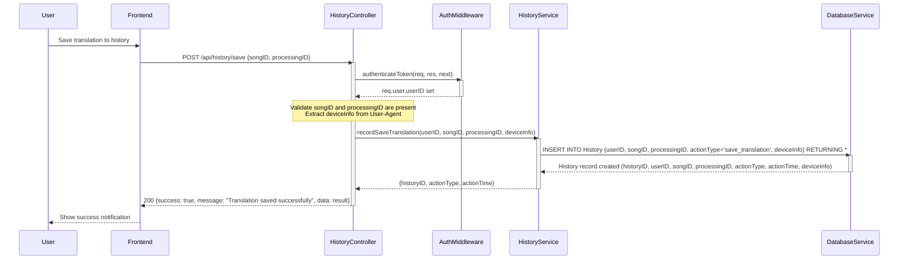
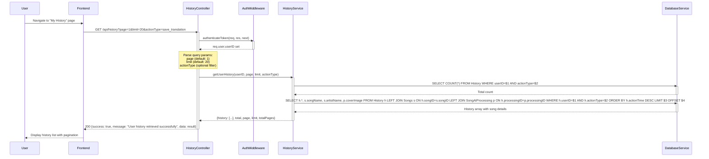
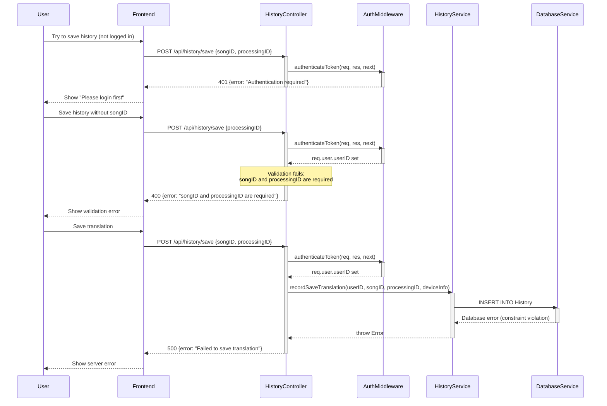

# Sequence Diagrams - User Interaction Flows

> **Verification Status**: ✅ All flows verified against actual code
> - Source files: `backend/src/controllers/shareController.js`, `backend/src/services/shareService.js`, `backend/src/controllers/favoriteController.js`, `backend/src/services/favoriteService.js`, `backend/src/controllers/historyController.js`, `backend/src/services/historyService.js`
> - All error codes, database operations, and share link generation documented from actual implementation
> - Last verified: 25 November 2025

---

## 1. Share Link Creation Flow

### Happy Path - Create New Share Link

### Happy Path - Access Shared Content

### Error Path - Share Link Failures

---

## 2. Favorites Management Flow

### Happy Path - Add to Favorites

### Happy Path - Remove from Favorites

### Happy Path - Get User Favorites List

### Error Path - Favorites Failures

---

## 3. History Tracking Flow

### Happy Path - Record Translation History

### Happy Path - Get User History

### Error Path - History Failures

---

## Summary of Error Codes

| Endpoint | Status Code | Error Scenario | Message |
|----------|-------------|----------------|---------|
| **POST /api/share/create** | 400 | Missing processingID | "processingID is required" |
| | 400 | Processing not found | "Processing record not found" |
| | 500 | Collision after max attempts | "Failed to create share link" |
| | 500 | Database error | "Failed to create share link" |
| **GET /api/share/{shortLink}** | 400 | Missing shortLink | "shortLink is required" |
| | 404 | Invalid shortLink | "Processing not found or not publicly shared" |
| | 500 | Server error | "Failed to retrieve processing" |
| **POST /api/favorites** | 401 | Missing auth token | "Authentication required" |
| | 400 | Missing processingID | "processingID is required" |
| | 500 | Database error | "Failed to add favorite" |
| **DELETE /api/favorites** | 401 | Missing auth token | "Authentication required" |
| | 400 | Missing processingID | "processingID is required" |
| | 404 | Favorite not found | "Favorite not found" |
| | 500 | Database error | "Failed to remove favorite" |
| **GET /api/favorites** | 401 | Missing auth token | "Authentication required" |
| | 500 | Database error | "Failed to retrieve user favorites" |
| **POST /api/history/save** | 401 | Missing auth token | "Authentication required" |
| | 400 | Missing required fields | "songID and processingID are required" |
| | 500 | Database error | "Failed to save translation" |
| **GET /api/history** | 401 | Missing auth token | "Authentication required" |
| | 500 | Database error | "Failed to retrieve user history" |

---

## Verification Notes

**Share Link Flow** (shareController.js lines 1-150, shareService.js lines 1-150):
- **createShareLink**: Optional JWT auth (userId can be null for anonymous) (controller lines 7-25)
- **shortLink generation**: SHA256 hash of processingID, first 12 characters (service lines 10-15)
- **Collision check**: Max 10 attempts, regenerate with timestamp + attempts if collision (service lines 40-60)
- **alreadyExists flag**: Returns existing shortLink if already created (service lines 30-40)
- **shareUrl format**: {frontend.url}/share/{shortLink} (service line 42)
- **getProcessingByShortLink**: Returns processing with shareStatus, approvalStatus, isApproved flag (service lines 80-120)

**Favorites Flow** (favoriteController.js lines 1-139, favoriteService.js):
- **addFavorite**: Requires auth (authenticateToken middleware), validates processingID (controller lines 5-38)
- **Duplicate check**: Returns isNew:false if favorite already exists (service)
- **removeFavorite**: Returns 404 if favorite not found (controller lines 40-73)
- **getUserFavorites**: Pagination with page/limit params (default: page=1, limit=20) (controller lines 75-100)
- **JOIN query**: Favorites joined with SongAIProcessing and Songs for complete data (service)

**History Flow** (historyController.js lines 1-100, historyService.js):
- **saveTranslation**: Requires auth, validates songID and processingID (controller lines 29-67)
- **deviceInfo**: Extracted from User-Agent header (mobile vs desktop) (controller line 54)
- **actionType**: 'save_translation' stored in History table (service)
- **getUserHistory**: Optional actionType filter, pagination (controller lines 5-27)
- **ORDER BY**: History ordered by actionTime DESC (most recent first) (service)

**Database Tables**:
- **SongAIProcessing**: shortLink column (varchar, unique), shareStatus, approvalStatus
- **UserFavorites**: userID, processingID, addedAt timestamp
- **History**: userID, songID, processingID, actionType, actionTime, deviceInfo

**JWT Authentication**:
- Favorites and History require authenticateToken middleware
- Share creation supports optional auth (anonymous sharing allowed)
- JWT verified via JWTService.verifyAccessToken()
