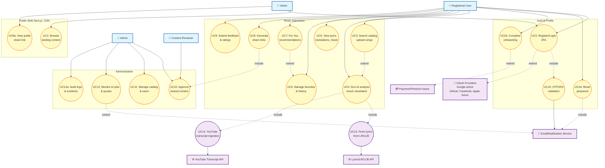

## MUSE MUSIC – Overall Use Case Diagram

The diagram below summarizes the primary actors and interactions supported by the MUSE MUSIC platform, spanning both customer-facing and administrative flows.

### Actor Highlights

- **Visitor** – anonymous traffic; can explore public marketing content and start the onboarding sequence.
- **Registered User** – authenticated customer with access to search, history, AI analysis (mood, translation, summary), favorites, sharing, and the personalized *For You* feed.
- **Admin** – staff role that moderates public content, inspects system metrics/logs, manages catalog entries and user accounts, and keeps AI processing capacity healthy.
- **Lyrics / LRCLIB API** & **YouTube Transcript API** – external providers the backend calls while running analyses to supply lyrics or subtitles when the local catalog does not have them.

### Use Case Notes

| ID   | Description | Key Components / References |
|------|-------------|-----------------------------|
| UC1  | Public visitors browse marketing sections, pricing, features before signup | `frontend/src/app/page.tsx`, `Navbar`, `Footer` |
| UC2  | Account lifecycle: register, login, 2FA check (OTP), OAuth (Google only; GitHub, Facebook, Apple planned) | `frontend/src/app/login`, `backend/src/controllers/authController.js`, `User` model, `googleAuthService.js` |
| UC2a | Forgot-password + reset flow (email link) | `frontend/src/app/reset-password`, `backend/src/services/emailService.js` |
| UC2b | Multi-step onboarding/setup wizard (profile, preferences) | `frontend/src/app/setup/step*/page.tsx`, `SetupRedirect` |
| UC3  | Search catalog, import via lyrics search, upload songs | `backend/src/services/songService.js`, `lyricsSearchResults`, `frontend search components` |
| UC4  | Run AI processing (summary, translation, mood, cover image) | `backend/src/services/analysisService.js`, `songAIProcessing` |
| UC5  | View song detail (lyrics, translation, mood radar, synced player) | `frontend/src/app/song/[songID]` |
| UC6  | Manage favorites, playback history, recently analyzed songs | `backend/src/services/historyService.js`, `userFavorites`, `frontend recent-list components` |
| UC7  | Personalized *For You* content (mood stats, recent, recommendations, top hits) | `backend/src/services/foryouService.js`, `frontend/src/app/for-you/page.tsx` |
| UC8  | Generate share links / public pages for AI results | `backend/src/services/shareService.js`, `frontend/src/app/share/[shortLink]` |
| UC8a | Public visitors view shared pages without login | `ShareLinkClient`, `songAIProcessing` public data |
| UC9  | Submit rating/feedback on AI output | `backend/src/services/ratingService.js`, `frontend/src/components/FeedbackSection.tsx` |
| UC10 | Admin review & approve public content / share requests | `backend/src/services/adminShareService.js`, admin UI |
| UC11 | Admin catalogs, user management, dashboards | `frontend/src/app/admin/*`, `backend/src/services/admin*.js` |
| UC12 | Monitor AI processing jobs, quotas, system logs | `backend/src/middleware/logger.js`, `analysisRateLimit.js`, admin dashboards |
| UC12a| Audit logs, incident reviews, notification hooks | `logger`, `NotificationService (future)` |
| UC13 | External lyrics fetching (LRCLIB/LRClib docs) | `backend/source/lrclib.md`, `scripts` |
| UC14 | YouTube transcript ingestion when lyrics missing | `backend/scripts/youtube_transcript.py`, `youtubeTranscriptUtils.js` |
| UC15 | OTP / 2FA validation (TOTP, backup codes) | `backend/src/middleware/twoFactorMiddleware.js`, `UserTwoFactorAuth` |
| NS   | Email/notification service for OTP, share approvals, alerts | `backend/src/services/emailService.js` |
| PM   | Placeholder for premium/payments integration (future) | `Customers` table columns (`isPremium`, etc.) |

Use this diagram as the base layer for more detailed sequence, component, or data-flow diagrams in the `diagrams/` folder.

